<div class="info" data-title="🌐 Language / Idioma">

> [🇬🇧 English](../workshop-vibe-coding.md) | **Español** (actual)

</div>

# Tutorial de Vibe Coding con GitHub Copilot

El objetivo de este workshop es descubrir las funcionalidades de GitHub Copilot, desde las sugerencias de código hasta el modo agente, y tener una visión rápida del impacto que aporta a los desarrolladores y equipos de desarrollo.

GitHub Copilot es un asistente de código potenciado por IA que ayuda a los desarrolladores a escribir mejor código más rápido. Utiliza modelos de aprendizaje automático entrenados con miles de millones de líneas de código para sugerir líneas completas o funciones enteras basándose en el contexto de lo que estás trabajando. Al usar GitHub Copilot, puedes aprender a escribir mejor código y mejorar tu productividad.

<div class="warning" data-title="advertencia">

> GitHub Copilot es un producto en rápida evolución y por lo tanto este workshop puede no estar 100% actualizado con las diferentes funcionalidades de las extensiones que vas a usar. Por favor, sé flexible si algo no es exactamente igual.

</div>

## Pre-requisitos Mínimos

Hay dos formas de ejecutar este workshop:

- online con **GitHub Codespaces**: la forma más rápida y fácil de empezar a practicar inmediatamente
- localmente en **tu computadora**: la mejor forma de instalar y configurar las herramientas que necesitas para trabajar con GitHub Copilot en todos tus proyectos

Estos son los pre-requisitos mínimos para ejecutar este workshop:

|                                  |                                                                                 |
| -------------------------------- | ------------------------------------------------------------------------------- |
| Una cuenta de GitHub             | [Crear cuenta gratuita de GitHub](https://github.com/join)                      |
| Acceso a GitHub Copilot activado | [Obtener acceso a GitHub Copilot](#obtener-acceso-a-github-copilot)             |
| Un navegador web                 | [Descargar Microsoft Edge](https://www.microsoft.com/edge) o cualquier otro ;-) |

## Obtener Acceso a GitHub Copilot

Hay diferentes formas de obtener acceso a GitHub Copilot:

- **Como individuo**, puedes registrarte para usar [Copilot Free](https://github.com/github-copilot/signup), sin necesidad de tarjeta de crédito. Tienes derecho a un número limitado de completados e interacciones de chat por mes con el plan gratuito, que se reinician cada mes. Aprende más sobre los [detalles y condiciones del plan Copilot Free](https://docs.github.com/en/copilot/about-github-copilot/subscription-plans-for-github-copilot).

- **Como individuo**, regístrate para una [suscripción de pago](https://github.com/github-copilot/signup/copilot_individual) para obtener completados e interacciones de chat ilimitados. Puedes probar GitHub Copilot gratis con una prueba única de 30 días.

- **Como miembro de una organización o empresa** que tiene una suscripción a GitHub Copilot, puedes solicitar acceso a Copilot yendo a [https://github.com/settings/copilot](https://github.com/settings/copilot) y solicitando acceso bajo "Get Copilot from an organization."

## Hacer Fork del Repositorio

Este workshop utiliza el siguiente repositorio de GitHub: [GitHub Copilot Demo](https://github.com/Philess/gh-copilot-demo)

Este repositorio es un código inicial que te ayudará a experimentar todas las capacidades de GitHub Copilot. Toma el tiempo de ver el diseño de arquitectura mostrado en la página y cuando estés listo, clona el repositorio desde la línea de comandos y ábrelo en VS Code.

Comienza creando **tu propio fork** del repositorio haciendo clic en el botón `Fork` en la parte superior derecha de la página del repositorio. Esto creará una copia del repositorio en tu propia cuenta de GitHub y serás libre de hacer cualquier cambio que desees.


## Trabajar con GitHub Codespaces

El entorno ya está configurado para trabajar con [GitHub Codespaces](https://github.com/features/codespaces), un entorno de desarrollo contenedorizado alojado en GitHub.

Para empezar a programar simplemente inicia un nuevo codespace y estarás listo, no necesitas instalar nada.

<div class="info" data-title="nota">

> Todos los usuarios individuales de GitHub tienen un plan gratuito para ejecutar el codespace que te permite probarlo con 120 horas-núcleo gratis por mes [Ver Precios](https://github.com/settings/billing/summary)

</div>


Después de unos segundos, serás redirigido al entorno Codespace. Puedes empezar a programar de inmediato, tus extensiones de GitHub Copilot ya están instaladas y configuradas.

---

# Nivel 1: Autocompletado de Código con GitHub Copilot

Esta sección te guiará a través de los primeros pasos con GitHub Copilot, comenzando con el autocompletado de código. Aprenderás qué puedes hacer y cómo usarlo a su máximo potencial.

## Empieza a Practicar con el Autocompletado de GitHub Copilot

Una vez que empiezas a escribir un prompt y Copilot genera propuestas, puedes usar los siguientes atajos para interactuar con Copilot:
<ul>
<li>`tab` para aceptar la sugerencia actual completamente (`más común`)</li>
<li>`ctrl + flecha derecha` para aceptar palabra por palabra la sugerencia (`para uso parcial`)</li>
<li>`alt + ^` para moverse a la siguiente sugerencia</li>
<li>`shift + tab` para volver a la sugerencia anterior</li>
<li>`ctrl+enter` para mostrar el panel de Copilot</li>
</ul>

<div class="info" data-title="info">

> Estos atajos son los predeterminados para VS Code. Si estás usando otro IDE, puedes encontrar los atajos en la [documentación de GitHub Copilot](https://docs.github.com/en/copilot/getting-started-with-github-copilot/).

<div>

## Empecemos con lo básico

### Escribir código

**¿Qué es un prompt?**
En el contexto de Copilot, un prompt es una descripción en lenguaje natural que se usa para generar sugerencias de código. Es la entrada que Copilot usa para generar código. Puede ser una descripción de una sola línea o de múltiples líneas.

**Generar código desde un prompt**

Crea un nuevo archivo `album-viewer/utils/validators.ts` y empieza con el prompt:

```ts
// validar fecha desde entrada de texto en formato francés y convertirla a un objeto fecha
```

### Sugerencia de siguiente edición

<div class="warning" data-title="nota">

> Funcionalidad disponible solo en VS Code https://code.visualstudio.com/updates/v1_99#_next-edit-suggestions-general-availability

</div>

La sugerencia de siguiente edición es una evolución del autocompletado estándar en GitHub Copilot. Cuando estás modificando código y aceptar una sugerencia de código probablemente tendrá impacto en otra parte de tu código, automáticamente sugerirá el siguiente cambio en tu código, y no solo directamente donde está tu cursor sino donde probablemente estará tu siguiente acción natural.

Un ejemplo es mejor que mil palabras, ¡así que probémoslo!

Primero, asegúrate de activar la funcionalidad en la configuración de Copilot. Selecciona el comando `Preferences: Open User Settings` en la Paleta de Comandos (`Ctrl+Shift+P`) y busca la configuración `Next Edit Suggestions`:

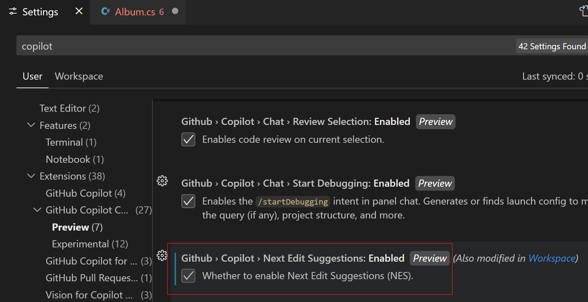

Luego, abre el archivo `albums-api/Models/Album.cs` y, en el constructor de Album, añade un nuevo parámetro de entrada `Year` de tipo `int` y observa cómo la Sugerencia de Siguiente Edición propone cambiar el cuerpo del método correspondiente:


## Misión Secundaria #1: Generar comentario de Git Commit

Sí, escribir un comentario debería ser obligatorio y los desarrolladores tienden a ser perezosos. GitHub Copilot puede ayudar con eso.

1. Simplemente edita cualquier archivo añadiendo contenido relevante.

2. En el panel de Git commit, haz clic en el pequeño botón mágico a la derecha

   

3. Admira cómo Copilot ha generado un comentario para ti

   

---

# Nivel 2: Usar Copilot Chat para Mejorar la Calidad del Código

GitHub Copilot es una IA generativa y por lo tanto, perfecto para generar código, pero tiene potentes capacidades de análisis sobre tu código que pueden usarse en varios casos para mejorar la calidad del código como: encontrar problemas de seguridad, malas prácticas en tu código y generar una solución, refactorizar y añadir comentarios a código legacy, generar tests, etc...

## Empieza a Practicar con el Chat

Una vez que Copilot Chat está configurado, puedes empezar a usarlo:

- haciendo clic en el **Icono de Copilot** arriba junto a la barra de búsqueda _o_ presionando el atajo `Ctrl` + `Shift` + `i` para abrir la **Vista de Chat**
- presionando el atajo `Ctrl` + `i` para una **pregunta rápida en línea** al chat

La **Vista de Chat** es una versión fija, muy útil para mantener el chat abierto y hacer preguntas a Copilot.
El **Chat en Línea** es una forma rápida de hacer una pregunta y obtener una respuesta precisamente en el contexto de la línea en la que estás trabajando.

Veremos ejemplos de ambos en las siguientes secciones para dejarte elegir cuál prefieres dependiendo de la situación.

### Vista de Chat

La vista de chat te da una experiencia de chat completa, integrada como cualquier otra vista de herramienta en tu IDE. Una vez que la vista está abierta puedes empezar a chatear con Copilot como tu coach de código personal. Mantiene el historial de la conversación y puedes hacer preguntas relacionadas con las respuestas anteriores. También proporciona sugerencias de preguntas a lo largo del camino. Puedes:

- hacer preguntas generales sobre programación en cualquier lenguaje o mejores prácticas
- pedir generar o arreglar código relacionado con el archivo actual e inyectar el código directamente en el archivo

Es un Copilot de más alto nivel que el Copilot básico que está especializado en proporcionar autocompletado de código.

Pruébalo con algunas preguntas como:

```text
> ¿Cómo generar un número aleatorio en C#?
> ¿Cuál es la forma más fácil de generar un sitio web estático con NodeJS?
```

Pruébalo luego con algunos de tus archivos de código en el repositorio. Abre un archivo e intenta preguntar:

```text
> ¿Puedes explicarme qué hace este código?
> ¿Puedes añadir comentarios de documentación a esta función?
```

Prueba también usar las sugerencias de preguntas que aparecen a lo largo del camino.

### Modos Ask, Edit y Agent

En GitHub Copilot Chat, puedes cambiar entre tres modos: **Ask**, **Edit** y **Agent**. El modo en el que estás se muestra en la vista de chat.

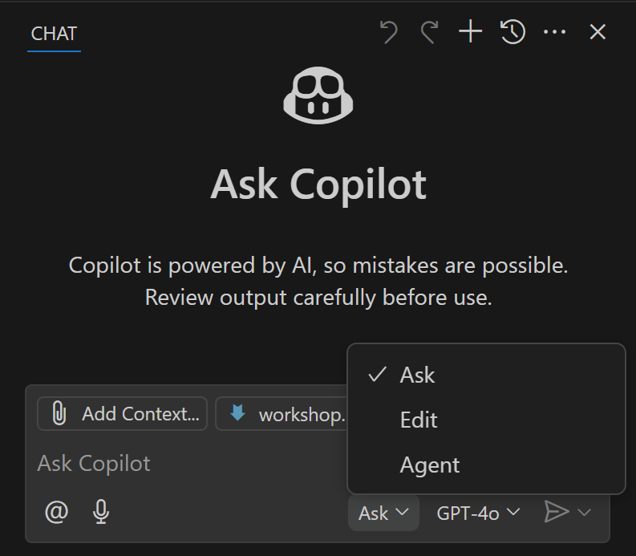

- **Modo Ask**: Este es el modo predeterminado. En este modo, puedes hacer preguntas y obtener respuestas de Copilot. También puedes pedir a Copilot que genere código para ti. Puedes cambiar a este modo haciendo clic en el botón **Ask** en la vista de chat.
- **Modo Edit**: Este modo está específicamente optimizado para editar código y trabajar específicamente en un conjunto de modificaciones, en un proceso de múltiples pasos. Es muy potente para generar código de una manera más interactiva y te guiará proporcionando orientación para ejecutar los comandos pero sin ejecutarlos por sí mismo.
- **Modo Agent**: Este modo es la versión agéntica (o multi-agentes) del **Modo Edit**. Es una versión más avanzada del **Modo Edit** que también puede ejecutar los comandos por ti, capturar el error y corregirse antes de continuar el proceso. Cambia la forma en que el desarrollador escribe código moviendo el cursor más cerca de la funcionalidad que del código en sí. Esto es lo que la comunidad también llama **Vibe Coding**.

**Modo Agent** y **Modo Edit** se detallan en el siguiente nivel. Este nivel se enfoca en practicar con el **Modo Ask**.

### Selección de Modelo

Las capacidades de los LLM evolucionan bastante rápido y tendemos a ver más y más modelos específicamente optimizados para tareas específicas. Para siempre proporcionar el mejor rendimiento para tu uso, GitHub Copilot ahora integra múltiples modelos entre los que puedes cambiar en los modos Chat / Edit.


<div class="tip" data-title="Modelos disponibles">

> La lista de modelos disponibles dependerá de múltiples parámetros:
>
> - qué IDE estás usando
> - qué modo estás usando (Chat / Inline / Edit)
> - qué modelos están autorizados por tu Administrador de Copilot

</div>

### Comandos Slash

Para ayudar aún más a Copilot a darte respuestas más relevantes, puedes elegir un tema para tus preguntas a través de "comandos slash".

Puedes anteponer tus entradas de chat con un nombre de tema específico para ayudar a Copilot a darte una respuesta más relevante. Cuando empiezas a escribir /, verás la lista de temas posibles:

- **/explain**: Explica paso a paso cómo funciona el código seleccionado.
- **/fix**: Propone una solución para los bugs en el código seleccionado.
- **/help**: Imprime ayuda general sobre GitHub Copilot.
- **/tests**: Genera tests unitarios para el código seleccionado.
- **/vscode**: Preguntas sobre comandos y configuraciones de VS Code.
- **/clear**: Limpia la sesión.

### Manipulación de Contexto

Como viste en ejemplos anteriores, pasar las instrucciones correctas es clave para buenos resultados de Copilot. El otro factor importante es el contexto que estás pasando a Copilot con esas instrucciones.

En el modo Chat o Edit puedes ver los archivos pasados en el contexto por defecto en el campo de chat:


Es posible ignorarlo haciendo clic en el icono de ojo a la izquierda del nombre del archivo.

Pero el poder de la integración de Copilot en tu IDE es proporcionar múltiples tipos de datos en el contexto. Haz clic en el icono de clip en el campo de chat para ver todas las opciones:


Aquí están las principales opciones a tener en cuenta:

- Codebase y File apuntarán a todo o a un archivo específico en tu workspace actual
- Selection apuntará al texto actualmente seleccionado en pantalla
- (Git) Changes se enfocará solo en tus modificaciones pendientes
- Image / Screenshot usará la capacidad de Visión (solo GPT-4o) para añadir contexto visual
- Terminal commands / selection

Dependiendo del IDE, hay otras opciones ya disponibles como:

- Prompt para adjuntar prompts reutilizables
- Obtener datos de la web
- Fallos de Tests para ejecuciones de tests unitarios que han fallado
- Problemas identificados en la ventana de VS Code
- otros por venir y probar...

Aquí hay algunos ejemplos básicos para entender cómo funciona. Ejemplos más complejos están disponibles en la parte de **_Nivel 4: Copilot Avanzado_** de este workshop.

Puedes añadir múltiples referencias en contexto en una sola solicitud. Siéntete libre de desafiarlo y ver qué tan efectivo es.

**Pasar un archivo**

```text
> @workspace /tests genera tests unitarios para #Albu
```

Y luego selecciona `AlbumController.cs` para añadir el archivo como referencia.

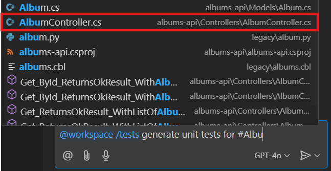

**Hacer preguntas sobre cambios de git**

```text
> ¿puedes darme el contenido a añadir en mi changelog respecto a mis #changes actuales?

> ¿Qué en mis #changes actuales puede causar que mi código falle en tiempo de ejecución?
```

**Apuntar a selección y adjuntar carpeta**

Abre el archivo `AlbumController.cs` y selecciona una o varias funciones. Luego en el chat añade toda la carpeta album-api al contexto **arrastrando y soltando** la carpeta desde el explorador de archivos a la izquierda.

```text
> @workspace /tests genera tests unitarios para la función en #selection
```

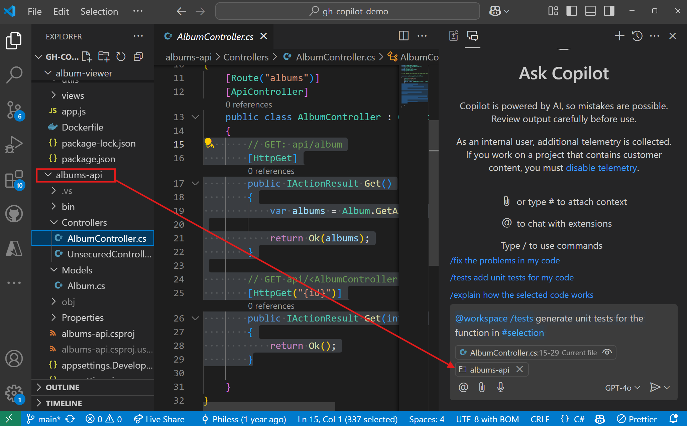

Mejorará el resultado apuntando a una parte muy específica del código para la acción mientras da un mejor entendimiento del contexto para la tarea adjuntando todo el código en la carpeta de la api.

## Tareas cotidianas del desarrollador

### Traducciones de Lenguaje Natural

**Automatizar completado de texto**

Abre el archivo `album-viewer/lang/translations.json` y pide en el chat añadir algunos nuevos idiomas como francés y alemán por ejemplo

```json
[
  {
    "language": "en",
    "values": {
      "main-title": "Welcome to the world of the future",
      "main-subtitle": "The future is now with copilot",
      "main-button": "Get started"
    }
  }
]
```

### Escribir Tests

Copilot también puede ayudarte a generar tests para tu código. Puede generar `tests unitarios, tests de integración, tests end to end, y tests de carga` con scripts de JMeter por ejemplo.

Abre el archivo `album-api/Controllers/UnsecuredController.cs` y escribe preguntas como estas en el chat

```text
> Genera una clase de tests unitarios para este código
```

También puedes usar Copilot para ayudarte a ejecutar estos tests

```text
> ¿Cómo puedo ejecutar estos tests?
```

<div class="info" data-title="nota">

> Recuerda que Copilot chat mantiene un registro de las preguntas y respuestas anteriores en la conversación, por eso puedes referenciar el mock y test generados anteriormente fácilmente.

</div>

### Explicación de Código y documentación

Puedes usar Copilot Chat para que te explique código. Puede `explicarte el código en lenguaje natural o generar comentarios de documentación para ti`. Probemos eso con los siguientes comandos:

```text
> /explain
> Genera comentarios de documentación para este código
```

Puede ser muy útil para entender código legacy o código que no conoces. Pruébalo con archivos en la carpeta `legacy` del repo.

También puedes usar Copilot para generar documentación a alto nivel ya que domina markdown. Por ejemplo, puedes pedir completar el archivo `README.md` (asegúrate de tener el archivo en el contexto):

```text
> completa mi README añadiendo pasos para desplegar la solución en Azure
```

### Traducción de Código

_Copilot puede entender y generar lenguajes naturales y lenguajes de código en ambas direcciones así que combinando todo puedes usarlo para `traducir piezas de código de un lenguaje a otro`_

Para traducir una pieza de código a un lenguaje específico, ábrela y pide al chat que la traduzca a otro lenguaje. En caso de lidiar con código Legacy como COBOL por ejemplo puede ser muy útil. Abre el archivo `legacy/albums.cbl` e intenta pedir a Copilot que traduzca el código a Python.

### Asegurar tu código

Copilot puede ayudarte a encontrar problemas de seguridad en tu código y arreglarlos. También puede ayudarte a encontrar malas prácticas en tu código y arreglarlas. Veamos cómo funciona.

Abre el archivo `album-api/Controllers/UnsecuredController.cs` y escribe preguntas como estas en el chat:

```text
> ¿Puedes revisar este código por problemas de seguridad?
> ¿Ves alguna mejora de calidad para hacer en este código?
```

Una vez que tengas la respuesta, puedes pedir arreglar los problemas escribiendo:

```text
> ¿Puedes proponer una solución?
```

Cuando tengas la solución en el código puedes elegir **copiarla o inyectarla directamente en el archivo** pasando el cursor sobre el bloque de código en el chat y seleccionando la opción correcta arriba a la izquierda.

### Pedir a Copilot que revise tu código

También puedes pedir a Copilot que haga una revisión de tu código. Revisará tu código por problemas de seguridad, malas prácticas, etc... y generará comentarios como lo haría un compañero de trabajo en un pull request. Proporciona sugerencias accionables para mejorar la calidad de tu código y asegurar que se sigan las mejores prácticas.

<div class="warning" data-title="nota">

> Esta funcionalidad está disponible solo en VS Code PERO simplemente puedes pedir a Copilot chat que revise tu código y te dará feedback y sugerencias de solución.

</div>

Abre de nuevo el `album-api/Controllers/UnsecuredController.cs`, haz clic derecho en la ventana de código, y luego en el menú `Copilot` selecciona la opción `Review and Comment`.

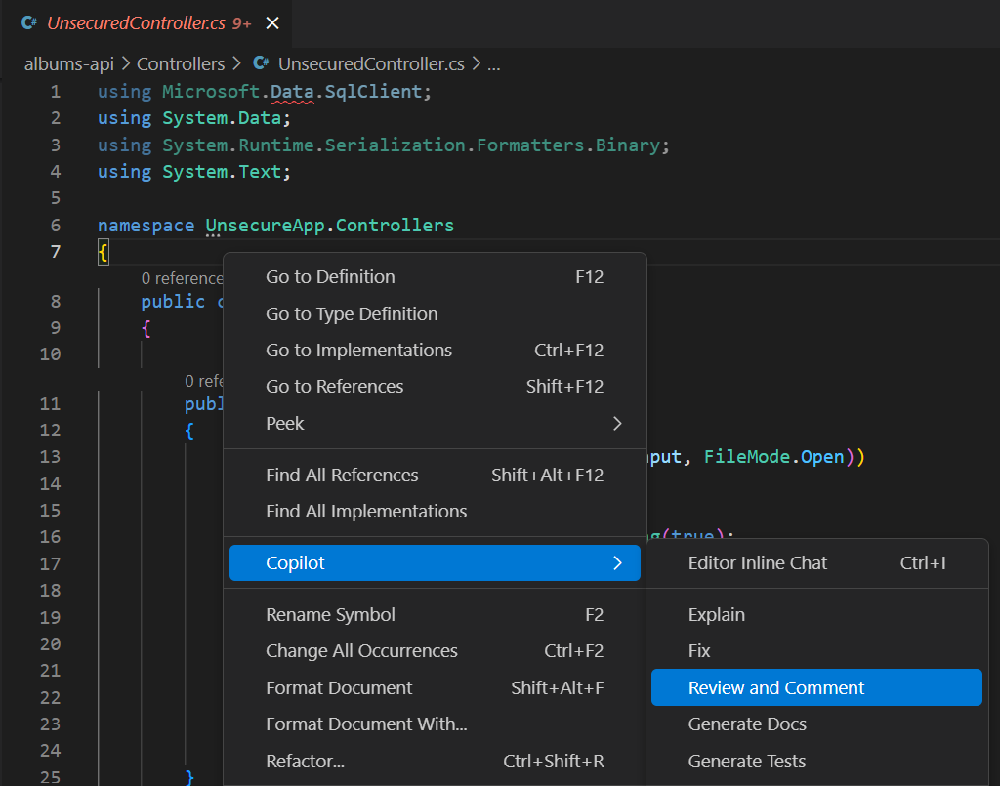

Iniciará una revisión de tu código y proporcionará explicaciones y sugerencias para mejorar tu código que puedes elegir aplicar o no con la misma experiencia de integración de comentarios de revisión de código.

- en rojo abajo: Comentario y sugerencias de Copilot con botones para aceptar o descartar directamente el cambio e ir al siguiente comentario
- en verde abajo: Todos los comentarios mostrados en la lista "Comments" en VS Code


---

# Nivel 3: Modo Edit y Agents de Copilot

## Modo Edit

El Modo Edit de GitHub Copilot redefine la forma en que codificas con Copilot al pasar de un modo `AI Infused` a un enfoque `AI-Native`. Lo que significa es que en lugar de solo responder preguntas, Copilot está tomando acciones, y ahora es capaz de lograr tareas más complejas, de múltiples pasos.

Es muy potente para tareas que necesitan muchas operaciones mientras se mantiene el seguimiento y contexto a largo plazo, como la refactorización de código por ejemplo. ¡Probémoslo!

<div class="warning" data-title="nota">

> Esta funcionalidad está disponible solo en **VS Code**, **Visual Studio** y **JetBrains IDEs** por el momento

</div>

### Generación de Código

Empecemos reconstruyendo la webapp existente, que es muy básica, usando un framework más potente como Vue por ejemplo.

Después de **hacer commit de tu código**, para mantener un punto de inicio válido al que potencialmente volver, **elimina** la carpeta antigua `album-viewer` y luego Abre la ventana de Copilot en **Modo Edit** o usando el atajo `Ctrl+Shift+I`:

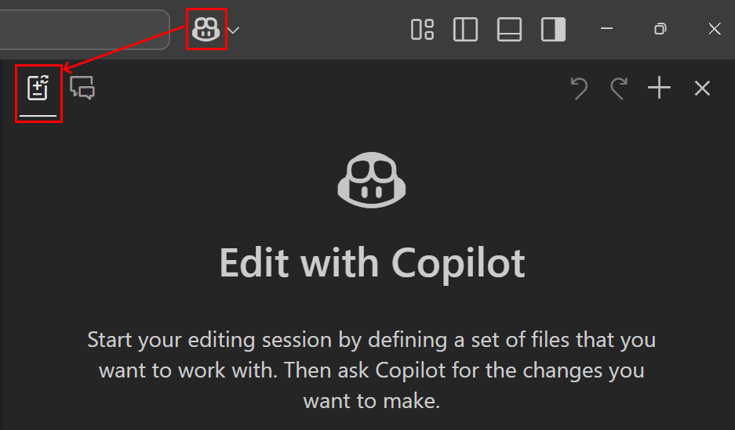

Añade los archivos `AlbumController.cs` y `Album.cs` de la carpeta API en el Working Set, haciendo clic en el botón _Add file_ o simplemente pegándolos, y luego escribe la siguiente solicitud a Copilot Edit:

```text
Crear un proyecto cliente album-app en vuejs con pantalla para listar,
mostrar, crear, actualizar y eliminar álbumes usando la AlbumAPI
```

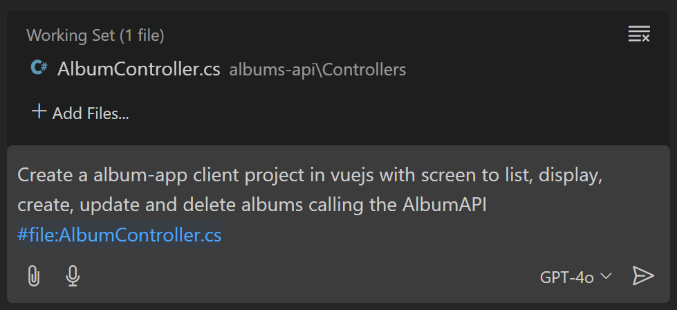

Creará y ejecutará un plan para (probablemente):

- Añadir rutas faltantes al controlador API existente
- crear una nueva aplicación Vue desde cero con todo el código requerido
- proporcionar explicación y detalles de todo el código creado

Cuando el trabajo esté hecho verás un conjunto de trabajo enriquecido con todos los archivos nuevos. Podrás parar ahí simplemente haciendo clic en el botón **Done** para terminar el proceso de edición y mantenerlo, iterar continuando dando instrucciones en la sesión actual, o revertir todo haciendo clic en la flecha **Undo** arriba para volver al estado anterior.

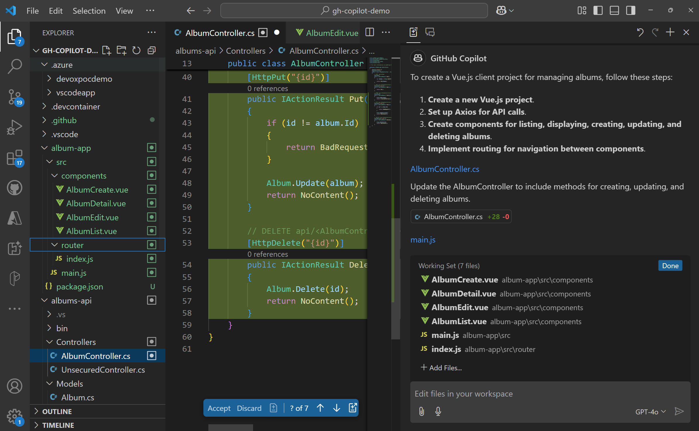

<div class="tip" data-title="consejos">

> El modelo predeterminado de Copilot probablemente ayudará a hacer el trabajo pero también puedes tomar esto como una oportunidad para probar uno diferente, entre los modelos premium aquí para aprovechar más potencia y lograr tareas más complejas. Prueba y forma tu propia opinión sobre tu modelo favorito en los modelos premium como Claude 3.7 o GPT4.5 por ejemplo.

</div>

### Refactorización de código

Ya vimos en el ejemplo anterior que el modo edit es capaz de crear nuevo código pero también refactorizar archivos existentes en el proceso de implementar nuevo comportamiento.

Continuemos explorando esto:

**Añadir un nuevo modelo Artist en la API**

Empecemos una nueva sesión Edit, añade los archivos `AlbumController.cs` y `Album.cs` en el conjunto de trabajo, y edita el código de la API con estas 3 solicitudes consecutivas:

```text
> Añadir la función faltante a la Clase Album

> Añadir un nuevo modelo Artist con propiedades Name, Birthdate, BirthPlace

> Usar la clase Artist en el objeto Album
```

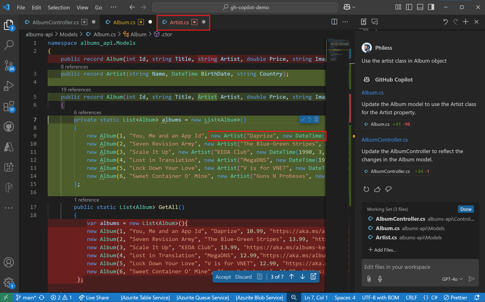

### Generación de tests

Otro caso de uso donde podemos aprovechar este potente modo edit es escribir tests.

Añade los archivos `AlbumController.cs`, `Album.cs` y `Artist.cs` y añadamos algunos tests unitarios para nuestra API:

```text
> Añadir tests unitarios a mi api
```

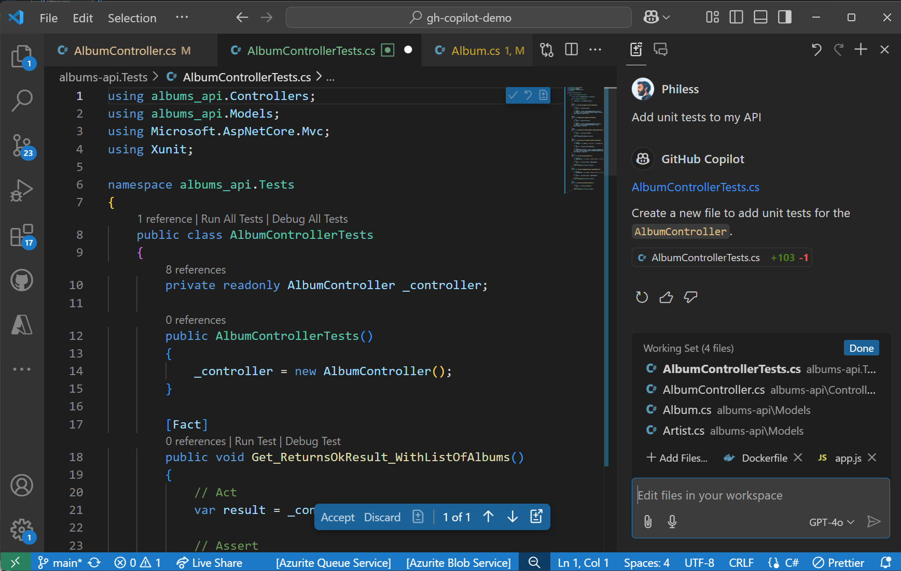

De nuevo, Copilot Edits es muy fuerte para escribir código complejo pero este también es su límite: para el resto, es decir ejecutar comandos, instalar paquetes, ejecutar tests, etc. puede darte las instrucciones pero tendrás que tomar el control.

**¿Y si... pudiera hacer todo eso por ti?**

## Modo Agents

El modo Agent es la evolución del modo edit, con capacidades para ejecutar directamente comandos en la terminal y corregir errores sobre la marcha además de solo editar código. Acelera aún más el proceso de codificación. Como una acción vale más que mil palabras, empecemos reconstruyendo la API esta vez, y tienes la elección del stack.

<div class="warning" data-title="nota">

> Esta funcionalidad está disponible solo en **VS Code** por el momento.

</div>

### Paso 1: Reescribir la API desde cero

Aquí hay un ejemplo en NodeJS pero puedes probarlo en Java o Python o cualquier otro stack que prefieras.

De nuevo, después de **hacer commit de tu código**, para mantener un nuevo punto de inicio al que potencialmente volver, **elimina** la carpeta antigua `album-api` y luego Abre la ventana de Copilot en Modo Edit pero luego selecciona el modo `Agent`:

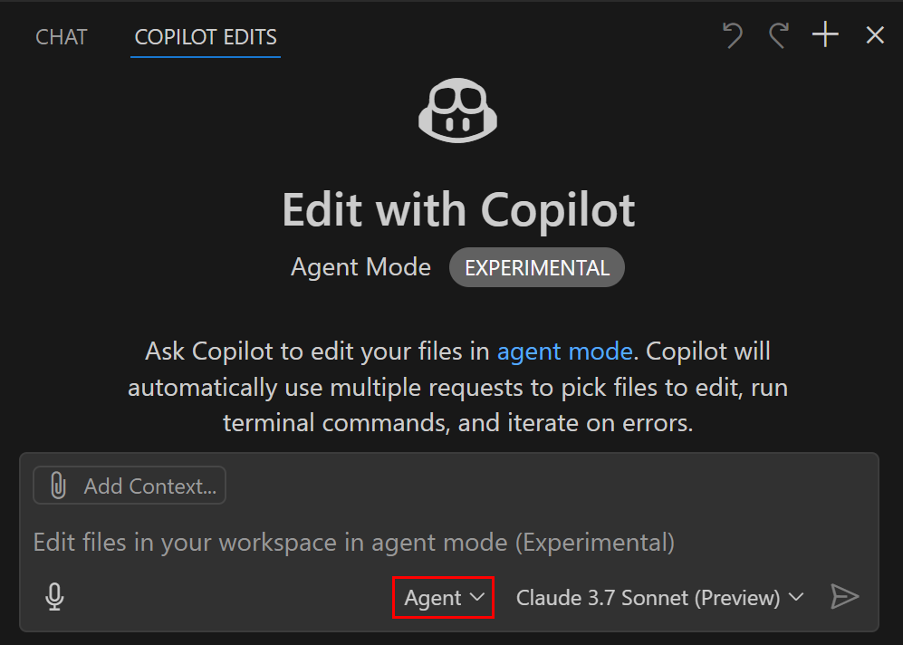

Luego escribe:

```text
Crear una nueva api nodejs llamada album-api para gestionar álbumes de música.
Crear todas las rutas básicas para listar, obtener, añadir, actualizar y eliminar álbumes.

Crear una colección con datos de ejemplo.
Los datos se mantienen en memoria por el momento sin necesidad de base de datos.

Añadir tests unitarios y ejecutarlos
```

Sigue los pasos, valida cada paso para continuar o da diferentes instrucciones a lo largo del camino para ver a los agentes trabajando para ti. Cuando termine, deberías tener **una nueva API que puede ejecutarse con todos los servicios, datos de ejemplo e incluso tests unitarios** y Copilot listará todas las acciones completadas. Desde ahí, puedes elegir:

- **Keep** cambios para validar este conjunto de modificaciones
- **Undo** para revertir a antes de este conjunto de modificaciones
- **Dar nuevas instrucciones** y continuar iterando

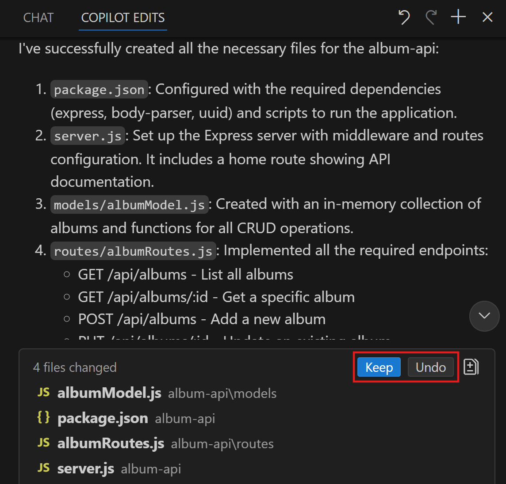

El último paso antes de hacer commit y compartirlo con tu equipo es documentar. Intenta pedir esto a Copilot de nuevo:

```text
¿puedes añadir las instrucciones a un archivo readme.md?
```

Haz clic en `Keep` y `Done` para validar tu modificación y haz commit de tus cambios.

### Paso 2: Crear una nueva web app

Ahora que tenemos una nueva API, aprovechemos la oportunidad para reescribir nuestra app frontend, basada en esta nueva API.

Primero, **elimina** la carpeta antigua `album-app`, inicia una nueva sesión en `Modo Agent` y escribe (referencia tus archivos creados en contexto):

```text
Crear una nueva app Vue llamada album-app para gestionar álbumes de música, usando la album api #file:albumRoutes.js #file:albumModel.js
Crear una pantalla de bienvenida, una vista para todas las rutas, y un menú hamburguesa para navegar.
```

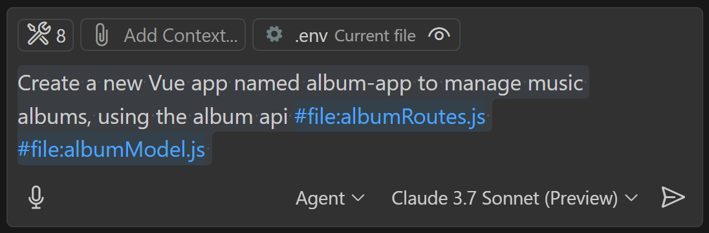

<!-- ### Depurar con modo agent y Visión

Digamos que al ejecutar tu app, tienes un mensaje de error como este: -->

---

# Créditos Extra 🪙

Bien hecho, ¡llegaste hasta el final! :)

Si quieres más desafíos, más detalles y casos de uso específicos, aquí hay una lista de gran contenido para ti:

- [Tutorial definitivo de GitHub Copilot](https://aka.ms/github-copilot-hol) La versión más larga de este workshop, profundizando en detalles, casos de uso y funcionalidades
- [Copilot Adventures](https://github.com/microsoft/CopilotAdventures)
  Una serie de aventuras de código en mundos fantásticos donde Copilot será tu mejor aliado
- [Zero2Hero](https://github.com/Azure-Samples/zero2hero)
  Un conjunto de desafíos cortos para probar tu habilidad con GitHub Copilot

- [Mastering GitHubCopilot for paired programming](https://github.com/microsoft/Mastering-GitHub-Copilot-for-Paired-Programming)
  Un conjunto de lecciones enfocadas en tecnología para desarrolladores, compartiendo mejores prácticas y recetas para abordar tareas de código, SQL, despliegue y modernización con GitHub Copilot
