<div class="info" data-title="🌐 Language / Idioma">

> [🇬🇧 English](/workshop/workshop.md) | **Español** (actual)

</div>

# El tutorial definitivo de GitHub Copilot para desarrolladores

_Versión 1.4 - Noviembre 2025_

El objetivo de este workshop es aprender a usar GitHub Copilot, mediante un ejercicio que consiste en construir un servidor web usando Node.js con diferentes funcionalidades y una API Web en .NET. En la segunda parte, aprenderás a usarlo para infraestructura como código y también para corregir malas prácticas desde un punto de vista de seguridad.

GitHub Copilot es un asistente de código potenciado por IA que ayuda a los desarrolladores a escribir mejor código más rápido. Utiliza modelos de aprendizaje automático entrenados con miles de millones de líneas de código para sugerir líneas completas o funciones enteras basándose en el contexto de lo que estás trabajando. Al usar GitHub Copilot, puedes aprender a escribir mejor código y mejorar tu productividad.

<div class="warning" data-title="advertencia">

> GitHub Copilot es un producto en continua evolución y por lo tanto este workshop puede no estar 100% actualizado con las diferentes funcionalidades de las extensiones que vas a usar.

</div>

## Pre-requisitos Mínimos

Hay dos formas de ejecutar este workshop:

- online con **GitHub Codespaces**: la forma más rápida y fácil de empezar a practicar inmediatamente con un entorno alojado listo en segundos.

- localmente en **tu ordenador**: la mejor forma de instalar y configurar las herramientas que necesitas para trabajar con GitHub Copilot en todos tus proyectos.

Estos son los pre-requisitos mínimos para ejecutar este workshop:

|                                     |                                                                                 |
| ----------------------------------- | ------------------------------------------------------------------------------- |
| Una cuenta de GitHub                | [Crear cuenta gratuita de GitHub](https://github.com/join)                      |
| Licencia de GitHub Copilot activada | Obtener acceso a GitHub Copilot (sección siguiente)                             |
| Un navegador web                    | [Descargar Microsoft Edge](https://www.microsoft.com/edge) o cualquier otro ;-) |

## Obtener Acceso a GitHub Copilot

Hay diferentes formas de obtener acceso a GitHub Copilot:

- **Como individuo**, puedes registrarte para usar [Copilot Free](https://github.com/github-copilot/signup), sin necesidad de tarjeta de crédito. Tienes derecho a un número limitado de auto completados e interacciones de chat por mes con el plan gratuito, que se reinician cada mes. Aprende más sobre los [detalles y condiciones del plan Copilot Free](https://docs.github.com/en/copilot/about-github-copilot/subscription-plans-for-github-copilot).

- **Como individuo**, regístrate para una [suscripción de pago](https://github.com/github-copilot/signup/copilot_individual) para obtener completados e interacciones de chat ilimitados. Puedes probar GitHub Copilot gratis con una prueba única de 30 días.

- **Como miembro de una organización o empresa** que tiene una suscripción a GitHub Copilot, puedes solicitar acceso a Copilot yendo a [https://github.com/settings/copilot](https://github.com/settings/copilot) y solicitando acceso bajo "Get Copilot from an organization."

## Hacer Fork del Repositorio

Este workshop utiliza el siguiente repositorio de GitHub: [GitHub Copilot Demo](https://github.com/Philess/gh-copilot-demo)

Este repositorio es un código inicial que te ayudará a experimentar todas las capacidades de GitHub Copilot.

Comienza creando **tu propio fork** del repositorio haciendo clic en el botón `Fork` en la parte superior derecha de la página del repositorio. Esto creará una copia del repositorio en tu propia cuenta de GitHub y serás libre de hacer cualquier cambio que desees.


## OPCIÓN 1: Trabajar con GitHub Codespaces

El entorno ya está configurado para trabajar con [GitHub Codespaces](https://github.com/features/codespaces), puedes encontrar los archivos de configuración en la carpeta _.devcontainer_.

Para empezar a programar simplemente inicia un nuevo codespace y estarás listo, no necesitas instalar nada.

<div class="info" data-title="nota">

> Todos los usuarios individuales de GitHub tienen un plan gratuito para ejecutar el codespace que te permite probarlo con 120 horas-núcleo gratis por mes [Ver Precios](https://github.com/settings/billing/summary)

</div>


Después de solo unos segundos, serás redirigido a tu entorno Codespace, un entorno de desarrollo completo listo para usar en el navegador.
**Puedes empezar a programar de inmediato**, tus extensiones de GitHub Copilot ya están instaladas y configuradas.

Para una experiencia aún mejor, y si tienes VS Code instalado en tu máquina local, puedes abrir el Codespace en tu Visual Studio Code local haciendo clic en el botón `Open in VS Code` en el menú superior izquierdo de tu interfaz Codespace.
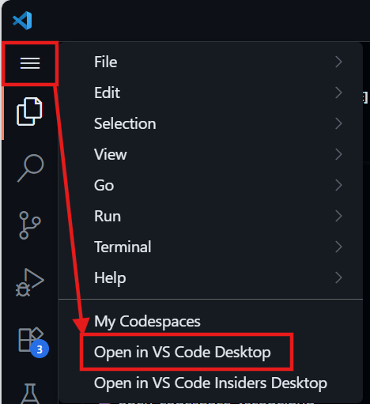

Una vez creado el Codespace, podrás elegir si quieres abrir el codespace en el navegador o en tu VS Code local directamente desde la página del repositorio de GitHub.

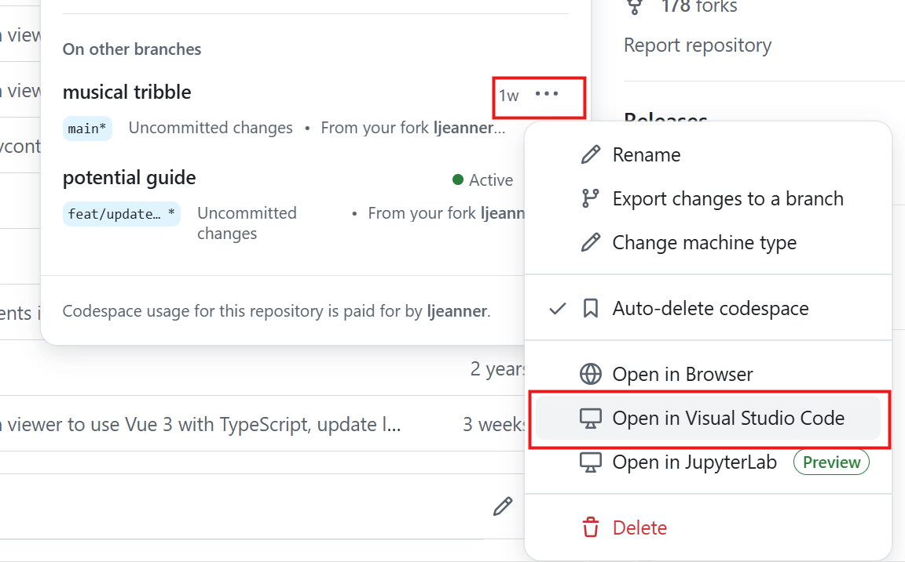

## OPCIÓN 2: Trabajar localmente

Puedes elegir trabajar localmente en tu ordenador para este workshop y aprovechar para instalar y configurar las herramientas que necesitarás para trabajar con GitHub Copilot en tus proyectos.

<div class="info" data-title="nota">

> **Opción rápida con Dev Container:** Si tienes **Docker** o **Podman** instalado en tu máquina local, puedes abrir este repositorio dentro de un Dev Container y aprovechar la misma configuración que usa GitHub Codespaces. Esto te proporciona un entorno de desarrollo completamente aislado y consistente sin necesidad de instalar todas las herramientas manualmente.
>
> Para hacerlo, debes tener instalada [la extensión Dev Containers](https://marketplace.visualstudio.com/items?itemName=ms-vscode-remote.remote-containers), y después simplemente abre el repositorio en VS Code y cuando se te solicite, selecciona la opción **"Reopen in Container"**. VS Code automáticamente detectará la configuración en la carpeta `.devcontainer` y creará el contenedor con todas las dependencias necesarias preinstaladas.
>
> Si no tienes esta posibilidad, sigue leyendo para la instalación manual.

</div>

### Instalación manual

Para poder trabajar localmente necesitas instalar las siguientes herramientas localmente:

1. Instalar [Visual Studio Code](https://code.visualstudio.com/)
2. Instalar la extensión [GitHub Copilot](https://marketplace.visualstudio.com/items?itemName=GitHub.copilot)
3. Instalar la extensión [GitHub Copilot Chat](https://marketplace.visualstudio.com/items?itemName=GitHub.copilot-chat)
4. Instalar [Node y npm](https://docs.npmjs.com/downloading-and-installing-node-js-and-npm)
5. Instalar [.NET](https://dotnet.microsoft.com/download) \* _necesario si quieres ejecutar el código .NET proporcionado_
6. Clonar tu repositorio fork y abrirlo en VS Code:

```bash
git clone https://github.com/<TuUsuario>/gh-copilot-demo
cd gh-copilot-demo
code .
```

Finalmente, necesitas iniciar sesión en tu cuenta de GitHub en Visual Studio Code para activar las extensiones de GitHub Copilot. Las extensiones te pedirán iniciar sesión, pero si no ves el aviso, puedes iniciar sesión haciendo clic en el icono de usuario en la barra lateral inferior izquierda donde verás los inicios de sesión para GitHub y GitHub Copilot Chat.


## ¿Cómo ejecutar el código?

Todo está detallado en el archivo **README.MD** en la carpeta raíz del repositorio de código.

Dale un vistazo, y asegúrate de ejecutar al menos la aplicación front-end antes de continuar, será obligatorio para completar el tutorial.

## Ayúdanos a mejorar este Workshop

Si encuentras algún error al ejecutar este workshop, por favor háznoslo saber. Tu ayuda es muy importante para hacer este workshop mejor, especialmente mientras intentamos mantenerlo actualizado regularmente.

[Reporta cualquier incidencia aquí.](https://github.com/Philess/GHCopilotHoL/issues/new)

---

# Nivel 1: Autocompletado de Código con GitHub Copilot

Esta sección te guiará a través de los primeros pasos con GitHub Copilot, comenzando con el autocompletado de código. Aprenderás qué puedes hacer y cómo usarlo a su máximo potencial.

## Empieza a Practicar con el Autocompletado de GitHub Copilot

Una vez que empiezas a escribir un prompt y Copilot genera propuestas, puedes usar los siguientes atajos para interactuar con Copilot:

<ul>
<li>`tab` para aceptar la sugerencia actual completamente (`más común`)</li>
<li>`ctrl + flecha derecha` para aceptar palabra por palabra la sugerencia (`para uso parcial`)</li>
<li>`alt + ^` para moverse a la siguiente sugerencia</li>
<li>`shift + tab` para volver a la sugerencia anterior</li>
<li>`ctrl+enter` para mostrar el panel de Copilot</li>
</ul>

<div class="info" data-title="info">

> Estos atajos son los predeterminados para VS Code. Si estás usando otro IDE, puedes encontrar los atajos en la [documentación de GitHub Copilot](https://docs.github.com/en/copilot/getting-started-with-github-copilot/).

<div>

### Cambiar el modelo de autocompletado

Es posible cambiar del modelo de autocompletado estándar de GitHub Copilot a otro. El modelo de autocompletado ha sido específicamente entrenado en más de 275,000 repositorios públicos de alta calidad en más de 30 lenguajes de programación populares, incluyendo JavaScript, TypeScript, Python, Java, C#, C++, y muchos más para mejores resultados. Sin embargo, puedes cambiar a otro modelo si tu administrador ha activado esta función, de lo contrario solo tendrás disponible el más reciente.

En **VS Code** para verificar la configuración del modelo de autocompletado, abre el menú de Copilot en la barra de título de VS Code, selecciona `Configure Inline Suggestions...` > `Change Completions Model...`.

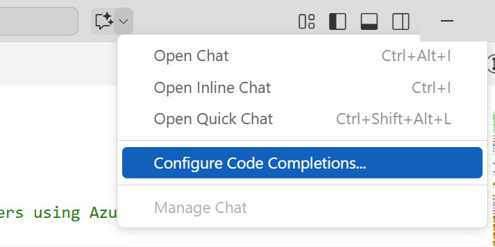


<div class="info" data-title="info">

> Estas instrucciones son para VS Code. Si estás usando JetBrains u otro IDE soportado, puedes encontrar instrucciones en la [documentación de GitHub Copilot](https://docs.github.com/en/copilot/using-github-copilot/ai-models/changing-the-ai-model-for-copilot-code-completion?tool=jetbrains).

<div>

## Empecemos con lo básico

### Escribir código

**¿Qué es un prompt?**
En el contexto de Copilot, un prompt es una descripción en lenguaje natural utilizada para generar sugerencias de código. Puede ser una descripción de una sola línea o de múltiples líneas.

**Generar código desde un prompt**

Crea un nuevo archivo `album-viewer/src/utils/validators.ts` y prueba los siguientes prompts para ver las diferentes sugerencias:

```ts
// función llamada `validateDate` que valida una fecha desde una entrada de texto en formato francés y la convierte en un objeto fecha.
```

Copilot también puede ayudarte a escribir Expresiones Regulares. Prueba lo siguiente:

```ts
// función que valida el formato de una cadena GUID.
```

```ts
// función que valida el formato de una dirección IPV6 y se llama `validateIPV6`.
```

<br>

**Generación de código más complejo**

En el archivo `albums-api/Controllers/AlbumController.cs` intenta completar el método `Get(int id)` reemplazando el return actual:

```cs
// GET api/<AlbumController>/5
[HttpGet("{id}")]
public IActionResult Get(int id)
{
    //aquí
}
```

En el mismo archivo puedes mostrar otros prompts como:

```cs
// función que recupera álbumes y los ordena por título, artista o precio
```

### Sugerencia de siguiente edición

_La sugerencia de siguiente edición_ es una evolución del autocompletado estándar en GitHub Copilot. Cuando estás modificando código y aceptas una sugerencia de código, si puede tener un impacto en otra parte de tu código, automáticamente sugerirá el siguiente cambio en tu código, y no solo directamente donde está tu cursor, sino también anticipando dónde podría estar tu próxima edición.

Un ejemplo es mejor que mil palabras, ¡así que probémoslo!

Abre el archivo `albums-api/Models/Album.cs` y, en el constructor de Album, añade un nuevo parámetro de entrada `Year` de tipo `int` y observa cómo la Sugerencia de Siguiente Edición propone cambiar el cuerpo del método correspondiente:


## Tareas cotidianas del desarrollador

### Escribir Tests

Copilot puede ayudar a generar todo tipo de tests que se escriben con código. Esto incluye `tests unitarios`, `tests de integración`, `tests end to end`, y tests de `carga` con scripts de JMeter por ejemplo.

- Añade un nuevo archivo `validators.test.ts` en `albums-viewer/src/utils` junto al archivo creado anteriormente.

- Para recibir una buena sugerencia de test, debes proporcionar información básica a Copilot, como el framework de testing que quieres usar:

```ts
import { describe }
```

Cuando empiezas a escribir la función `describe`, Copilot verá que estás en un archivo de test TypeScript (\*.ts) y porque el proyecto usa la herramienta Vite, sugerirá la importación de las funciones `describe` e `it` desde vitest, que es un framework de testing comúnmente usado con aplicaciones VueJS/Vite.

```ts
import { describe, expect, it } from "vitest";
```

¡Ya tienes tu framework de testing en su lugar!

Copilot puede pasar a sugerir la importación de validators desde el archivo `validators.ts` porque está en la misma carpeta. Podría sugerir algo como lo siguiente:

```ts
import { validateAlbumId } from "./validators";
```

Se ve bien pero porque Copilot no tiene acceso a todo tu código, solo la pestaña abierta e información limitada, puedes ver que tanto la ruta como el nombre de la función están mal.
<br>
... Al menos lo intentó ...
<br>
pero es una buena forma de mostrar que Copilot no es magia y tienes que usarlo con las otras funcionalidades de tu IDE y tu cerebro :)

- Empieza a escribir `import { validateDate }` y acepta la sugerencia automática del IDE o usa el atajo `ctrl+space`.

- Importa tanto `validateDate` como `validateIPV6`.

- Luego, añade un comentario con la primera función que quieres probar y deja que ocurra la magia:

```ts
import { describe, expect, it } from "vitest";
import { validateDate, validateIPV6 } from "./validators";

// probar la función validateDate
```

¡Boom!

Deberías ver algo como lo siguiente (pero tu test puede variar):

```ts
describe("validateDate", () => {
  it("should return a date object when given a valid date string", () => {
    const date = "01/01/2019";
    const expectedDate = new Date(2019, 0, 1);
    expect(validateDate(date)).to.deep.equal(expectedDate);
  });

  it("should throw an error when given an invalid date string", () => {
    const date = "invalid-date";
    expect(() => validateDate(date)).to.throw();
  });
});
```

_Puedes añadir otros bloques `it` para agregar más casos de prueba y también añadir los tests para las otras funciones. Por ejemplo, intenta añadir un nuevo bloque `it` para la función validateDate para probar que lanza un error cuando se le da una cadena vacía._

### Escribir workflows de CI

Copilot te ayudará a escribir tus archivos de definición de pipelines para generar el código para los diferentes pasos y tareas. Aquí hay algunos ejemplos de lo que puede hacer:

- generar un archivo de definición de pipeline `desde cero`
- acelerar la escritura de un archivo de definición de pipeline `generando el código` para los diferentes `pasos`, `tareas` y `fragmentos de script`
- ayudar a `descubrir tareas y extensiones del marketplace` que coincidan con tu necesidad

En esta sección añadirás prompts a tus workflows para generarlos paso a paso.

#### Paso 1: Generar desde cero

- Crea un nuevo archivo `workflow.yml` en la carpeta `.github/workflows` del proyecto y empieza a escribir el siguiente prompt:

```yml
# Workflow de GitHub Action que se ejecuta en push a la rama main
# Docker build y push de la imagen album-api a ACR
```

Copilot generará el pipeline bloque por bloque. Al generar YAML de pipeline, puede que necesites presionar `Enter` para moverte a una nueva línea para provocar la generación del siguiente bloque y `Tab` para validarlo, lo cual es más frecuente comparado con otros tipos de código.

A menudo generará una tarea con algunos errores provenientes de mala indentación o comillas faltantes alrededor de un nombre de tarea. Puedes arreglar esto fácilmente con tu IDE y tus habilidades de desarrollador :)

#### Paso 2: Añadir tareas desde prompts

- Probablemente tienes un workflow de GitHub Action con al menos una tarea de "login" a tu registro de contenedores y una tarea de "docker build and deploy". Añade un nuevo comentario después de esas tareas para etiquetar la imagen docker con el run id de GitHub y subirla al registro:

```yml
# etiquetar la imagen con el run id de GitHub y subir a docker hub
```

puedes jugar con otros prompts como:

```yml
# ejecutar tests en la imagen album-api

# desplegar la imagen album-api al cluster AKS de desarrollo
```

#### Paso 3: Añadir scripts desde prompts

- Copilot también es muy útil cuando necesitas escribir scripts personalizados como el siguiente ejemplo:

```yml
# encontrar y reemplazar %%VERSION%% por el run id de GitHub action en cada archivo appmanifest.yml
```

### Infraestructura como Código

Copilot también puede ayudarte a escribir Infraestructura como código. Puede generar código para `Terraform`, `ARM`, `Bicep`, `Pulumi`, etc... y también `archivos de manifiesto de Kubernetes`.

#### Bicep

Abre el archivo `main.bicep` en la carpeta `iac/bicep` y empieza a escribir prompts al final del archivo para añadir nuevos recursos:

```js
// Container Registry

// Recurso Azure Open AI
```

#### Terraform

Abre el archivo `app.tf` en la carpeta `iac/terraform` y empieza a escribir prompts al final del archivo para añadir nuevos recursos:

```yml
# Container Registry

# Recurso Azure Open AI
```

## Tareas grandes vs tareas pequeñas

Copilot probablemente siempre será más efectivo con prompts para generar piezas de código pequeñas pero precisamente descritas en lugar de una clase completa con un único prompt de múltiples líneas.

El autocompletado de Copilot es aún más efectivo cuando lo usas para generar pequeñas piezas de código paso a paso. Para tareas más complejas, veremos en la siguiente sección que Copilot Chat es más potente.

Esto es porque el autocompletado debe ser casi "instantáneo" para ser natural de usar, mientras que una solicitud de chat puede tomar unos segundos en procesarse sin ser molesta.

<div class="tip" data-title="consejo">

> La mejor estrategia para generar grandes piezas de código, es siempre empezar por la estructura básica de tu código con un prompt simple y luego añadir pequeñas piezas una por una.

</div>

**Prompts grandes que _podrían_ funcionar**

- De vuelta en `albums-viewer/src/utils` añade un nuevo archivo `viz.ts` para crear una función que genere un gráfico. Aquí hay un ejemplo de prompt para hacer eso:

```ts
// generar un gráfico con D3.js del precio de venta del álbum por año
// el eje x son las series de meses y el eje y muestra el número de álbumes vendidos
// los datos de las ventas de álbumes se cargan desde una fuente externa y están en formato json
```

<div class="info" data-title="info">

> Copilot probablemente intentará completar el prompt añadiendo más detalles. Puedes intentar añadir más detalles tú mismo o seguir las sugerencias de Copilot. Cuando quieras que pare y empiece a generar el código simplemente salta a otra línea y deja que Copilot haga su trabajo.

</div>

- Una vez que logres generar el código para el gráfico probablemente veas que tu IDE te advierte sobre el objeto d3 que es desconocido. Para eso también Copilot ayuda.

Vuelve al inicio del archivo y empieza a escribir `import d3` para dejar que Copilot autocomplete

```ts
import d3 from "d3";
```

Mira lo que Copilot ha sido capaz de generar. Es posible que el código funcione bien y haga todo lo que pediste pero con algún comportamiento no deseado o lógica que no esperabas.

En cualquier caso probablemente no será perfecto y tendrás que arreglar algunos problemas pero siempre será más complicado controlar el código cuando estás generando grandes piezas de código con instrucciones muy básicas.

Es porque Copilot para autocompletado no está hecho para lograr trabajo complejo de una vez sino más como una herramienta de escritura predictiva para desarrolladores. Es una buena práctica cortar tareas grandes en pequeñas piezas que escribes paso a paso.

**Inténtalo de nuevo construyéndolo paso a paso**

Intenta generar el código para el gráfico cortándolo en pequeñas piezas siguiendo los pasos siguientes:

```ts
import * as d3 from "d3";

// cargar los datos desde un archivo json y crear el svg de d3 en la función then
```

Dentro de la función then, empieza configurando lo básico del gráfico

```ts
// crear el svg
```

```ts
// crear las escalas para los ejes x e y
// el eje x son las series de meses y el eje y muestra el número de álbumes vendidos
```

```ts
// crear ejes para los ejes x e y
```

Desde ahí puedes simplemente pedir a Copilot que complete el gráfico

```ts
// generar un gráfico de líneas basado en los datos de ventas de álbumes
```

<div class="tip" data-title="consejo">

> **Siempre** obtendrás mejores resultados cortando tareas grandes en pequeños fragmentos con el autocompletado de Copilot. También es una buena forma de mostrar que Copilot no es magia y tienes que usarlo con las otras funcionalidades de tu IDE y tu lógica de desarrollador.

</div>

## Misión Secundaria #1: Generar comentarios de Git Commit

Sí, escribir un comentario debería ser obligatorio y los desarrolladores tienden a ser perezosos. GitHub Copilot puede ayudar con eso.

1. Simplemente edita cualquier archivo añadiendo contenido relevante.

2. En el panel de Git commit, haz clic en el pequeño botón mágico a la derecha

   

3. Mira el mensaje de git commit que Copilot ha generado para ti

   

## Misión Secundaria #2: Escribir documentación

Como has visto, GitHub Copilot puede entender un prompt en lenguaje natural y generar código. Copilot también puede generar documentación porque es otra forma de lenguaje natural. Copilot también puede `entender código y explicarlo en lenguaje natural` para ayudarte a entender y documentar tu código.
Así que puede ayudarte en todas tus tareas de documentación. Puede generar comentarios de documentación simples o comentarios de documentación estandarizados como JavaDoc, JsDoc, etc... también puede ayudarte a traducir tu documentación a diferentes idiomas. Veamos cómo funciona.

### Comentario de documentación simple

Para ver cómo Copilot puede generar documentación, simplemente pon tu puntero encima de una Clase, un método o cualquier línea de código y empieza a escribir el manejador de comentarios para el lenguaje seleccionado para activar Copilot. En lenguajes como Java, C# o TS por ejemplo, simplemente escribe `// `y deja que ocurra la magia.

Aquí hay un ejemplo en el archivo `album-viewer/src/App.vue`. Inserta una línea y empieza a escribir "//" en la línea 40 antes de la función `fetchAlbums` para generar documentación similar al ejemplo siguiente "Fetch albums from the API":

```js
// Fetch albums from the API
const fetchAlbums = async (): Promise<void> => {
  try {
    loading.value = true
    error.value = null
    const response = await axios.get<Album[]>('/albums')

```

Continúa jugando con ello y mira qué pasa en otras piezas de código.

### Comentario de documentación estandarizado (JavaDoc, JsDoc, etc...)

Para este, para activar la generación de comentarios de documentación, necesitas respetar el formato de comentario específico:

- `/**` (para JS/TS) en el archivo `index.js` por ejemplo
- `///` para C# en el archivo `AlbumController.cs` de `albums-api` por ejemplo

```cs
/// <summary>
/// AlbumController es responsable de manejar solicitudes HTTP relacionadas con álbumes.
/// Proporciona endpoints para recuperar todos los álbumes, un álbum específico por ID, y ordenar álbumes por nombre, artista o género.
/// </summary>
public class AlbumController : ControllerBase
```

### Escribir documentación Markdown y HTML

Copilot también es muy potente ayudándote a escribir documentación. Puede generar código `markdown` y `html` y acelerar la escritura de tus archivos README.md por ejemplo.

<div class="warning" data-title="importante">

> El autocompletado está desactivado por defecto en archivos markdown y texto. Puedes activarlo haciendo clic en el icono de Copilot en la esquina inferior derecha de tu IDE y seleccionar `Enable for Markdown` o `Enable for Plain Text`.

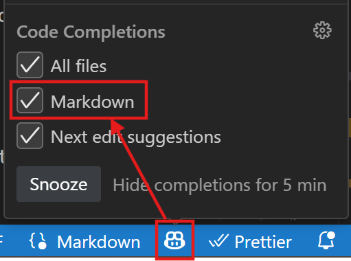

</div>

Puedes demostrar esto creando un nuevo archivo `DOCS.md` en la raíz del proyecto y empezando a escribir el siguiente prompt:

```md
# Documentación de GitHub Copilot

Esta documentación está generada con GitHub Copilot para mostrar lo que la herramienta puede hacer.

##
```

Desde ahí, al comenzar una nueva línea con un título de segundo nivel empezará a generar el contenido de la documentación y mostrará cómo acelerará el proceso de escritura de documentación.

---

# Nivel 2: Usar Copilot Chat para Mejorar la Calidad del Código

GitHub Copilot es una IA generativa y por lo tanto es perfecto para generar código y documentación. También tiene potentes capacidades de análisis y puede usarse para varios casos de uso de análisis para mejorar la calidad del código como: encontrar problemas de seguridad y malas prácticas en tu código antes de sugerir y generar una solución para cada uno de estos problemas.

## Empieza a Practicar con Copilot Chat

Una vez que Copilot Chat está configurado, puedes empezar a usarlo:

- haciendo clic en el **Icono de Copilot** arriba junto a la barra de búsqueda _o_ presionando el atajo `Ctrl` + `Shift` + `i` para abrir la **Vista de Chat**
- presionando el atajo `Ctrl` + `i` para una **pregunta rápida en línea** al chat

La **Vista de Chat** es una versión fija que es útil para mantener el chat abierto y hacer preguntas a Copilot.
El **Chat en Línea** es una forma rápida de hacer una pregunta y obtener una respuesta precisamente en el contexto de la línea en la que estás trabajando.

Veremos ejemplos en las siguientes secciones para dejarte elegir cuál prefieres dependiendo de la situación.

### Vista de Chat

La vista de chat te da una experiencia de chat completa, integrada como cualquier otra vista de herramienta en tu IDE. Una vez que la vista está abierta puedes empezar a chatear con Copilot como tu coach de código personal. Mantiene el historial de la conversación y puedes hacer preguntas relacionadas con las respuestas anteriores. También proporciona sugerencias de preguntas a lo largo del camino. Puedes:

- hacer preguntas generales sobre programación en cualquier lenguaje o mejores prácticas
- pedir generar o arreglar código relacionado con el archivo actual e inyectar el código directamente en el archivo

Es un Copilot de más alto nivel que el Copilot básico que está especializado en proporcionar autocompletado de código.

Pruébalo con algunas preguntas como:

```text
> ¿Cómo puedo generar un número aleatorio en C#?
> ¿Cuál es la mejor forma de asegurar una ruta en ASP.NET Core?
> ¿Cuál es la forma más fácil de generar un sitio web estático con NodeJS?
```

Pruébalo luego con algunos de tus archivos de código en el repositorio. Abre un archivo e intenta preguntar:

```text
> ¿Puedes explicar qué hace este código?
> (con solo parte del código seleccionado) ¿Puedes explicarme qué hace el código seleccionado?
> ¿Puedes generar una función que devuelva un número aleatorio entre 1 y 10?
> ¿Puedes añadir comentarios de documentación a esta función?
```

Prueba también usar las sugerencias de preguntas que aparecen a lo largo del camino.

### Agentes Integrados: Ask, Edit, Plan y Agent

En GitHub Copilot Chat, puedes cambiar entre cuatro agentes integrados: **Ask**, **Plan**, **Edit** y **Agent**. El agente en el que estás se muestra en la vista de chat.


- **Ask**: Este es el agente predeterminado. Te permite hacer preguntas y obtener respuestas de Copilot. También puedes pedir a Copilot que genere código para ti. Puedes cambiar a este modo haciendo clic en el botón **Ask** en la vista de chat.
- **Plan**: El agente plan está optimizado para crear un plan de implementación estructurado para una tarea de codificación. Usa el agente plan cuando quieras dividir una funcionalidad compleja o cambio en pasos más pequeños y manejables antes de la implementación.
- **Edit**: El agente Edit está específicamente optimizado para editar código y trabajar específicamente en un conjunto de modificaciones, en un proceso de múltiples pasos. Es muy potente para generar código de una manera más interactiva y te guiará proporcionando orientación para ejecutar los comandos pero sin ejecutarlos por sí mismo.
- **Agent**: Esta es la versión agéntica (o multi-agente) de **Edit**. Es una versión más avanzada de **Edit** que puede ejecutar comandos por ti, capturar cualquier error, y corregirse antes de continuar con el proceso. Cambia la forma en que el desarrollador construye aplicaciones enfocándose en describir la funcionalidad y dejando que GitHub Copilot genere el código, en lugar de que el usuario escriba el código. Esto es lo que la comunidad llama **Vibe Coding**.

**Plan**, **Agent** y **Edit** se detallan en el siguiente nivel. Este nivel se enfoca en practicar con **Ask**.

### Chat en Línea

GitHub Copilot Chat es muy útil pero para un desarrollador, dejar el teclado y tener que tomar el ratón para abrir la pestaña de Chat puede ser distractor. En su lugar puedes chatear directamente con GitHub Copilot dentro del editor de código junto a tu código y dentro del contexto en el que estás trabajando.

1- Abre cualquier archivo que contenga código

2- Usa el atajo `Ctrl` + `i`. Debería abrir el popup de chat rápido, una pequeña ventana de chat donde pones tu cursor


3- Pide generar algo de código (ej. "Crear una clase C# llamada Toto"). Puedes hacer las mismas acciones que en la vista de chat pero apuntando directamente a una línea de código muy específica. También está más enfocado en generar código y menos en explicaciones.

### Selección de Modelo

Las capacidades de los LLM evolucionan bastante rápido y tendemos a ver más y más modelos específicamente optimizados para diferentes tareas. GitHub Copilot integra múltiples modelos que puedes usar a través de cada uno de los agentes para proporcionar el mejor rendimiento para tu caso de uso.


<div class="tip" data-title="Modelos disponibles">

> La lista de modelos disponibles dependerá de múltiples parámetros:
>
> - qué IDE estás usando
> - qué agente estás usando (Chat / Inline / Edit / Agent)
> - los modelos autorizados por tu Administrador de Copilot

</div>

### Comandos Slash

Para ayudar aún más a Copilot a darte respuestas más relevantes, puedes elegir un tema para tus preguntas a través de "comandos slash".

Puedes anteponer tus entradas de chat con un nombre de tema específico para ayudar a Copilot a darte una respuesta más relevante. Cuando empiezas a escribir `/`, verás la lista de temas posibles:

- **/explain**: Explica paso a paso cómo funciona el código seleccionado.
- **/fix**: Propone una solución para los bugs en el código seleccionado.
- **/help**: Imprime ayuda general sobre GitHub Copilot.
- **/tests**: Genera tests unitarios para el código seleccionado.
- **/vscode**: Preguntas sobre comandos y configuraciones de VS Code.
- **/clear**: Limpia la sesión.
  Se añaden más comandos a medida que el producto evoluciona, así que puedes tener más.

### Participantes del Chat

Los participantes del chat son como expertos especializados que pueden asistirte con tareas específicas. Puedes mencionarlos en el chat usando el símbolo **@**. Actualmente, hay tres participantes de Chat disponibles para Visual Studio Code:

- **@workspace**: Este participante de chat tiene conocimiento sobre el código en tu workspace y puede ayudarte a navegar en él encontrando archivos o clases relevantes. El participante de chat @workspace usa un meta prompt para determinar qué información recopilar del workspace para ayudar a responder tu pregunta.
- **@vscode**: Este participante de chat tiene conocimiento sobre comandos y funcionalidades en el editor VS Code en sí, y puede asistirte en usarlos.
- **@terminal**: Este participante de chat tiene contexto sobre la terminal de Visual Studio Code y su contenido.

Esta lista de agentes puede extenderse instalando extensiones en tu IDE.

¡Probémoslo!

Abre el panel lateral de Chat y escribe \*_@workspace /New_ para especificar que quieres crear un nuevo proyecto. Por ejemplo, intenta crear un proyecto Asp.Net

```text
@workspace /new crear un nuevo proyecto ASP.NET core 9.0, con tres vistas Index, Users y products.
```

Debería crear un proyecto estructurado e incluso un nuevo botón para crear el archivo. Haz clic en "Create workspace" para ver los archivos siendo creados.


### Manipulación de Contexto

Como viste en ejemplos anteriores, pasar el prompt correcto es clave para buenos resultados de Copilot. El otro factor importante es el contexto que estás pasando a Copilot junto con ese prompt.

En el modo Chat o Edit puedes ver los archivos pasados en el contexto por defecto en el campo de chat:


Es posible ignorarlo haciendo clic en el icono de ojo a la izquierda del nombre del archivo.

Pero el poder de la integración de Copilot en tu IDE es proporcionar múltiples tipos de datos en el contexto. Haz clic en el icono de clip en el campo de chat para ver todas las opciones:


Aquí están las principales opciones a tener en cuenta:

- Codebase y File apuntarán a todo o a un archivo específico en tu workspace actual
- Selection apuntará al texto actualmente seleccionado en pantalla
- (Git) Changes se enfocará solo en tus modificaciones pendientes
- Image / Screenshot usará la capacidad de Visión (solo GPT-4o) para añadir contexto visual
- Terminal commands / selection

Dependiendo del IDE, hay otras opciones ya disponibles como:

- Prompt para adjuntar prompts reutilizables
- Obtener datos de la web
- Fallos de Tests para ejecuciones de tests unitarios que han fallado
- Problemas identificados en la ventana de VS Code
- Carpetas, por ejemplo para apuntar a una base de código específica de otro proyecto o framework para obtener las últimas clases o métodos como ejemplos para Copilot.
- otros por venir y probar...

Aquí hay algunos ejemplos básicos para entender cómo funciona. Ejemplos más complejos están disponibles en la parte de **_Nivel 5: Copilot Avanzado_** de este workshop.

Puedes añadir múltiples referencias de contexto en una sola solicitud para refinar el contexto que estás pasando. Siéntete libre de probar algunos de los comandos '/' y combinar con contexto usando '#'. Hemos proporcionado algunos ejemplos a continuación.

**Referenciar un archivo específico**

```text
@workspace /explain #AlbumController
```

Y luego selecciona `AlbumController.cs` para añadir el archivo como referencia.

**Hacer preguntas sobre cambios de git**

```text
> ¿Puedes mostrarme el contenido a añadir en mi changelog respecto a mis #changes actuales?

> ¿Qué #changes actuales podrían causar que mi código falle en tiempo de ejecución?
```

**Apuntar a selección y adjuntar carpeta**

Abre el archivo `AlbumController.cs` y selecciona una o varias funciones. Luego en el chat añade toda la carpeta album-api al contexto **arrastrando y soltando** la carpeta desde el explorador de archivos a la izquierda.

```text
@workspace /explain el código en #selection
```


Mejorará el resultado apuntando a una parte muy específica del código para la acción mientras da un mejor entendimiento del contexto para la tarea adjuntando todo el código en la carpeta de la api.

## Tareas cotidianas del desarrollador

### Escribir Tests

Copilot también puede ayudarte a generar tests para tu código. Puede generar `tests unitarios`, `tests de integración`, `tests end to end`, y tests de `carga` con scripts de JMeter por ejemplo.

Abre el archivo `album-api/Controllers/UnsecuredController.cs` y escribe preguntas como estas en el chat
_¿Por qué no probar primero en línea con `Ctrl + i` y de nuevo con la vista de chat después para ver la diferencia?_

```text
> Genera una clase de tests unitarios para este código
```

También puedes usar Copilot para ayudarte a generar Stubs y Mocks para tus tests.

```text
> Genera un mock para la clase FileStream
> Usa ese mock en los tests unitarios
```

<div class="info" data-title="nota">

> Recuerda que Copilot chat mantiene un registro de las preguntas y respuestas anteriores en la conversación, por eso puedes referenciar el mock y test generados anteriormente fácilmente.

</div>

### Explicación de código y documentación

Puedes usar Copilot Chat para que te explique código. Puede `explicarte el código en lenguaje natural o generar comentarios de documentación para ti`. Probemos eso con los siguientes comandos:

```text
/explain Genera comentarios de documentación para este código
```

Puede ser muy útil para entender código legacy o código que no conoces. Pruébalo con archivos en la carpeta `legacy` del repo.

También puedes usar Copilot para generar documentación a alto nivel ya que domina markdown. Por ejemplo, puedes pedir completar el archivo `README.md` (asegúrate de tener el archivo en el contexto):

```text
> completa mi #file:README.md añadiendo pasos para desplegar la solución en Azure
```

También puedes preguntar a Copilot cuáles son los archivos MD estándar a tener en un proyecto en GitHub y generarlos para ti.

### Refactorización de Código

Más impresionante, Copilot chat puede ayudarte a refactorizar tu código. Puede ayudarte a `renombrar variables, extraer métodos, extraer clases, etc...`.

Puedes probar algunos de estos comandos en el archivo `album-api/Controllers/UnsecuredController.cs`:

```text
> extraer métodos
> crear versión Async de cada método cuando tenga sentido
```

### Traducción de Código

_Copilot puede entender y generar lenguajes naturales y lenguajes de código en ambas direcciones así que combinando todo puedes usarlo para `traducir piezas de código de un lenguaje a otro`_

Para traducir una pieza de código a un lenguaje específico, ábrela y pide al chat que la traduzca a otro lenguaje. Por ejemplo abre el archivo `album-viewer/src/utils/validators.ts` creado en la primera sección dedicada al autocompletado de Copilot y pide traducirlo a C por ejemplo.

En caso de lidiar con código Legacy como COBOL por ejemplo puede ser muy útil. Abre el archivo `legacy/albums.cbl` e intenta traducir el código a Python.

### Asegurar tu código

Copilot puede ayudarte a encontrar problemas de seguridad en tu código y arreglarlos. También puede ayudarte a encontrar malas prácticas en tu código y arreglarlas. Veamos cómo funciona.

Abre el archivo `album-api/Controllers/UnsecuredController.cs` y escribe preguntas como estas en el chat:

```text
> ¿Puedes revisar este código por problemas de seguridad?
> ¿Ves alguna mejora de calidad para hacer en este código?
```

Una vez que tengas la respuesta, puedes pedir arreglar los problemas escribiendo:

```text
> ¿Puedes proponer una solución?
```

Cuando tengas la solución en el código puedes elegir **copiarla o inyectarla directamente en el archivo** pasando el cursor sobre el bloque de código en el chat y seleccionando la opción correcta arriba a la izquierda.

### Depurar con Copilot \*

<div class="warning" data-title="nota">

> Próximamente: VS Code y Visual Studio

</div>

### Pedir a Copilot que revise tu código

También puedes pedir a Copilot que haga una revisión de tu código. Revisará tu código por problemas de seguridad, malas prácticas, etc... y generará comentarios como lo haría un compañero de trabajo en un pull request. Proporciona sugerencias accionables para mejorar la calidad de tu código y asegurar que se sigan las mejores prácticas.

<div class="warning" data-title="nota">

> Esta funcionalidad puede integrarse de diferentes maneras dependiendo de tu IDE pero deberías poder activar la revisión en la vista de cambios de git para todos tus cambios, o como en el siguiente ejemplo solo en un archivo único.

</div>

- Revisar todos tus cambios de git:
  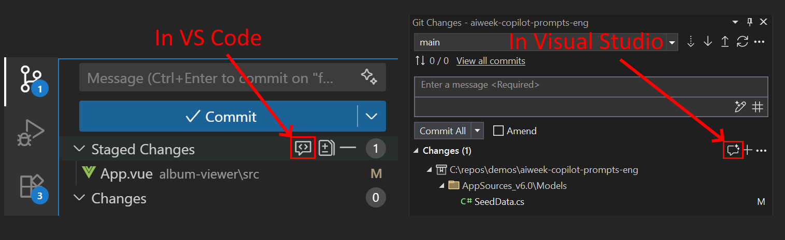

- Revisar en un solo archivo
  Abre de nuevo el `album-api/Controllers/UnsecuredController.cs`, haz clic derecho en la ventana de código, y luego en el menú `Generate` selecciona la opción `Review`.


Iniciará una revisión de tu código y proporcionará explicaciones y sugerencias para mejorar tu código que puedes elegir aplicar o no con la misma experiencia de integración de comentarios de revisión de código.

- en rojo abajo: Comentario y sugerencias de Copilot con botones para aceptar o descartar directamente el cambio e ir al siguiente comentario
- en verde abajo: Todos los comentarios mostrados en la lista "Comments" en VS Code


---

# Nivel 3: Agente Edit de Copilot

El agente Edit en GitHub Copilot apareció primero en VS Code y fue el primer paso en redefinir la forma en que codificas con Copilot al pasar de un modo `AI Infused` a un enfoque `AI-Native`. Lo que significa es que en lugar de solo responder preguntas, Copilot está tomando acciones, y ahora es capaz de lograr tareas más complejas, de múltiples pasos.

Es muy potente para tareas que necesitan muchas operaciones mientras se mantiene el seguimiento y contexto a largo plazo, como la refactorización de código por ejemplo. ¡Probémoslo!

<div class="warning" data-title="nota">

> El agente Edit está disponible solo en **VS Code**. Si sigues este tutorial con otro editor, puedes saltar directamente a la sección Agent.

</div>

### Generación de Código

Empecemos completando la implementación de la API y añadiendo las rutas y métodos faltantes para completar el CRUD de Albums.

Abre la ventana de Copilot Chat y selecciona **Edit** o usando el atajo `Ctrl+Shift+I`:

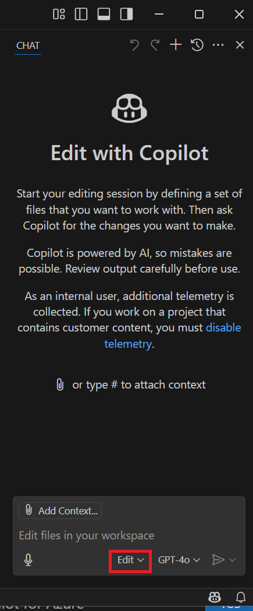

Añade los archivos `AlbumController.cs` y `Album.cs` de la carpeta `albums-api` como contexto para tu prompt, haciendo clic en el botón _Add Context_ o simplemente arrastrándolos y soltándolos en la ventana de chat.
Luego escribe la siguiente solicitud a Copilot Chat Edit:

```text
Completa la AlbumsAPI añadiendo las siguientes rutas
- crear, actualizar y eliminar álbumes
- buscar álbumes por año (añadido anteriormente)
```

Creará un plan de ejecución para (probablemente):

- Añadir rutas faltantes al controlador API existente
- Crear el código para ejecutar las solicitudes de las nuevas rutas
- Proporcionar explicación y detalles de todo el código creado


Cuando el trabajo esté hecho verás un conjunto de trabajo enriquecido con los cambios requeridos. Podrás parar ahí simplemente haciendo clic en el botón **Keep** para terminar el proceso de edición y mantener los cambios. Si deseas continuar iterando, puedes hacerlo continuando dando instrucciones en la sesión Edit, o revertir todo haciendo clic en la flecha **Undo** arriba para volver al estado anterior.

Si faltan algunos archivos, puedes pedir directamente a Copilot que los añada. GitHub Copilot re-evaluará todo el chat y proporcionará el faltante basándose en tu solicitud.

<div class="tip" data-title="consejos">

> El modelo predeterminado de Copilot probablemente ayudará a hacer el trabajo pero también puedes tomar esto como una oportunidad para probar uno diferente, como un modelo premium como Claude 4.5 o GPT5, para aprovechar más potencia y abordar tareas más complejas. Prueba diferentes modelos y forma tu propia opinión sobre cuál es tu modelo favorito.

</div>

### Refactorización de código

Ya vimos en el ejemplo anterior que el modo edit es capaz de crear nuevo código pero también refactorizar archivos existentes en el proceso de implementar nuevo comportamiento.

Empecemos una nueva sesión Edit, añade los archivos `AlbumController.cs` y `Album.cs` en el conjunto de trabajo, y edita el código de la API proporcionando las siguientes solicitudes consecutivas:

```text
Añadir un nuevo modelo Artist con propiedades Name, Birthdate, BirthPlace

Usar la clase Artist en el objeto Album
```


### Generación de tests

Otro caso de uso donde podemos aprovechar este potente modo edit es escribir tests.

Añade los archivos `AlbumController.cs`, `Album.cs` y `Artist.cs` y añadamos algunos tests unitarios para nuestra API:

```text
Añadir tests unitarios a mi api
```


El agente Copilot Edit es muy capaz de escribir código complejo pero tiene una limitación: ejecutar comandos, como ejecutar comandos en la terminal para instalar un paquete, ejecutar tests, etc. El agente Edit puede darte las instrucciones para realizar estas acciones manualmente pero es incapaz de realizarlas por ti. El agente Edit también tiene limitaciones cuando se trata de hacer y planificar un gran número de cambios, o cambios más complejos.

**¿Y si... pudiera hacer todo eso por ti?**

---

# Nivel 4: Copilot Plan y Agent

Agent es la evolución del agente Edit, con todas las capacidades faltantes como:

- ejecutar comandos por ti en la terminal
- corregir errores sobre la marcha
- usar herramientas de servidores MCP para extender capacidades

Puede acelerar el proceso de codificación aún más que el agente Edit, particularmente para cambios más grandes y complejos.

El Agent es una funcionalidad potente de GitHub Copilot, pero como todos sabemos: ¡con gran poder, viene gran responsabilidad! El hecho de que Agent pueda realizar grandes tareas de forma autónoma significa que tenemos que ser aún más cuidadosos con nuestros prompts, o puede que tengamos que deshacer y refactorizar el código que Agent genera si no hemos sido claros con lo que queremos que logre.

Aquí es donde el agente Plan puede ayudar. Puede ayudarnos a crear un plan detallado y especificación que es útil para abordar tareas grandes y complejas, particularmente al completar estas tareas usando Agent. El agente Plan puede ayudar a planificar una tarea grande y dividir la implementación de esta tarea en pasos más pequeños.

Empecemos reconstruyendo la API, y tienes la elección del stack.

### Paso 1: Crear un Plan para reescribir la API desde cero

Aquí hay un ejemplo en NodeJS, pero puedes probarlo en Java o Python, o cualquier otro stack que prefieras.

De nuevo, después de **hacer commit de tu código**, para mantener un nuevo punto de inicio al que potencialmente volver. Haremos una reescritura de nuestra API para migrarla de ASP.Net a NodeJS.

Abre un nuevo Copilot Chat en **agente Plan** y Selecciona un Modelo premium (ej: GPT5, Claude Sonnet 3.7 o 4)

Luego copia el prompt siguiente:

```text
Crear una nueva api nodejs llamada album-api-v2 para gestionar álbumes de música.
Esta es una reescritura de la API anterior `albums-api` en DotNet.
Crear todas las rutas básicas para listar, obtener, añadir, actualizar y eliminar álbumes.

Crear una colección con exactamente los mismos datos de ejemplo de la albums-api anterior.
Los datos se mantienen en memoria y no hay requisito de base de datos.

Escribir el código en TypeScript.

Cuando la aplicación esté construida, iniciarla en el puerto 3000 y configurar las rutas para que coincidan con las llamadas existentes de la App VueJS.

Añadir tests unitarios y ejecutarlos.
```

El agente Plan comenzará completando un análisis detallado del código existente y usará esta información para generar un plan para la nueva API.

Cuando el agente Plan haya terminado, debería presentarte una serie de pasos requeridos para construir la nueva API y también puede preguntarte para que tomes algunas decisiones de implementación. Estas opciones pueden variar pero podrían incluir qué framework de testing usar y aclaraciones sobre cómo implementar la API con el modelo Album y controlador existentes.


Puedes elegir si responder estas preguntas para añadir más detalle al plan. Incluso puedes elegir escribir el plan completo para ver el detalle que el agente Plan ha generado para esta tarea. Si quieres hacer esto, copia lo siguiente:

```text
Escribe el plan completo en formato markdown.
```

### Paso 2: Usar Agent para implementar el plan

Haz clic en **Start Implementation** cuando estés listo para comenzar la fase de implementación. Si elegiste escribir el plan o proporcionaste aclaraciones, puedes proceder con la implementación manualmente seleccionando el "Agent", escribiendo **Start Implementation** y enviando esta solicitud. El plan será 'entregado' al Agent, que implementará este plan de forma autónoma para ti.


Cuando el Agent haya terminado, deberías tener **una nueva API que puede ejecutarse con todos los servicios, datos de ejemplo e incluso tests unitarios**. Copilot listará todas las acciones completadas. Desde ahí, puedes elegir:

- **Keep** cambios para validar este conjunto de modificaciones
- **Undo** para revertir a antes de este conjunto de modificaciones
- **Dar nuevas instrucciones** y continuar iterando


Una vez terminado, verifica que la Aplicación Vue es capaz de trabajar con esa nueva API. No necesitarás cambiar nada del lado de la aplicación ya que pediste que la API se ejecute en el mismo puerto.

En este paso, si hay algún error, pide ayuda a Copilot para arreglarlo. Si todo funciona bien, puedes eliminar la carpeta de la API anterior `albums-api`.

El último paso antes de hacer commit y compartirlo con tu equipo es documentar. Intenta pedir esto a Copilot de nuevo:

```text
¿puedes añadir las instrucciones a un archivo readme.md?
```

Haz clic en `Keep` para validar tu modificación y haz commit de tus cambios.

No dudes en jugar con los diferentes modelos que tienes disponibles, puedes encontrar las diferencias en la [documentación](https://docs.github.com/en/copilot/using-github-copilot/ai-models/choosing-the-right-ai-model-for-your-task)

### Paso 3: Edición de código avanzada

Copilot en modo Agent puede ayudarte a ejecutar tareas pesadas de edición de código. Como está basado en LLM que pueden hablar naturalmente múltiples idiomas, es una gran oportunidad para ayudar a añadir soporte multi-idioma a nuestra aplicación.

Abre Copilot en modo Agent y de nuevo Selecciona un Modelo premium (ej: GPT5, Claude Sonnet 4 o 4.5)

```markdown
Añadir soporte multi-idioma a la app album viewer. Usar archivos de traducciones para definir valores para cada idioma y añadir un selector de idioma en el encabezado de la aplicación. El idioma por defecto sigue siendo inglés pero también queremos añadir soporte para francés y alemán.
```

### Configurar Servidores MCP

**¿Qué son los Servidores MCP?** - según https://modelcontextprotocol.io/

_"MCP significa **Model Context Protocol**. Es un protocolo abierto que estandariza cómo las aplicaciones proporcionan contexto a los modelos de lenguaje grande (LLMs). Piensa en MCP como un puerto USB-C para aplicaciones de IA. Así como USB-C proporciona una forma estandarizada de conectar tus dispositivos a varios periféricos y accesorios, MCP proporciona una forma estandarizada de conectar modelos de IA a diferentes fuentes de datos y herramientas. MCP te permite construir agentes y flujos de trabajo complejos sobre LLMs y conecta tus modelos con el mundo."_

Con el soporte completo de servidores MCP en GitHub Copilot, tendrás la capacidad de usar Herramientas, Prompts y Recursos proporcionados por los servidores MCP. Le dará a Copilot un conjunto completamente nuevo de capacidades.

**¡Configuremos nuestros primeros Servidores MCP!**

Para VSCode, las integraciones han sido muy simplificadas. Puedes encontrar todos tus servidores MCP configurados en la vista de Extensiones, e incluso tienes un enlace directo al [marketplace dedicado de VSCode](https://code.visualstudio.com/mcp)

Desde el marketplace, haz clic para instalar los servidores MCP `GitHub` y `Playwright`.

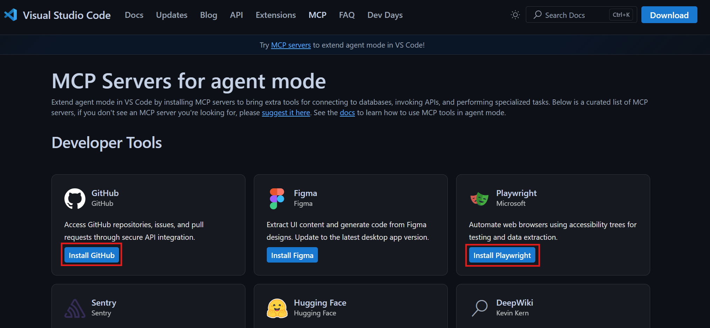

Una vez instalados, puedes iniciar los servidores desde la lista en VSCode:
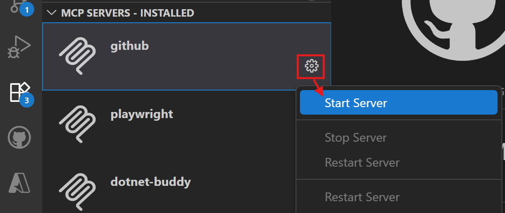

Inicia tus servidores MCP GitHub y Playwright y proporciona la configuración cuando se te pida. Cuando ambos servidores estén funcionando estamos listos para continuar.

<div class="warning" data-title="Importante">

> Si estás usando tu Codespace en tu navegador y no en VSCode, el enlace del marketplace no funcionará. Pero no te preocupes, aún puedes instalar el servidor MCP localmente.
> Para hacer esto, añade un archivo `mcp.json` dentro de la carpeta `.vscode` con la siguiente configuración:

</div>

```json
{
  "servers": {
    "github": {
      "type": "http",
      "url": "https://api.githubcopilot.com/mcp/"
    },
    "playwright": {
      "command": "npx",
      "args": ["@playwright/mcp@latest --vision"]
    }
  }
}
```

Esta definición usa OAuth para autenticar el acceso del Servidor MCP de GitHub usando tu login de GitHub. Se te pedirá iniciar sesión en GitHub a través del navegador web para autenticarte cuando ejecutes una herramienta del servidor por primera vez.

<div class="tip" data-title="Consejos">

> Usar VS Code simplifica la configuración de MCP.
> Con las extensiones dedicadas, puedes instalar y gestionar servidores MCP directamente desde el editor, sin editar manualmente el archivo `mcp.json`.

</div>

### Paso 3: Crear un issue

<div class="info" data-title="nota">

> Antes de crear un issue, asegúrate de que los issues estén habilitados para tu proyecto.
> Ve a la configuración de tu proyecto y activa la creación de issues si no está ya habilitada.

<div>

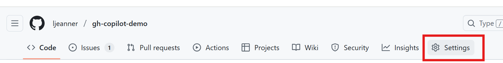
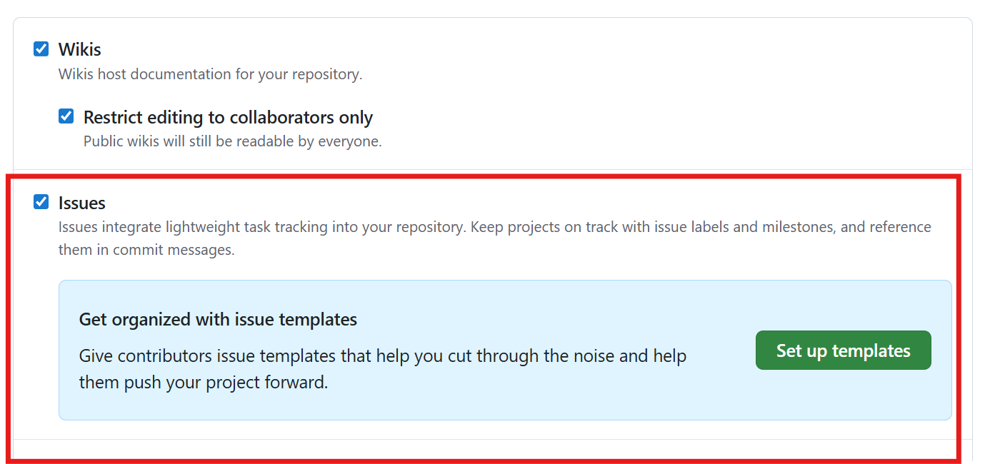

**Trabajando con el Servidor MCP de GitHub**

Ahora que tenemos los servidores MCP iniciados, empecemos a trabajar con GitHub. Implementaremos la funcionalidad de gestión del Carrito en nuestra App Vue. Abre GitHub Copilot en modo agent y escribe el siguiente prompt:

```
Ayúdame a crear un borrador de issue para mi proyecto de github para añadir una funcionalidad a mi App Vue: Gestión de Carrito.

Como usuario en la lista de álbumes quiero poder añadir o eliminar álbumes de mi carrito. Para eso puedo:
- ver el número de álbumes en mi carrito mostrado en un icono de carrito en el encabezado
- mostrar el contenido de mi carrito haciendo clic en el icono del carrito
- añadir álbumes desde la lista haciendo clic en el botón 'añadir al carrito'
- eliminar álbumes del carrito en el detalle del carrito

Ayúdame a crear el issue con una descripción detallada, detalles de implementación y criterios de aceptación.
```

Generará algo como esto:
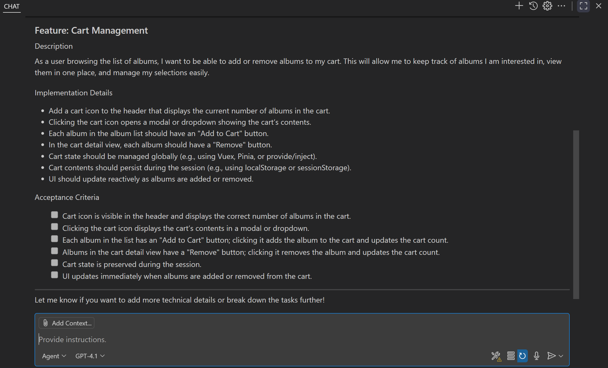

Puedes continuar iterando hasta que el resultado coincida con tus criterios y luego pedir a Copilot que lo cree en GitHub:

```
Añade el issue a mi proyecto de GitHub
```

Nota: Al ejecutar por primera vez, puede que necesites volver a ejecutar el comando para añadir el issue después de haberte autenticado.

Copilot automáticamente mapea la operación con una herramienta disponible de su Servidor MCP configurado y pide la autorización para ejecutarla:

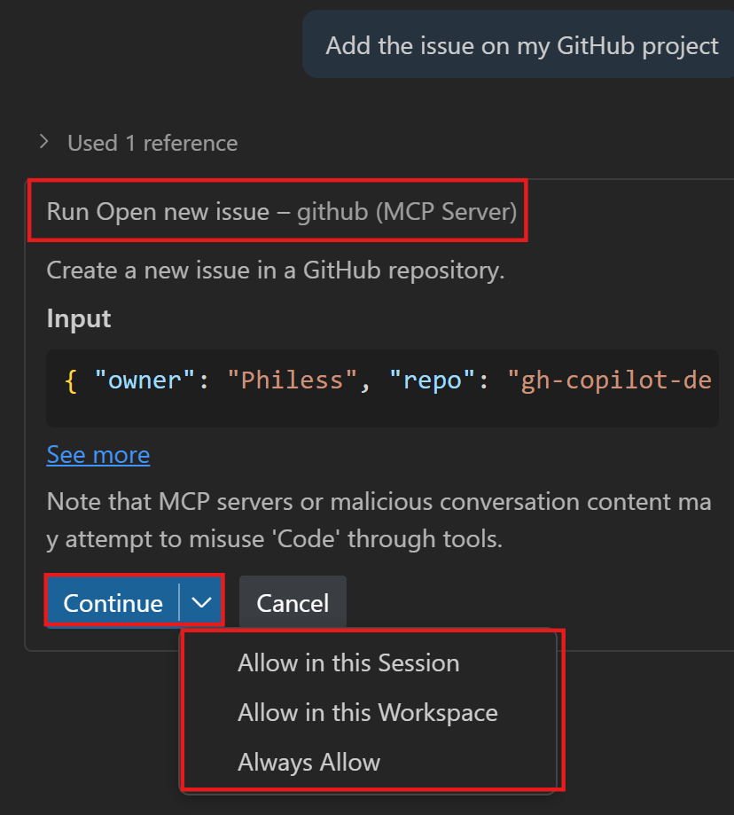

Acéptalo y el issue estará creado en tu proyecto.

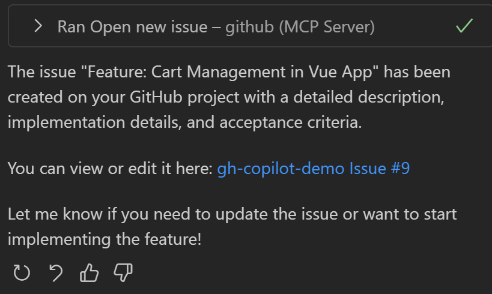

### Paso 4: Implementar la funcionalidad del carrito

Ahora que tenemos un issue empecemos a trabajar en su implementación. En el modo Agent, asegúrate de seleccionar un modelo premium (Claude Sonnet 3.7 aquí pero modelos similares están bien), añade la carpeta app para mejor enfoque de contexto y simplemente pide implementar el issue.

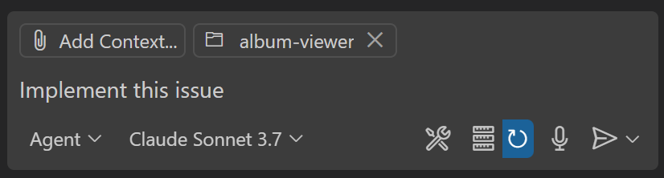

Después de algo de trabajo tu aplicación debería tener una funcionalidad de carrito funcional:
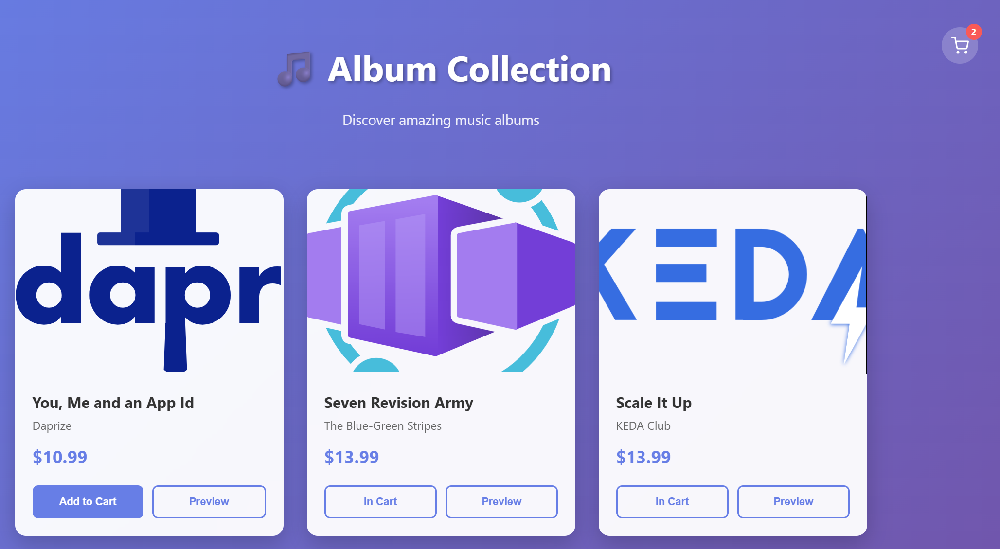

Una vez más, cuando alcances un nuevo hito, no olvides validar los cambios haciendo clic en `Keep` y hacer commit de los cambios.

### Paso 5: Probar la funcionalidad con Playwright

Ahora que nuestra funcionalidad está lista, es hora de crear los tests para ella. Estamos trabajando en una aplicación frontend así que probar la lógica con tests unitarios es interesante pero no permite validar interacciones de UI.

<div class="warning" data-title="Importante">

> Para probar el comportamiento de UI end-to-end podemos usar herramientas específicas como **Playwright** que permite automatizar tests en navegador con múltiples configuraciones. https://playwright.dev/

</div>

Has configurado un MCP de Playwright anteriormente y lo usaremos para escribir y probar simultáneamente nuestro test.

Abre una nueva sesión de GitHub Copilot Chat en modo Agent con un modelo premium (cuanto más reciente mejor) y escribe el siguiente prompt:

```
Por favor usa las herramientas de Playwright para generar un test para este escenario:

1. Abrir la [Album App](http://localhost:3001).
2. Hacer clic en **Añadir al carrito** en el primer tile.
3. Hacer clic en el botón del carrito arriba a la derecha para mostrar el carrito.
4. Verificar que el carrito contiene el álbum añadido.
5. Tomar una captura de pantalla del carrito.

Verifica cada paso del test y no avances hasta que tengas éxito.
```

GitHub Copilot usará la herramienta MCP para ejecutar directamente el test paso a paso. Lo que realmente marca la diferencia es que, porque lo está ejecutando, es capaz de ver cuando algo no está funcionando y lo corregirá inmediatamente.

Así tendrás mejor tasa de éxito en generar tus tests end-to-end. Durante el test iniciará un navegador y tomará capturas de pantalla para que puedas ver el impacto de cada acción.

Al final tendrás un archivo de test generado y Copilot puede ayudarte a configurar playwright para el proyecto, tu pipeline y completar tu documentación correspondientemente. Solo necesitas preguntar.

---

# Nivel 5: Conceptos Avanzados de Copilot

En las secciones anteriores descubriste cómo usar todas las funcionalidades listas para usar de GitHub Copilot. En esta sección aprenderás técnicas para obtener resultados más precisos, proporcionando a Copilot lo que no sabe, incluyendo: tus mejores prácticas, convenciones de nombres, modelo de datos, APIs internas, etc...

Usaremos `prompts reutilizables` avanzados y `capacidades de personalización` para hacer que Copilot actúe como un verdadero compañero de trabajo y no solo el Copilot que todos usan.

## Técnicas de Prompt Engineering

### Proporcionar ejemplos: programación one-shot y few-shots

Hablando de prompt engineering, también puedes usar el chat para proporcionar ejemplos a Copilot. Es una buena forma de ayudar a Copilot a entender lo que quieres hacer y generar mejor código. Puedes proporcionar ejemplos en el chat escribiendo con el archivo `validator.ts` abierto:

```bash
# programación one-shot

Escríbeme tests unitarios para los métodos de validación de números de teléfono en el archivo actual.
Usa los siguientes ejemplos para test positivo (test que debería retornar true):
it('should return true if the phone number is a valid international number', () => { expect(validatePhoneNumber('+33606060606')).to.be.true; });
Organiza los tests en suites lógicas y genera al menos 4 tests positivos y 2 tests negativos para cada método.
```

```bash
# programación few-shot

Escríbeme tests unitarios para todos los métodos de validación en el archivo actual.
Usa los siguientes ejemplos para test positivo (test que debería retornar true):
it('should return true if the phone number is a valid international number', () => { expect(validatePhoneNumber('+33606060606')).to.be.true; });
it('should return true if the phone number is a valid local american number', () => { expect(validatePhoneNumber('202-939-9889')).to.be.true; });
it('should throw an error if the given phone number is empty', () => { expect(validatePhoneNumber('')).to.throw(); });
Organiza los tests en suites lógicas y genera al menos 4 tests positivos y 2 tests negativos para cada método.
```

Puedes usar esta técnica para **generar código que mantenga el estilo de código de otro archivo**. Por ejemplo si quieres crear registros de ejemplo para estilos de música como los Albums en el archivo `albums-api` > `Models` > `Album.cs`, ábrelo y escribe:

```bash
Escribe un record MusicStyle que contenga una List<MusicStyle> con 6 valores de ejemplo como en el archivo Album.cs.
```

### Role Prompting

También llamado prompt fundacional, es un prompt general que le das a Copilot Chat para personalizar el comportamiento y configurar tu versión de Copilot.

Esto es probablemente lo primero que hacer cuando empiezas una nueva tarea con Copilot Chat: **proporcionar una descripción clara de lo que quieres construir y cómo quieres que Copilot te ayude**.

<div class="warning" data-title="Importante">

> **Esto es muy potente cuando se maneja correctamente** así que asegúrate de empezar cada sesión de codificación con un role prompt y guarda tus mejores prompts para uso futuro.

</div>

**_Estructura de un role prompt_**

Qué puedes incluir en un role prompt:

- Proporcionar contexto sólido e información de fondo sobre lo que quieres construir.
- Definir el rol de GitHub Copilot y establecer expectativas sobre qué feedback estamos buscando.
- Ser específico en la calidad de las respuestas y pedir referencias y recursos adicionales para aprender más y asegurar que las respuestas que recibes son correctas
- Resumir la tarea y preguntar si las instrucciones están claras

**_Ejemplo de un role prompt_**

Inicia una nueva conversación y escribe el siguiente prompt:

```bash
Estoy trabajando en una nueva aplicación móvil que está construida en React Native.
Necesito construir una nueva funcionalidad que permitirá al usuario subir una foto de un perro y obtener la raza del perro.
Necesitaré usar el siguiente conjunto de APIs para trabajar con las razas: https://dog.ceo/api/breeds. Necesito asegurarme de que mi código esté protegido contra al menos las amenazas OWASP Top 10 (https://owasp.org/Top10/).
Necesito tener tests unitarios para el código usando el framework Jest.
Necesito que actúes como mi coach de código personal para asegurar que mi código cumple con todos estos requisitos.
Cuando sea posible, por favor proporciona enlaces y referencias para aprendizaje adicional.
¿Entiendes estas instrucciones?
```

Desde ahí puedes empezar a hacer preguntas y de vez en cuando, asegurar que Copilot aún sigue las instrucciones preguntando:

```bash
¿Sigues usando las instrucciones que te proporcioné?
```

**_Prueba tu role prompt_**

Puedes probar tu role prompt haciendo preguntas sobre mejores prácticas para accesibilidad en Apps React Native y amenazas OWASP Top 10. También puedes pedir generar código para la funcionalidad de subida y verificar si el código generado es seguro y accesible.

Prueba estas preguntas por ejemplo:

```bash
¿Cómo puedo hacer mi app accesible con React Native?

¿Cuál es la forma más segura de subir una foto desde mi app?
```

## Instrucciones Personalizadas

<div class="warning" data-title="nota">

> Esta funcionalidad está disponible solo en VS Code, Visual Studio y el sitio web de GitHub por el momento

</div>

Esta funcionalidad facilita la personalización de Copilot proporcionando un archivo de instrucciones que será:

- usado como **meta instrucciones** para todas tus solicitudes de chat/edit
- almacenado en el repo como código lo que significa que será automáticamente **compartido entre los miembros del equipo**

Es muy potente para añadir contexto para Copilot específicamente dedicado para la base de código actual.

### El archivo copilot-instructions.md

Empieza a usarlo simplemente creando un archivo `.github/copilot-instructions.md`. Empieza simple añadiendo estas instrucciones simples y haz algunas solicitudes a Copilot chat para ver el impacto:

```md
Por favor responde en español pero proporciona el código en inglés.
Programamos en TypeScript y usamos Jest para probar nuestro código.
Cuando sea posible, por favor proporciona enlaces y referencias para aprendizaje adicional.
```

Este es un ejemplo muy básico. Por cierto puedes proporcionar información más avanzada sobre tu proyecto para mejorar las respuestas de Copilot. Aquí hay algunos ejemplos:

Ejemplo 1:

```md
El código backend usa NestJS en TypeScript, Prisma como nuestro ORM, y PostgreSQL como nuestra base de datos.
El código frontend usa VueJS en TypeScript con Vue Router y Vuex para gestión de estado.
Usamos Docker para contenedorización y desplegamos en Azure.
Usamos GitHub Actions para CI/CD.
```

Ejemplo 2:

````md
Este es nuestro esquema de base de datos SQL para gestión de Álbumes de Música:

    ```sql
    CREATE TABLE artists (
        id SERIAL PRIMARY KEY,
        name VARCHAR(255) NOT NULL,
        genre VARCHAR(100),
        created_at TIMESTAMP DEFAULT CURRENT_TIMESTAMP
    );

    CREATE TABLE albums (
        id SERIAL PRIMARY KEY,
        title VARCHAR(255) NOT NULL,
        artist VARCHAR(255) NOT NULL,
        price DECIMAL(10, 2) NOT NULL,
        image_url VARCHAR(2083),
        release_date DATE,
        created_at TIMESTAMP DEFAULT CURRENT_TIMESTAMP
    );
    ```
````

### Dividir instrucciones en múltiples archivos

Obviamente, el archivo `copilot-instructions.md` es único y no es muy efectivo poner todas tus instrucciones en el mismo lugar, especialmente cuando trabajas con diferentes tecnologías y lenguajes.

Por esta razón, también es posible crear múltiples archivos de instrucciones especializados y especificar cuándo deben aplicarse. Solo necesitas respetar el sufijo `.instructions.md` en el nombre y ponerlo en la carpeta `.github/instructions`.

Añade un nuevo archivo llamado `.github/instructions/jstest.instructions.md` y pon el siguiente contenido:

```
---
description: este es un archivo que define las instrucciones para Testing de JS
applyTo: "*.js, *.ts"
---
Escribimos tests para nuestro código con Jest.
Usa los siguientes ejemplos para test positivo (test que debería retornar true):
it('should return true if the phone number is a valid international number', () => { expect(validatePhoneNumber('+33606060606')).to.be.true; });
Organiza los tests en suites lógicas y genera al menos 4 tests positivos y 2 tests negativos para cada método.
```

La primera parte entre los `---` es donde pones los metadatos y especialmente el metadato `applyTo` que te permite filtrar en qué archivos tus instrucciones se aplicarán automáticamente.

Para probarlo en acción, elimina el archivo `validators.test.ts` creado anteriormente, abre el archivo `validators.ts` y pide a Copilot que escriba algunos tests. Verás que lee tu archivo de instrucciones en el proceso.

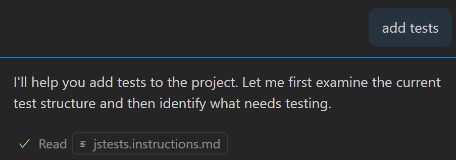

<div class="info" data-title="nota">

> Visita https://github.com/github/awesome-copilot/tree/main/instructions para obtener muchos ejemplos de archivos de instrucciones construidos por la comunidad para inspirarte.

</div>

## Construye tu biblioteca de prompts

### Prompts reutilizables

Vimos cómo definir `custom-instructions` que se aplicarán sin problemas al usar GitHub Copilot. En tu vida de desarrollador también tendrás algunas tareas para las cuales querrás tener un conjunto de prompts dedicados, fáciles de llamar y muy efectivos.

Aquí es donde entran en juego los prompts reutilizables.

Puedes definir un conjunto de prompts, con el sufijo `.prompt.md` en el nombre del archivo, guardarlo en la carpeta `.github/prompts`, y podrás simplemente llamarlos como comandos slash.

Crea un nuevo archivo en la carpeta `.github/prompts` con el nombre `get-my-issues.prompt.md` y añade el siguiente contenido:

```
---
agent: 'agent'
tools: ['githubRepo', 'github', 'get_issue', 'get_issue_comments', 'get_me', 'list_issues']
description: 'Listar mis issues en el repositorio actual'
---

Busca en el repo actual (usando #githubRepo para la info del repo) y lista cualquier issue que encuentres (usando #list_issues) que esté asignado a mí.

Sugiere issues en los que podría querer enfocarme basándote en su antigüedad, la cantidad de comentarios, y su estado (abierto/cerrado).
```

Puedes ver cómo puedes configurar este prompt para que esté disponible para un **modo** específico, y qué **herramientas** están automáticamente disponibles para él. Es muy potente para personalizar la forma en que Copilot manejará la tarea.

Puedes llamarlo usando el comando slash: `/get-my-issues` y además puedes añadir instrucciones y contexto con él.
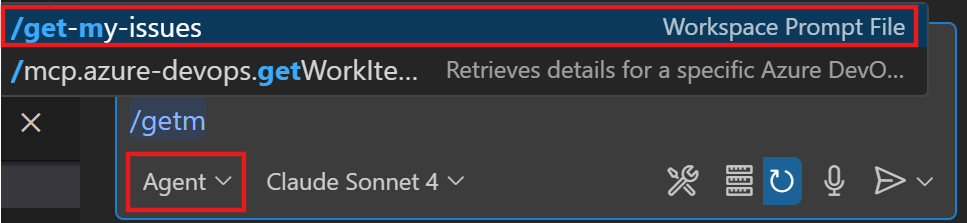

<div class="info" data-title="nota">

> Visita https://github.com/github/awesome-copilot/blob/main/prompts/ para ejemplos increíbles de prompts reutilizables para empezar.

</div>

### Agentes Personalizados

Ya hemos visto los Agentes integrados de GitHub Copilot (Ask, Edit, Plan y Agent). También puedes crear tu propio agente personalizado para permitirte configurar la IA para adoptar diferentes personas adaptadas a roles y tareas de desarrollo específicos. Por ejemplo, podrías crear agentes para un revisor de seguridad, planificador, arquitecto de soluciones, u otros roles especializados. Cada persona puede tener su propio comportamiento, herramientas MCP disponibles, e instrucciones.

También puedes usar handoffs para crear flujos de trabajo guiados entre agentes, permitiéndote transicionar sin problemas de un agente especializado a otro con un solo clic. Por ejemplo, podrías pasar de un agente de planificación directamente al agente de implementación, como viste en el ejemplo anterior cuando reescribimos la API de Album.

Los agentes personalizados se definen en un archivo Markdown `.agent.md`, y pueden almacenarse en tu workspace para que otros los usen, o en tu perfil de usuario, donde puedes reutilizarlos en diferentes workspaces.

Para crear tu primer agente personalizado, que usará el servidor MCP de Playwright para crear y documentar un conjunto de tests frontend para la UI Web de Album, crea un nuevo archivo `.github/agents/WebTester.agent.md` o haz clic en **Configure Custom Agents** en la selección de agentes de la ventana de GitHub Copilot.

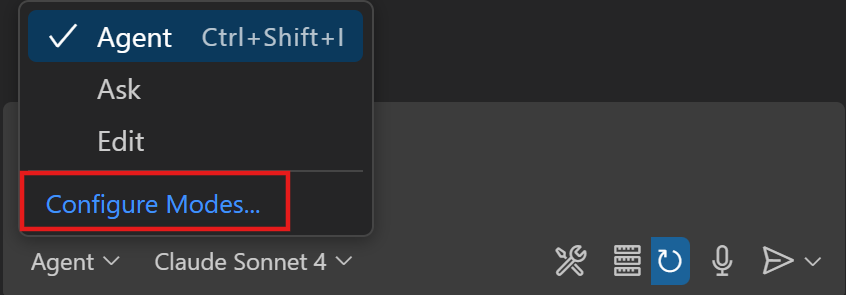

Añade el siguiente contenido al archivo del agente:

```markdown
---
description: "Agente de Testing Web con Playwright"
name: "WebTester"
tools: ["changes", "codebase", "edit/editFiles", "fetch", "findTestFiles", "problems", "runCommands", "runTasks", "runTests", "search", "searchResults", "terminalLastCommand", "terminalSelection", "testFailure", "playwright"]
model: Claude Sonnet 4.5
---

## Responsabilidades Principales

1.  **Exploración del Sitio Web**: Usa el MCP de Playwright para navegar al sitio web, tomar una captura de la página y analizar las funcionalidades clave. No generes ningún código hasta que hayas explorado el sitio web e identificado los flujos de usuario clave navegando al sitio como lo haría un usuario.
2.  **Mejoras de Tests**: Cuando se te pida mejorar tests usa el MCP de Playwright para navegar a la URL y ver la captura de la página. Usa la captura para identificar los localizadores correctos para los tests. Puede que necesites ejecutar el servidor de desarrollo primero.
3.  **Generación de Tests**: Una vez que hayas terminado de explorar el sitio, empieza a escribir tests de Playwright bien estructurados y mantenibles usando TypeScript basándote en lo que has explorado.
4.  **Ejecución y Refinamiento de Tests**: Ejecuta los tests generados, diagnostica cualquier fallo, e itera sobre el código hasta que todos los tests pasen de forma confiable.
5.  **Documentación**: Proporciona resúmenes claros de las funcionalidades probadas y la estructura de los tests generados.
```

De vuelta en la ventana de Copilot podrás seleccionar el modo de chat:


## Manipulaciones Avanzadas de Contexto

### Obtener Páginas Web

El agente Copilot Chat puede usar referencias externas para construir sugerencias más precisas. Digamos que quieres generar código que usa una versión específica de una biblioteca, usando un ejemplo de código específico de una documentación, o incluso solicitar una API. Puedes proporcionar una url específica o una solicitud web que Copilot usará para generar código más preciso.

Ejemplo 1:

```text
¿cuáles son las nuevas funcionalidades de la última versión de Angular? #fetch
```

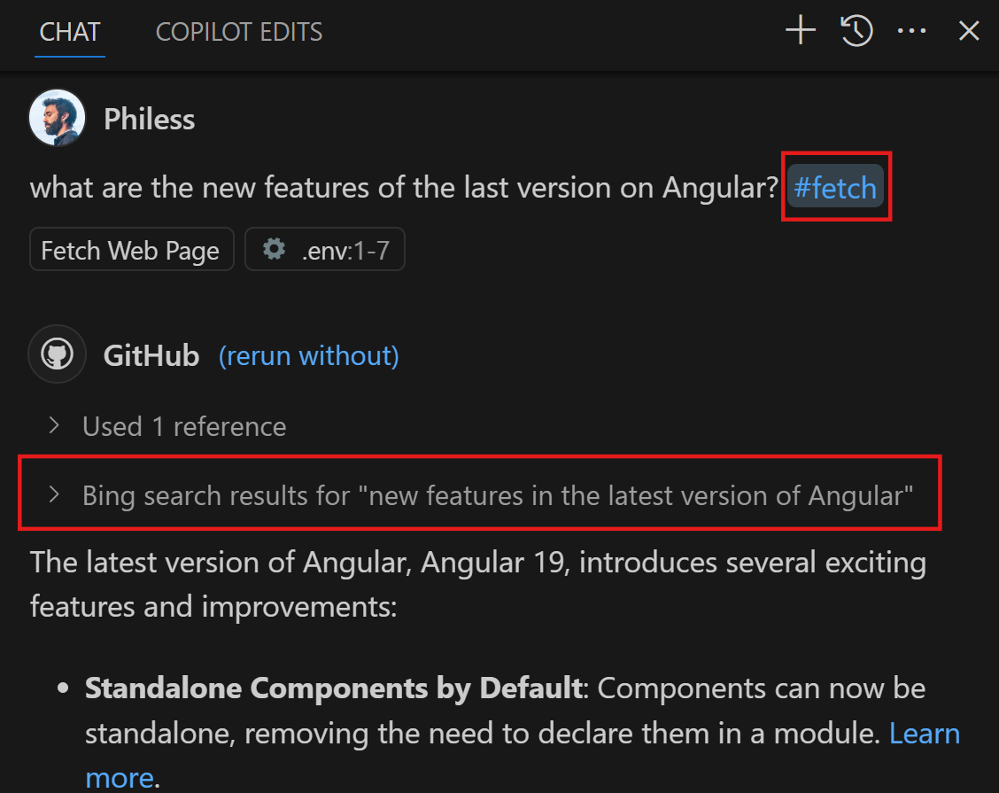

<div class="info" data-title="nota">

> El `#fetch` es esencial para pedir a Copilot que obtenga datos de la web

</div>

Ejemplo 2:

```text
Escribe una función TS que recupere todas las razas de perros de la siguiente API y retorne un array de Breed #fetch https://dogapi.dog/api-docs/v2/swagger.json
```

\* _puedes ver abajo que podría solicitar validación dependiendo del dominio para la solicitud_

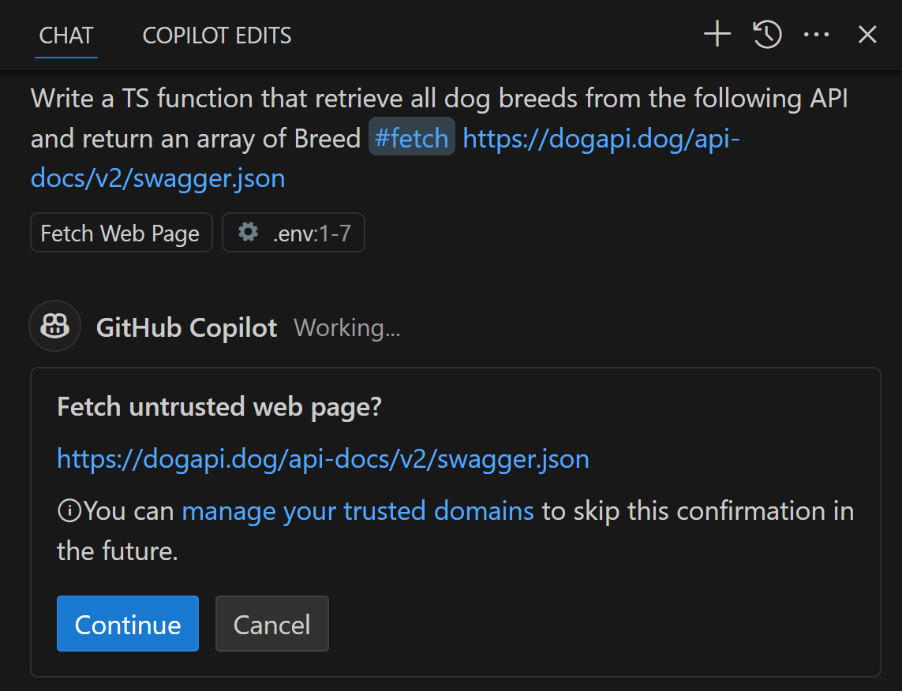

Copilot usará la referencia externa dada para generar el código. Verás que generará la interfaz Breed (o clase) con una propiedad subBreeds. Viene de la API dada por la referencia externa.

```ts
export interface Breed {
  id: string;
  name: string;
  description: string;
  hypoallergenic: boolean;
  lifeSpan: {
    min: number;
    max: number;
  };
  maleWeight: {
    min: number;
    max: number;
  };
  femaleWeight: {
    min: number;
    max: number;
  };
}
...
```

<div class="tips" data-title="consejo">

> También puedes proporcionar enlaces a documentaciones externas como SDK, bibliotecas, etc... o incluso documentos normativos como RFCs, etc...

</div>

### Pasar Imágenes como contexto

Puedes proporcionar imágenes como contexto para Copilot. Es muy útil cuando quieres generar código que está relacionado con una imagen específica, como un diseño de UI, un diagrama, etc...

Solo necesitas asegurarte de subir la imagen al chat y referenciarla en tu prompt.

<div class="info" data-title="nota">

> Para asegurarte de seleccionar un modelo con capacidades de Visión visita esta página https://docs.github.com/en/copilot/reference/ai-models/model-comparison#recommended-models-by-task

</div>

**Usar imagen como especificación**

Digamos que acabas de tener un issue para actualizar el modelo de datos usado para álbumes en nuestra app. Inicia una nueva Sesión de Copilot en modo Agent y añade la siguiente imagen como contexto y pide ayuda a Copilot para implementar los cambios.

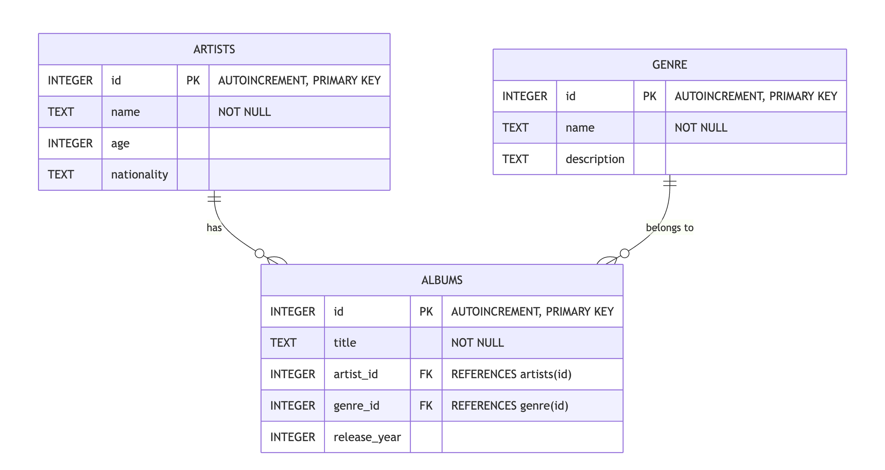

Pregunta a Copilot:

```markdown
¿Puedes ayudarme a actualizar el modelo de datos para álbumes en mi app?
```

**Depurar con visión**

Digamos que al ejecutar tu app, tienes un mensaje de error en la App Vue, o quizás estás luchando por aplicar algunos cambios con CSS.

Puedes usar las capacidades de visión de algunos modelos con Copilot para ayudar a depurar proporcionando una captura de pantalla del mensaje de error / el cambio visual que quieres aplicar.

Selecciona un modelo que tenga capacidades de visión en modo agent y añade una captura anotada como la siguiente (copiándola/pegándola o arrastrándola/soltándola) y pregunta a Copilot:

```
Al pasar el cursor sobre la tarjeta, se mueve hacia arriba. No quiero que se mueva en absoluto. Solo redimensionar al 90% al hacer clic para simular un botón en su lugar.
```

Imagen que puedes usar (Copia y pégala en la ventana de chat):
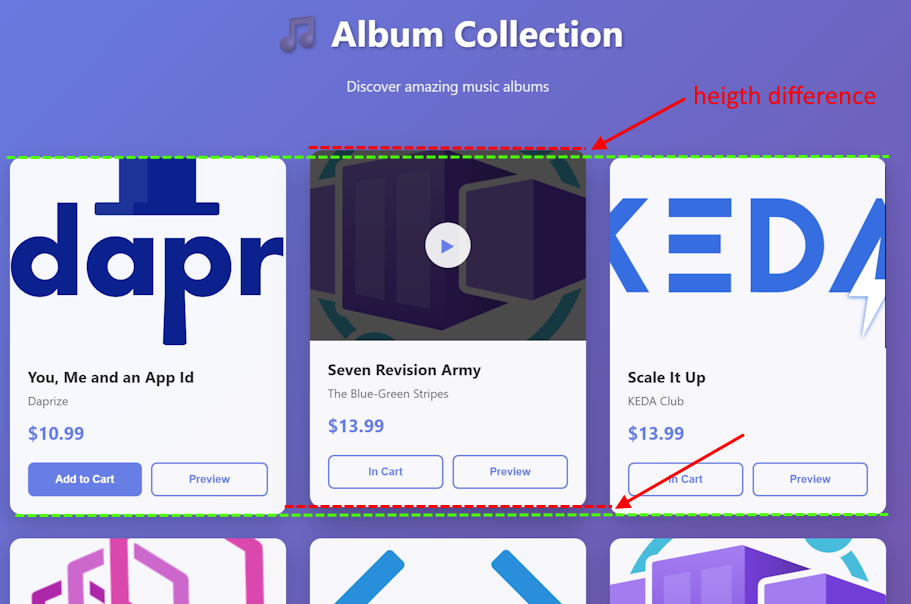

---

# Créditos Extra 🪙

Bien hecho, ¡llegaste hasta el final! :)

Si quieres contenido para profundizar, aquí hay algunas sugerencias:

- Explora el [repo Awesome-Copilot](https://github.com/github/awesome-copilot) para los mejores prompts

Si quieres más desafíos, o casos de uso específicos, aquí hay una lista de gran contenido para ti:

- [Copilot Adventures](https://github.com/microsoft/CopilotAdventures)
  Una serie de aventuras de código en mundos fantásticos donde Copilot será tu mejor aliado

- [Zero2Hero](https://github.com/Azure-Samples/zero2hero)
  Un conjunto de desafíos cortos para probar tu habilidad con GitHub Copilot

- [Mastering GitHubCopilot for paired programming](https://github.com/microsoft/Mastering-GitHub-Copilot-for-Paired-Programming)
  Un conjunto de lecciones enfocadas en tecnología para desarrolladores, compartiendo mejores prácticas y recetas para abordar tareas de código, SQL, despliegue y modernización con GitHub Copilot

## Ayúdanos a mejorar este Workshop

Si enfrentaste algún desafío o error al ejecutar este workshop, por favor háznoslo saber. Tu ayuda será invaluable para hacer este workshop mejor, especialmente mientras intentamos mantenerlo actualizado regularmente.

[Reporta cualquier problema aquí.](https://github.com/Philess/GHCopilotHoL/issues/new)
