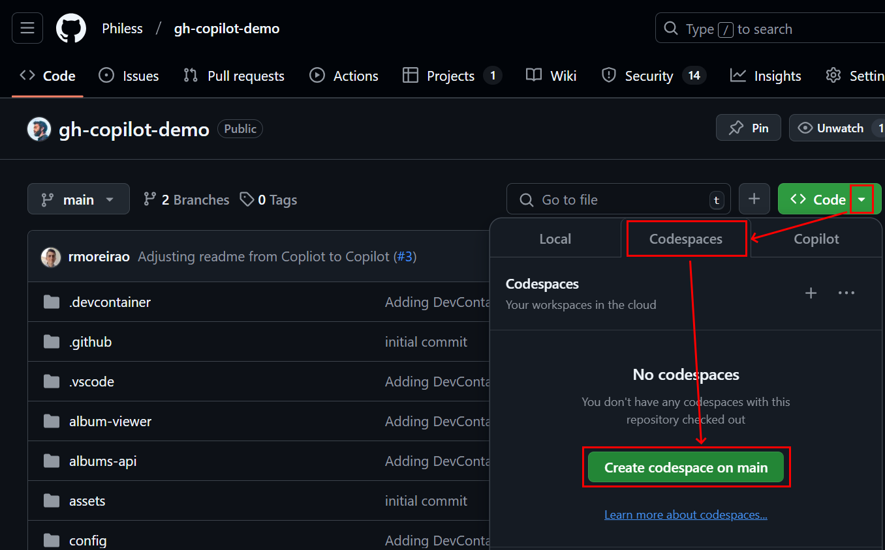
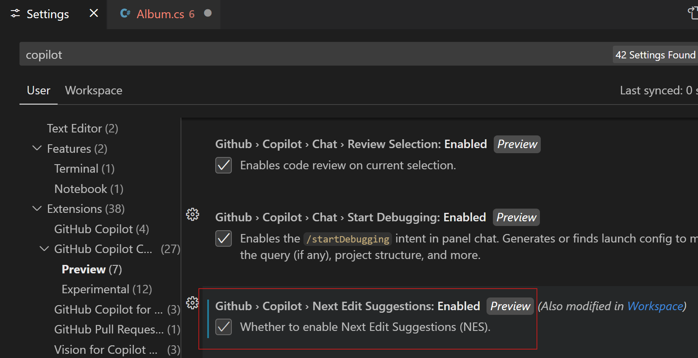
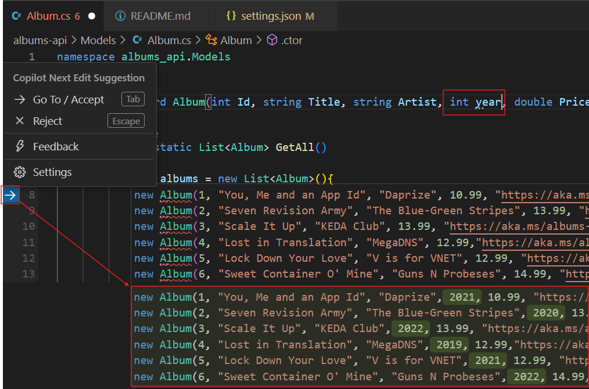
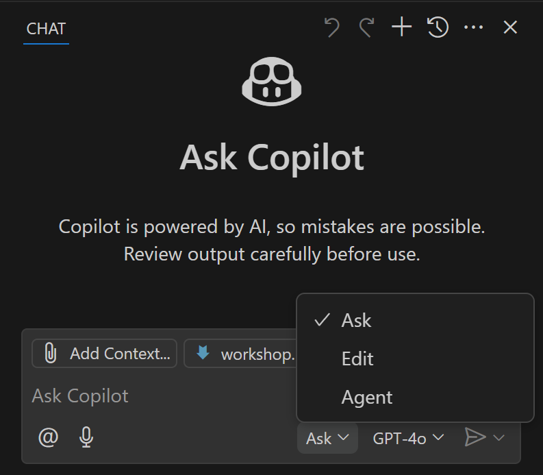
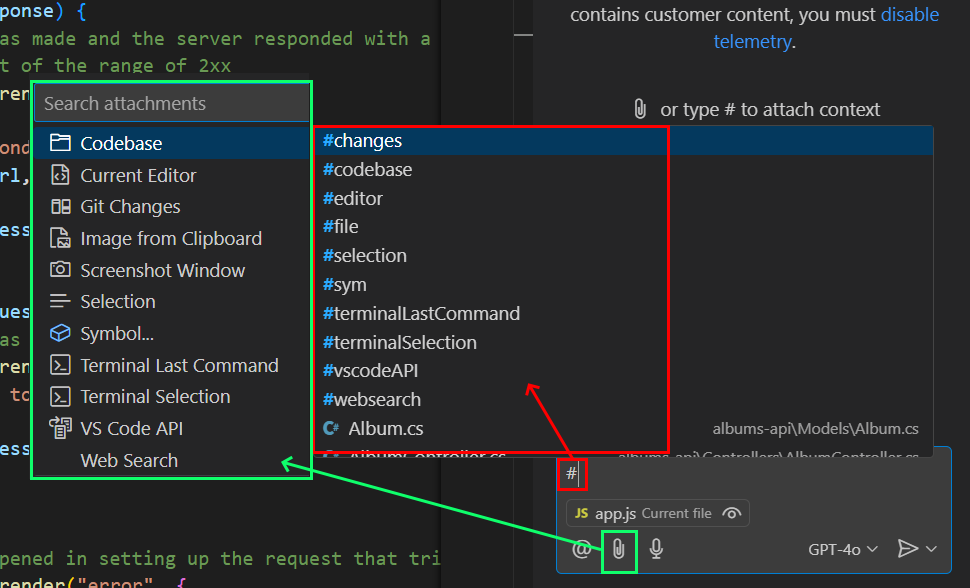
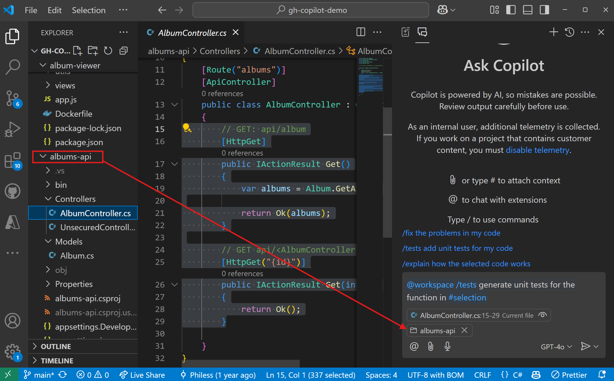
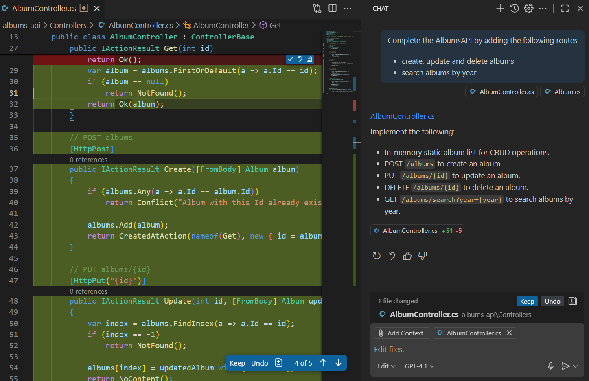
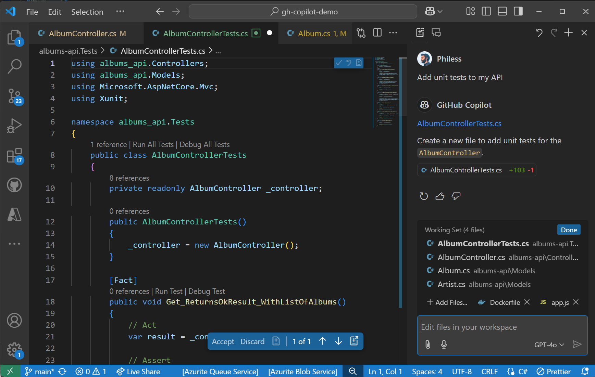
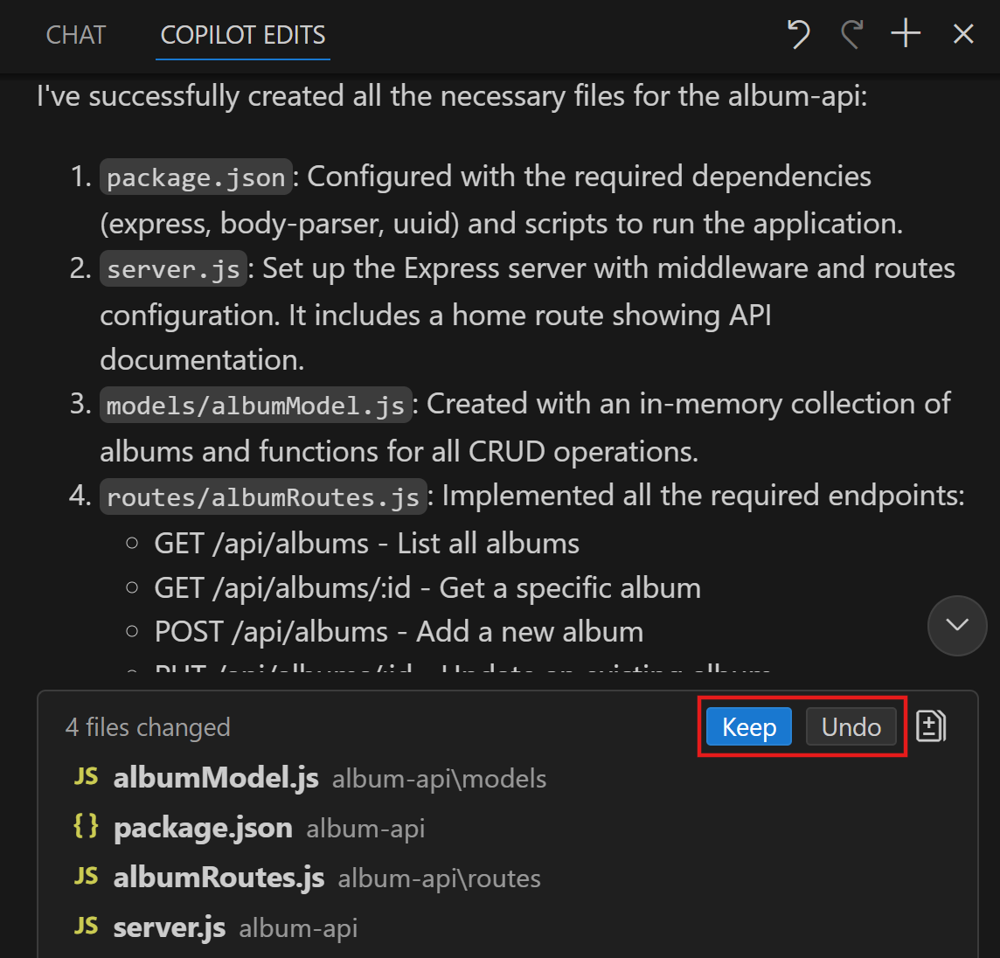

# The ultimate GitHub Copilot Tutorial for developers

The goal of this workshop is to discover GitHub Copilot features, from Code suggestions to agent mode and have a quick overview on the impact it brings to developers and development teams?

GitHub Copilot is an AI-powered code assistant that helps developers write better code faster. It uses machine learning models trained on billions of lines of code to suggest whole lines or entire functions based on the context of what you’re working on. By using GitHub Copilot, you can learn how to write better code and improve your productivity.

<div class="warning" data-title="warning">

> GitHub Copilot is a quickly evolving product and thus this workshop may not be 100% up to date with the different features of the different extensions you are going to use. Please be clever if it's not exactly the same.

</div>

## Minimal Pre-requisites

There are two ways to run this workshop:
- online with **GitHub Codespaces**: fastest and easiest way to start playing immediately
- locally on **your computer**: the best way to install and configure the tools you need to work with GitHub Copilot on every projects

These are the very minimal pre-requisites to run this workshop:

| | |
|----------------|-----------------|
| A GitHub account | [Create free GitHub account](https://github.com/join) |
| GitHub Copilot Access activated | [Get Access to Github Copilot](#get-access-to-github-copilot) |
| A web browser  | [Download Microsoft Edge](https://www.microsoft.com/edge) or any other one ;-)|


## Get Access to Github Copilot

There are different ways to get access to GitHub Copilot:

- **As an individual**, you can sign up to use [Copilot Free](https://github.com/github-copilot/signup), without the need for a credit card. You are entitled to a limited number of completions and chat interactions per month with the free plan, which reset each month. Learn more about the [Copilot Free plan details and conditions](https://docs.github.com/en/copilot/about-github-copilot/subscription-plans-for-github-copilot).

- **As an individual**, sign up for a [paid subscription](https://github.com/github-copilot/signup/copilot_individual) to get unlimited completions and chat interactions. You can try GitHub Copilot for free with a one-time 30-day trial.

- **As a member of an organization or enterprise** that has a subscription to GitHub Copilot, you can request access to Copilot by going to [https://github.com/settings/copilot](https://github.com/settings/copilot) and requesting access under "Get Copilot from an organization."


## Fork the repository

This workshop uses the following GitHub Repository: [Github Copilot Demo](https://github.com/Philess/gh-copilot-demo)

This repository is a code starter that will help you experiment all capabilities with GitHub Copilot. Take the time to look at the architecture design displayed on the page and when you're ready, clone the repository from the command line and open it in VS Code.

Start by creating **your own fork** of the repository by clicking on the `Fork` button on the top right of the repository page. It will create a copy of the repository in your own GitHub account and you will be free to make any changes you want.


## OPTION 1: Work with GitHub Codespaces

The environment is already configured to work with [GitHub Codespaces](https://github.com/features/codespaces), you can find the configuration files in the *.devcontainer* folder.

To start programming just start a new codespace and you are ready to go, don't need to install anything.

<div class="info" data-title="note">

> Every individual users of Github has a free plan to run the codespace to let you try it with a free 120 core-hours per month [See Pricing](https://github.com/settings/billing/summary)

</div>



After a few seconds, you will be redirected to the Codespace environment. You can start coding right away, your Github Copilot extensions are already installed and configured.

## OPTION 2: Work locally

You can choose to work locally on your computer for this workshop and take that as an opportunity to install and configure the tools you'll need to work with GitHub Copilot on your projects. 

You first need to install the following tools locally:

1. Install [Visual Studio Code](https://code.visualstudio.com/)
2. Install the [GitHub Copilot](https://marketplace.visualstudio.com/items?itemName=GitHub.copilot) extension
3. Install the [GitHub Copilot Chat](https://marketplace.visualstudio.com/items?itemName=GitHub.copilot-chat) extension
4. Install [Node and npm](https://docs.npmjs.com/downloading-and-installing-node-js-and-npm)
5. Install mocha

    ``` bash
    npm install --global mocha
    npm install axios
    ```

7. Install [Docker](https://docs.docker.com/engine/install/)
8. Install [.NET Core](https://dotnet.microsoft.com/download) \* *needed if you want to run provided .net code*

Then, clone your forked repository and open it in VS Code.

``` bash
git clone https://github.com/<YourUser>/gh-copilot-demo
cd gh-copilot-demo
code .
```

Finally, you need login to your GitHub account in Visual Studio Code to activate the GitHub Copilot extensions. The extensions will ask you to login, but if you don't see the prompt, you can login by clicking on the user icon in the bottom left sidebar where you will see the logins for Github and Github Copilot Chat.


---

# Level 1: Code Completion with GitHub Copilot

This section will guide you through the first steps with GitHub Copilot, starting with code completion. You will learn what you can do and how to use it at his full potential.

## Start playing with GitHub Copilot Completion

Once you start typing a prompt and copilot generate proposals, you can use the following shortcuts to interact with Copilot:
    <ul>
        <li>`tab` to accept the current suggestion entirely (`most common`)</li>
        <li>`ctrl + right arrow` to accept word by word the suggestion (`for partial use`)</li>
        <li>`alt + ^` to move to next suggestion</li>
        <li>`shift + tab` to go back to the previous suggestion</li>
        <li>`ctrl+enter` to display the copilot pane</li>
    </ul>

<div class="info" data-title="info">

> These shortcuts are the default ones for VS Code. If you are using another IDE, you can find the shortcuts in the [GitHub Copilot documentation](https://docs.github.com/en/copilot/getting-started-with-github-copilot/).

<div>


## Let's start with the basics

### Write code

**What is a prompt?**
In the context of Copilot, a prompt is a piece of natural language description that is used to generate code suggestions. It's the input that Copilot uses to generate code. It can be a single line or a multiple lines description.

**Generate code from prompt**

Create a new `album-viewer/utils/validators.ts` file and start with the prompt:

```ts
// validate date from text input in french format and convert it to a date object
```

### Next edit suggestion


<div class="warning" data-title="note">

> Feature available only on VS Code https://code.visualstudio.com/updates/v1_99#_next-edit-suggestions-general-availability

</div>

Next Edit suggestion is an evolution of the standard completion in Github Copilot. When you are modifying code and accepting a code suggestion can will probably have impact on other part of your code, it will automatically suggest the next change in your code, and not only directly where your pointer is but where your natural next action will probably be.

An example is better than a thousands words so let's try that!

First, be sure to activate the feature on your copilot settings. Select the `Preferences: Open User Settings` command in the Command Palette (`Ctrl+Shift+P`) and search for the `Next Edit Suggestions` seetings:



Then, open the `albums-api/Models/Album.cs` file and, on the Album contructor, add a new input parameter `Year` of type `int` and see the Next Edit Suggestion propose to change the body of the method accordingly:



## Side Quest #1: Generate Git Commit comment

Yes, writing a comment should be mandatory and developers tend to be lazy. GitHub Copilot can help with that.

1. Just edit any file by adding some relevant content into it.

2. On the Git commit panel, click the small magical button on the right

    

3. Admire Copilot having generated a comment for you

    

---

# Level 2: Use Copilot Chat to improve code quality

GitHub Copilot is a generative AI and thus, perfect to generate code, but it has powerfull analysis capabilities on your code that can be used in several case to improve code quality like: find security issues, bad practices in your code and generate a fix, refactor and add comment to legacy code, generate tests, etc...


## Start playing with the Chat

Once Copilot Chat is setup, you can start using it:

- by clicking the **Copilot Icon** on the top next to the search bar *or* pressing `Ctrl` + `Shift` + `i` shortcut to open the **Chat view**
- by pressing `Ctrl` + `i` shortcut for a quick **inline question** to the chat

The **Chat View** is a sticky version, very usefull to keep the chat open and ask questions to copilot.
The **Inline Chat** is a quick way to ask a question and get an answer precisely in the context of the line you are working on.

We'll see examples of both in the next sections to let you choose which one you prefer depending on the situation.

### Chat View

The chat view gives you a full chat experience, integrate as any other tool view in your IDE. Once the view is open you can start chatting with Copilot as your personnal code coach. It keeps the history of the conversation and you can ask question related to the previoius answers. It also provides suggestions for questions along the way. You can:

- ask general question about coding on any language or best practice
- ask to generate or fix code related to the current file and inject the code directly in the file

It's a more high level copilot than the vanilla copilot which is specialized on providing code completion.

Try it with a few questions like:

```text
> How to generate a random number in C#?
> What is the easiest way to generate a static website with NodeJS?
```

Try it then with some of your code files in the repository. Open a file a try asking:

```text
> Can you explain me what this code does?
> Can you add documentation comments to this function?
```

Try also using the questions suggestions that appears along the way.

### Ask, Edit & Agent modes

On the GitHub Copilot Chat, you can switch between three modes: **Ask**, **Edit**, and **Agent**. The mode you are in is displayed in the chat view.



- **Ask mode**: This is the default mode. In this mode, you can ask questions and get answers from Copilot. You can also ask Copilot to generate code for you. You can switch to this mode by clicking the **Ask** button in the chat view.
- **Edit mode**: This mode is specifically optimized for editing code and specifically working on a set of modifications, in a multi-step process. It's very powerfull to generate code in a more interactive way and will guide you by providing guidance to run the commands but not executing it by itself.
- **Agent mode**: This mode is the agentic (or multi-agents) version of **Edit mode**. It's a more advanced version of the **Edit mode** that can also run the commands for you, catch the error and correct itself before continuing the process. It changes the way the developer is writing code by moving the cursor closer to the feature than the code itself. This is what the community also calls **Vibe Coding**.

**Agent Mode** and **Edit Mode** are detailed in next level. This level focus on playing with **Ask mode**.

### Model Selection

LLMs capabilities evolves pretty fast and we tend to see more and more models specifically optimized for specific tasks. In order to always provide the best performances for your usage, GitHub Copilot now integrate multiple model that you can switch between on Chat / Edit modes. 


<div class="tip" data-title="Available models">

> The list of available models will depend on multiple parameters:
> - which IDE are you using
> - which mode are you using (Chat / Inline / Edit)
> - what are the model authorized by your Copilot Administrator

</div>

### Slash Commands

To further help Copilot give you more relevant answers, you can choose a topic for your questions through "slash commands."

You can prepend your chat inputs with a specific topic name to help Copilot give you a more relevant response. When you start typing /, you’ll see the list of possible topics:

- **/explain**: Explain step-by-step how the selected code works.
- **/fix**: Propose a fix for the bugs in the selected code.
- **/help**: Prints general help about GitHub Copilot.
- **/tests**: Generate unit tests for the selected code.
- **/vscode**: Questions about VS Code commands and settings.
- **/clear**: Clear the session.

### Context Manipulation

As you saw in previous examples, passing the right instructions is key for good copilot results. The other big factor is the context your are passing to Copilot with that instructions.

In the Chat or Edit mode you can see the files passed in the context by default in the chat field:


It's possible to ignore it by clicking on the eye icon on the left of the file name.

But the power of the integration of Copilot in your IDE is to provide multiple kind of data in the context. Click on the paper clip icon in the chat field to see all options:



Here are the main options to keep in mind:
- Codebase and File will target either all or a specific file in your current workspace
- Selection will target the current selected text on screen
- (Git) Changes will focus only on your pending modifications
- Image / Screenshot will use the Vision capability (only GPT-4o) to add some visual context
- Terminal commands / selection

Depending on the IDE, there is other options already availables like:
- Prompt to attach reusables prompts
- Fetch data from the web
- Tests failure for unit test runs that have failed
- Problems identified in the VS Code windows
- other to come and try...

Here are a few basic examples to understand how it works. More complex example are available in ***Level 4: Copilot Advanced*** part of this workshop. 

You can add multiple reference in context in a single request. Feel free to challenge it and see how effective it is. 

**Pass a file**

```text
> @workspace /tests generate unit tests for #Albu
```

And then select `AlbumController.cs` to add the file as reference.


**Ask question on git changes**

```text
> can you give me the content to add in my changelog regarding my current #changes

> What in my current #changes can cause my code to fail at runtime?
```

**Target selection and attach folder**

Open the `AlbumController.cs` file and select one or many functions. Then in the chat add all the album-api folder to the contect by **drag-and-dropping** the folder from the file explorer on the left.

```text
> @workspace /tests generate unit tests for the function in #selection 
```



It will improve result by targeting a very specific part of the code for the action while giving a better understanding of the context for the task by attaching all the code in the api folder.


## Everyday developer's tasks

### Natural Language Translations

**Automate text completion**

Open file `album-viewer/lang/translations.json` and ask in the chat to add some new languages like french and german for example

```json
[
    {
        "language": "en",
        "values": {
            "main-title": "Welcome to the world of the future",
            "main-subtitle": "The future is now with copilot",
            "main-button": "Get started"
        }
    }
]
```


### Write Tests

Copilot can also help you generate tests for your code. It can generate `unit tests, integration tests, end to end tests, and load testing` tests with JMeter scripts for example.

Open the `album-api/Controllers/UnsecuredController.cs` file and type questions like these to the chat

```text
> Generate a unit tests class for this code
```

You can also use copilot to help you run this tests

```text
> How can i run these tests?
```

<div class="info" data-title="note">

> Remember that Copilot chat is keeping track of the previous Q & A in the conversation, that's why you can reference the previously generated mock and test easily.

</div>

### Code Explanation and documentation

You can use Copilot Chat to explain code to you. It can `explain you the code in natural language or generate documentation comments for you`. Let's try that with the following commands:

```text
> /explain
> Generate documentation comments for this code
```

It can be very useful to understand legacy code or code you don't know. Give it a try with files in the `legacy` folder of the repo.

You can also use Copilot to generate documentation at a high level as it'sc fluent in markdown. For example, you can ask to complete `README.md` file (ensure you have the file in the context):

```text
> complete my README by adding step to deploy solution on azure
```

### Code Translation

*Copilot can understand and generate natural languages and code language in both way so by combining everything you can use it to `translate code pieces from a language to another one`*

To translate a piece of code in a specific language, open it and ask to the chat to translate it to another language. In case of dealing with Legacy code like COBOL for example it can be very useful. Open the `legacy/albums.cbl` file and try asking Copilot to translate the code to Python.

### Secure your code

Copilot can help you find security issues in your code and fix them. It can also help you find bad practices in your code and fix them. Let's see how it works.

Open the `album-api/Controllers/UnsecuredController.cs` file and type questions like these to the chat:

```text
> Can you check this code for security issues?
> Do you see any quality improvement to do on this code?
```

Once you have the answer, you can ask to fix the issues by typing:

```text
> Can you propose a fix?
```

When you have the fix in the code you choose to **copy it or inject it directy in the file** by hovering the code block in the chat and selecting the right option on the top left.


### Ask copilot to review your code

You can also ask Copilot to do a review of your code. It will check your code for security issues, bad practices, etc... and generate comments just as a co-worker will do on a pull request. It provides actionable suggestions to improve your code quality and ensure best practices are followed.

<div class="warning" data-title="note">

> This feature is available only on VS Code BUT you can simply ask to copilot chat to review your code and he will give you feedbacks and fix suggestions.

</div>

Open again the `album-api/Controllers/UnsecuredController.cs`, right-click in the code window, and then in the `Copilot` menu select `Review and Comment` option. 


It will start a review of your code and provide explanations and suggestions to improve your code that you can choose to apply or not with the same experience with code review comments integration.
- in red below: Copilot comment and suggestions with buttons to directly accept or discard change and go to next comment
- in green below: All comment shows in the "Comments" list in VS Code


---

# Level 3: Copilot Edit & Agents Mode

## Edit mode

The Edit Mode of GitHub Copilot is redefines the way you code with Copilot by transitioning from an `AI Infused` mode to an `AI-Native` approach. What it means is that instead of just answering questions, Copilot is taking actions, and is able now to achieve more complex, multi-steps tasks.

It's very powerfull for tasks that needs a lot of operations while keeping track and context on a longer term, like code refactoring for example. Let's try that!

<div class="warning" data-title="note">

> This feature is available only on **VS Code**, **Visual Studio** and **JetBrains IDEs** for the moment

</div>

### Code Generation

Let's start by rebuilding the existing webapp, which is very basic by using a more powerfull framework like Vue for exemple.

After **committing your code**, to keep a valid starting point to potentially rollback to, **remove** the old `album-viewer` folder and then Open Copilot windows on **Edit Mode** or using the `Ctrl+Shift+I` shortcut:


Add the `AlbumController.cs` and `Album.cs` files from the API folder in the Working Set, by clicking *Add file* button or simply by pasting it, and then type the following request to Copilot Edit:

```text
Create a album-app client project in vuejs with screen to list, 
display, create, update and delete albums using the AlbumAPI
```


It will create an execute a plan to (probably):
- Add missing route to existing API controller
- create a new Vue from scratch with all the required code
- provide explaination and details on all the code created

When the job is done you'll a working set enriched with all new files. You'll be able to stop there by just clicking **Done** button to end the edit process and keep it, iterate by continuing giving instructions in the current session, or rollbakc everything by clicking on the **Undo** arrow on top to come back to the previous state.



<div class="tip" data-title="tips">

> The default model of Copilot will probably help to do the job but you can also take this as an opportunity to try a different one, among the premium models here to leverage more power and achieve more complex tasks. Try and make your own opinion on your favorite model in the premium models like Claude 3.7 or GPT4.5 for instance.

</div>

### Code refactoring

We already seen in the previous example that the edit mode is able to create new code but also refactor existing files in the process of implementing new behavior.

Let's continue to explore this:

**Add a new Artist model on the API**

Let's start a new Edit session, add the `AlbumController.cs` and `Album.cs` files in the working set, and edit the API code with this 3 consecutive requests:

```text
> Add the missing function to the Album Class

> Add a new Artist model with Name, Birthdate, BirthPlace properties

> User the Artist class in the Album object
```


### Tests generation

Another use case where we can take advantage of this powerfull edit mode is writing tests. 

Add the `AlbumController.cs`, `Album.cs` and `Artist.cs` files and Let's add some unit tests for our API:

```text
> Add unit test to my api
```



Again, Copilot Edits is very strong to write complex code but this is also his limit: for the rest, aka running commands, installing package, running tests, etc. it can gives you the instructions but you will have to take the control.

**What if... it can do all that for you?**

## Agents mode

The Agent mode is the evolution of edit mode, with capabilities to directly run commands on the terminal and correct errors on the fly on top of just editing code. It accelerate even more the coding process. As action is worth thousand words, let's start by rebuilding the API this time, and you have the choice of the stack. 

<div class="warning" data-title="note">

> This feature is available only on **VS Code** for the moment.

</div>

### Step 1: Rewrite the API from scratch

Here is an example in NodeJS but you can try it in Java or Python or any other stack you prefer.

Again, after **commiting your code**, to keep a new starting point to potentially rollback to, **remove** the old `album-api` folder and then Open Copilot windows on Edit Mode but then select the `Agent` mode:


Then type:

```text
Create a new nodejs api named album-api to manage music albums. 
Create all basic routes to list, get, add, update and delete albums.

Create a collection with sample data. 
Data are kept in memory for the moment no need to database.

Add unit tests and run it
```

Follow the step, validate each step to continue or give different instructions along the way to see the agents working for you. When finished, you should have **a new API that can run with all services, sample datas and even unit tests** and Copilot will list all actions completed. From there, you can choose to:
- **Keep** changes to validate this set of modifications
- **Undo** to rollback to before this set of modifications
- **Give new instructions** & continue to iterate



The last step before committing it and share it with you team is documenting. Try to ask this to Copilot again:

```text
can you add the instructions to a readme.md file
```

Clic on `Keep` and `Done` to validate your modification and commit your changes.

### Step 2: Create a new web app

Now that we have a new API, let's take the opportunity to rewrite our frontend app, based on this new API. 

First, **remove** the old `album-app` folder, start a new session in `Agent Mode` and type (reference your created file in context):

```text
Create a new Vue app named album-app to manage music albums, using the album api #file:albumRoutes.js #file:albumModel.js  
Create a splashscreen, a view for all routes, and a burger menu to navigate.
```


<!-- ### Debug with agent mode and Vision

Let's say that when running your app, you have an error message like this one: -->


---

# Extra Credits 🪙

Well done, you made it 'till the end :)

If you want more challenge, more details and specific use cases, here a a list of great content for you:

- [GitHub Copilot Ultimate tutorial](https://aka.ms/github-copilot-hol) The longer version of this workshops, going deeper in details, use cases and features
- [Copilot Adventures](https://github.com/microsoft/CopilotAdventures)
    A series of code adventures in fantastic worlds were Copilot will be your best ally
- [Zero2Hero](https://github.com/Azure-Samples/zero2hero)
    A set of short challenges to test your ability with GitHub Copilot

- [Mastering GitHubCopilot for paired programming](https://github.com/microsoft/Mastering-GitHub-Copilot-for-Paired-Programming)
    A set of technology-focused lesson for developers, sharing best practices and recipices for adressing code, sql, deployment, and modernization tasks with GitHub Copilot
