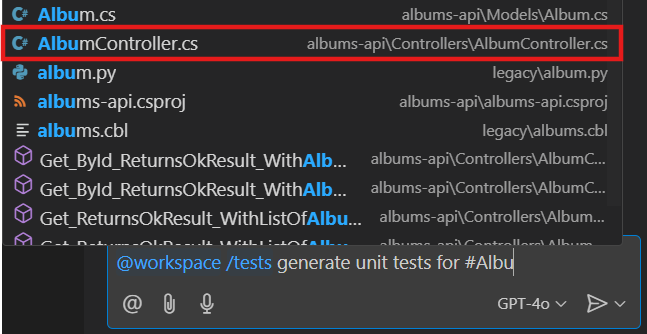
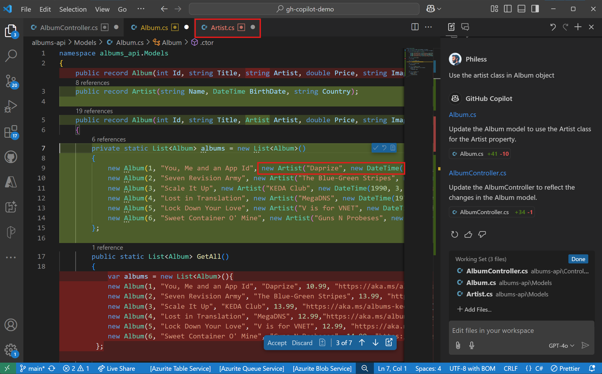
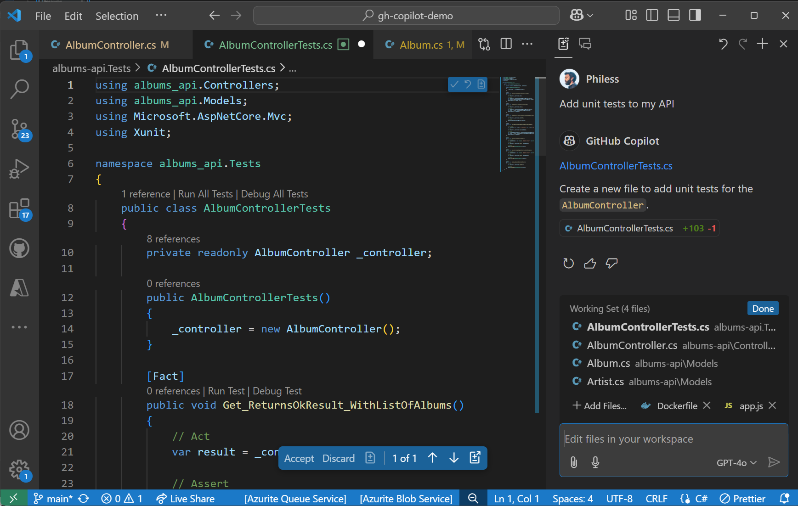
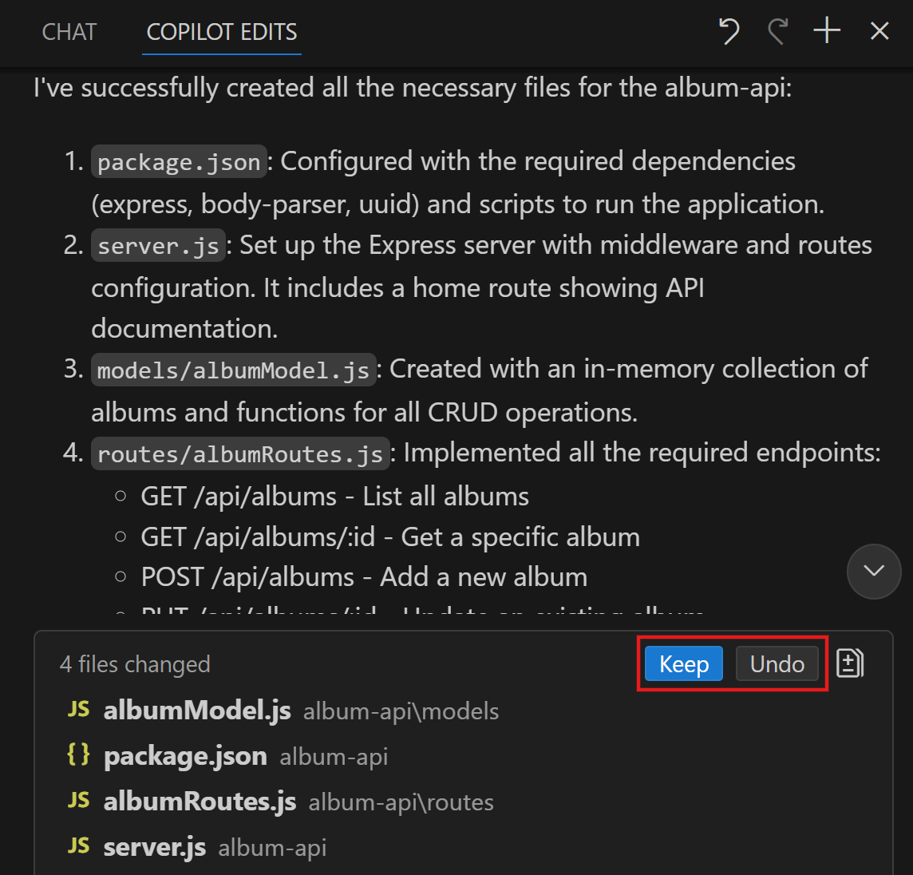

# The ultimate GitHub Copilot Tutorial for developers

The goal of this workshop is to learn how to use GitHub Copilot, using an exercise that consists of building a web server using Nodejs with different functionalities and a .NET Web API. In the second part, you'll learn how to use it for infrastructure as code but also to fix bad practices in terms of security.

GitHub Copilot is an AI-powered code assistant that helps developers write better code faster. It uses machine learning models trained on billions of lines of code to suggest whole lines or entire functions based on the context of what you’re working on. By using GitHub Copilot, you can learn how to write better code and improve your productivity.

<div class="warning" data-title="warning">

> GitHub Copilot is a quickly evolving product and thus this workshop may not be 100% up to date with the different features of the different extensions you are going to use. Please be clever if it's not exactly the same.

</div>

## Minimal Pre-requisites

There are two ways to run this workshop:
- online with **GitHub Codespaces**: fastest and easiest way to start playing immediately
- locally on **your computer**: the best way to install and configure the tools you need to work with GitHub Copilot on every projects

These are the very minimal pre-requisites to run this workshop:

| | |
|----------------|-----------------|
| A GitHub account | [Create free GitHub account](https://github.com/join) |
| GitHub Copilot Access activated | [Get Access to Github Copilot](#get-access-to-github-copilot) |
| A web browser  | [Download Microsoft Edge](https://www.microsoft.com/edge) or any other one ;-)|


## Get Access to Github Copilot

There are different ways to get access to GitHub Copilot:

- **As an individual**, you can sign up to use [Copilot Free](https://github.com/github-copilot/signup), without the need for a credit card. You are entitled to a limited number of completions and chat interactions per month with the free plan, which reset each month. Learn more about the [Copilot Free plan details and conditions](https://docs.github.com/en/copilot/about-github-copilot/subscription-plans-for-github-copilot).

- **As an individual**, sign up for a [paid subscription](https://github.com/github-copilot/signup/copilot_individual) to get unlimited completions and chat interactions. You can try GitHub Copilot for free with a one-time 30-day trial.

- **As a member of an organization or enterprise** that has a subscription to GitHub Copilot, you can request access to Copilot by going to [https://github.com/settings/copilot](https://github.com/settings/copilot) and requesting access under "Get Copilot from an organization."


## Fork the repository

This workshop uses the following GitHub Repository: [Github Copilot Demo](https://github.com/Philess/gh-copilot-demo)

This repository is a code starter that will help you experiment all capabilities with GitHub Copilot. Take the time to look at the architecture design displayed.

Start by creating **your own fork** of the repository by clicking on the `Fork` button on the top right of the repository page. It will create a copy of the repository in your own GitHub account and you will be free to make any changes you want.


## OPTION 1: Work with GitHub Codespaces

The environment is already configured to work with [GitHub Codespaces](https://github.com/features/codespaces), you can find the configuration files in the *.devcontainer* folder.

To start programming just start a new codespace and you are ready to go, don't need to install anything.

<div class="info" data-title="note">

> Every individual users of Github has a free plan to run the codespace to let you try it with a free 120 core-hours per month [See Pricing](https://github.com/settings/billing/summary)

</div>


After a few seconds, you will be redirected to the Codespace environment. You can start coding right away, your Github Copilot extensions are already installed and configured.

## OPTION 2: Work locally

You can choose to work locally on your computer for this workshop and take that as an opportunity to install and configure the tools you'll need to work with GitHub Copilot on your projects. 

You first need to install the following tools locally:

1. Install [Visual Studio Code](https://code.visualstudio.com/)
2. Install the [GitHub Copilot](https://marketplace.visualstudio.com/items?itemName=GitHub.copilot) extension
3. Install the [GitHub Copilot Chat](https://marketplace.visualstudio.com/items?itemName=GitHub.copilot-chat) extension
4. Install [Node and npm](https://docs.npmjs.com/downloading-and-installing-node-js-and-npm)
5. Install mocha

    ``` bash
    npm install --global mocha
    npm install axios
    ```

7. Install [Docker](https://docs.docker.com/engine/install/)
8. Install [.NET Core](https://dotnet.microsoft.com/download) \* *needed if you want to run provided .net code*

Then, clone your forked repository and open it in VS Code.

``` bash
git clone https://github.com/<YourUser>/gh-copilot-demo
cd gh-copilot-demo
code .
```

Finally, you need login to your GitHub account in Visual Studio Code to activate the GitHub Copilot extensions. The extensions will ask you to login, but if you don't see the prompt, you can login by clicking on the user icon in the bottom left sidebar where you will see the logins for Github and Github Copilot Chat.


---

# Level 1: Code Completion with GitHub Copilot

This section will guide you through the first steps with GitHub Copilot, starting with code completion. You will learn what you can do and how to use it at his full potential.

## Start playing with GitHub Copilot Completion

Once you start typing a prompt and copilot generate proposals, you can use the following shortcuts to interact with Copilot:
    <ul>
        <li>`tab` to accept the current suggestion entirely (`most common`)</li>
        <li>`ctrl + right arrow` to accept word by word the suggestion (`for partial use`)</li>
        <li>`alt + ^` to move to next suggestion</li>
        <li>`shift + tab` to go back to the previous suggestion</li>
        <li>`ctrl+enter` to display the copilot pane</li>
    </ul>

<div class="info" data-title="info">

> These shortcuts are the default ones for VS Code. If you are using another IDE, you can find the shortcuts in the [GitHub Copilot documentation](https://docs.github.com/en/copilot/getting-started-with-github-copilot/).

<div>

### Change completion model

It's now possible to switch from the standard Github Copilot completion model, based on GPT-4o mini, to another one. The completion model has been specifically trained on over 275,000 high-quality public repositories in over 30 popular programming languages, including JavaScript, TypeScript, Python, Java, C#, C++, and many more for better results. However, you are able to switch to another model if your administrator has activated this feature otherwise you may have only the latest one.

In **VS Code** To get started, open the Copilot menu in the VS Code title bar, select `Configure Code Completions...` > `Change Completions Model...`. Alternatively, open the Command Palette and select GitHub Copilot: `Change Completions Model...`


<div class="info" data-title="info">

> These instructions are for VS Code. If you are using JetBrains or other supported IDE, you can find instructions on [GitHub Copilot documentation](https://docs.github.com/en/copilot/using-github-copilot/ai-models/changing-the-ai-model-for-copilot-code-completion?tool=jetbrains).

<div>

## Let's start with the basics

### Write code

**What is a prompt?**
In the context of Copilot, a prompt is a piece of natural language description that is used to generate code suggestions. It can be a single line or a multiple lines description.

**Generate code from prompt**

Create a new `album-viewer/utils/validators.ts` file and try the different following prompts to see the different suggestions:

```ts
// validate date from text input in french format and convert it to a date object
```

Copilot can help you also to write `RegExp patterns`. Try these:

```ts
// function that validates the format of a GUID string

// function that validates the format of a IPV6 address string
```

<br>

**More complex code generation**

In the `albums-api/Controllers/AlbumController.cs` file try to complete the `Get(int id)` method by replace the current return:

```cs
// GET api/<AlbumController>/5
[HttpGet("{id}")]
public IActionResult Get(int id)
{
    //here
}
```

In the same file you can show other prompts like:

```cs
// function that sort albums by name, artist or genre
```

### Next edit suggestion


<div class="warning" data-title="note">

> Preview feature available only on [VS Code](https://code.visualstudio.com/blogs/2025/02/12/next-edit-suggestions)

</div>

*Next edit suggestion* is an evolution of the standard completion in Github Copilot. When you are modifying code and accepting a code suggestion, it can have an impact on other part of your code, it will automatically suggest the next change in your code, and not only directly where your pointer is but where your natural next action will probably be.

An example is better than a thousands words so let's try that!

First, be sure to activate the feature on your copilot settings. Select the `Preferences: Open User Settings` command in the Command Palette (`Ctrl+Shift+P`) and search for the *Next edit suggestion* settings:


Then, open the `albums-api/Models/Album.cs` file and, on the Album contructor, add a new input parameter `Year` of type `int` and see the Next Edit Suggestion propose to change the body of the method accordingly:


## Everyday developer's tasks

### Write Tests

Copilot can help generate all kind of tests that are written with code. It Includes `unit tests`, `integration tests`, `end to end tests`, and `load testing` tests with JMeter scripts for example.

- Add a new file `validators.test.ts` in the `albums-viewer/tests` folder

- To have good test suggestion, you should provide some basic informations to Copilot such as the test framework you want to use:

```ts
import { describe }
```

When you start typing the `describe` function, Copilot will see you're in test file in TS and suggest you to import the `describe` and `it` functions from Mochai which is a famous test framework for JS/TS.
Accept the suggestion and it will automatically suggest also the `expect` function from Chai: accept it also.

```ts
import {describe, it} from 'mocha';
import {expect} from 'chai';
```

You have your test framework in place! Now just import the functions you want to test by starting a new line by the `import` keyword, Copilot will see you are in a test file, to test some `validators` because of the name and it will suggest something like that:

```ts
import {validateAlbumId} from '../src/validators';
```

It looks ok but because Copilot doesn't have access to all your code, only the open tab and limited informations, you can see that both the path and the function name are wrong.
<br>
... At least he tried ...
<br>
but it's a good way to show that Copilot is not magic and you have to use it with your other IDE feature and your brain :)

- Accept the suggestion and change the path. You will be able to have VS Code to give you the available function with the `ctrl+space` shortcut. Import `validateDate`, `validateIPV6`.

- Then, add a comment with the first function you want to test and let the magic happen:

```ts
import {describe, it} from 'mocha';
import {expect} from 'chai';

import {validateDate, validateIPV6} from '../utils/validators';

// test the validateDate function
```

Boom!

```ts
describe('validateDate', () => {
    it('should return a date object when given a valid date string', () => {
        const date = '01/01/2019';
        const expectedDate = new Date(2019, 0, 1);
        expect(validateDate(date)).to.deep.equal(expectedDate);
    });

    it('should throw an error when given an invalid date string', () => {
        const date = 'invalid-date';
        expect(() => validateDate(date)).to.throw();
    });
});
```

*You can add other `it` block to add more test cases and also add the tests for the other functions. For example try add a new `it` block for the validateDate function to test that it throws an error when given en empty string.*

### Write CI pipelines

Copilot will help you in writing your pipeline definition files to generate the code for the different steps and tasks. Here are some examples of what it can do:

- generate a pipeline definition file `from scratch`
- accelerate the writing of a pipeline definition file by `generating the code` for the different `steps`, `tasks` and `pieces of script`
- help `discover marketplace tasks and extensions` that match your need

#### Step 1: generate from scratch

- Create a new file `workflow.yml` in the `.github/workflows` folder of the project and start typing the following prompt:

```yml
# Github Action workflow that runs on push to main branch
# Docker build and push the album-api image to ACR
```

Copilot will generate the pipeline block by block. When generating pipeline YAML, you may need to press `Enter` to move to a new line to prompt the generation of the next block and `Tab` to validate it, which is more frequent compared to other types of code.

It will often generate a task with a few errors coming from bad indentation or missing quote around a task name. You can easily fix these with your IDE and your developer skills :)

#### Step 2: add tasks from prompts

- You probably have a github action workflow with at least a "login" task to your container registry and a "docker build and deploy" task. Add a new comment after those tasks to tag the docker image with the github run id and push it to the registry:

```yml
# tag the image with the github run id and push to docker hub
```

you can play with other prompts like:

```yml
# run tests on the album-api image

# deploy the album-api image to the dev AKS cluster
```

#### Step 3: add scripts from prompts

- Copilot is also very usefull when you need to write custom script like the following example:

```yml
# find and replace the %%VERSION%% by the github action run id in every appmanifest.yml file
```

### Infrastructure As Code

Copilot can also help you write Infrastructure as code. It can generate code for `Terraform, ARM, Bicep, Pulumi, etc...` and also `Kubernetes manifest files`.

#### Bicep

Open the `main.bicep`file in `iac/bicep` folder and start typing prompts at the end of the file to add new resources:

```js
// Container Registry

// Azure Cognitive Services Custom Vision resource
```

#### Terraform

Open the `app.tf`file in `iac/terraform` folder and start typing prompts at the end of the file to add new resources:

```yml
# Container Registry

# Azure Cognitive Services Custom Vision resource
```

## Big tasks vs small tasks

Copilot will probably will always more effective with prompt to generate small but precisely described pieces of code rather than a whole class with a unique multiple lines prompt.

Copilot completion is even more effective when you use it to generate small pieces of code step by step. For more complex task, we will see in the next section that Copilot Chat is more powerfull.

This is because completion must be almost "instant" to be natural to use where a chat request can take a few seconds to be processed without being annoying.

<div class="tip" data-title="tip">

> The best strategy to generate big piece of code, is always starting by the basic shell of your code with a simple prompt and then adding small pieces one by one.

</div>

**Big prompts that *could* works**

- Back in the `albums-viewer/utils` add a new file `viz.ts` to create a function that generates a graphe. Here is a sample of prompt to do that:

```ts
// generate a plot with D3.js of the selling price of the album by year
// x-axis are the month series and y-axis show the numbers of albums sold
// data from the sales of album are loaded in from an external source and are in json format
```

<div class="info" data-title="info">

>Copilot will probably try to complete the prompt by adding more details. You can try to add more details yourself or follow copilot's suggestions. When you want it to stop and start generating the code just jump on another line and let the copilot do its work.

</div>

- Once you achieved to generate the code for the chart you probably see that your IDE warn you about the d3 object that is unknown. For that also Copilot helps.
Return on top of the file and start typing `import d3` to let copilot autocomplete

```ts
import d3 from "d3";
```

Look at what Copilot has been able to generate. It's possible that the code is working fine and does everything you asked for but also you probably hit the token limit and Copilot was not able to generate the whole code.

It's because Copilot for autocompletion is not made for creating big pieces of code at once, but is more specialized in generating small pieces step by step.


**Try again by build it step by step**

Try to generate the code for the plot by cutting it into small pieces following the steps below:

```ts
import * as d3 from 'd3';

// load the data from a json file and create the d3 svg in the then function
```

Inside the then function, starts by setting up the basics of the plot

```ts
// create the svg
```

```ts
// create the scales for the x and y axis
// x-axis are the month series and y-axis show the numbers of album selled
```

```ts
// create axes for the x and y axis
```

From there you can just ask to copilot to complete the chart

```ts
// generate a line chart based on the albums sales data
```

<div class="tip" data-title="tip">

>You will **always** get better results by cutting big task into small chunks with copilot autocomplete. It's also a good way to show that copilot is not magic and you have to use it with your other IDE feature and your developer logic.

</div>


## Side Quest #1: Generate Git Commit comment

Yes, writing a comment should be mandatory and developers tend to be lazy. GitHub Copilot can help with that.

1. Just edit any file by adding some relevant content into it.

2. On the Git commit panel, click the small magical button on the right

    

3. Admire Copilot having generated a comment for you

    

## Side Quest #2: Writing documentation

Copilot can understand a natural language prompt and generate code and because it's just language to it, it can also `understand code and explain it in natural language` to help you document your code.
So it can help you in all your documentation tasks. It can generate simple documentation comment or standardized documentation comment like JavaDoc, JsDoc, etc... it can also help you translate your documentation in different languages. Let's see how it works.

### Simple documentation comment

To see that just put you pointer on top of a Class, a method or any line of code and start typing the comment handler for the selected language to trigger copilot. In language like Java, C# or TS for example, just type `// `and let the magic happen.

Here is an example in the `albums-viewer/routes/index.js` file. Insert a line and start typing on line 13 inside the `try block`

```js
router.get("/", async function (req, res, next) {
  try {
    // Invoke the album-api via Dapr
    const url = `http://127.0.0.1:${DaprHttpPort}/v1.0/invoke/${AlbumService}/method/albums`;

```

Continue to play with it and see what happens on other pieces of code.

### Standardized documentation comment (JavaDoc, JsDoc, etc...)

For this one, to trigger the documentation comment generation, you need to respect the specific comment format:

-  `/**` (for JS/TS) in the `index.js` file for example
- `///` for C# in the `AlbumController.cs` of the AlbumApi file for example

```cs
/// <summary>
/// function that returns a single album by id
/// </summary>
/// <param name="id"></param>
/// <returns></returns>
[HttpGet("{id}")]
public IActionResult Get(int id)
```

### Writing markdown and html documentation

Copilot is also very powerfull to help you write documentation. It can generate `markdown` and `html` code and accelerate the writing of your readme.md files like for this one for example.

You can show that by creating a new file `demo.md` in the root of the project and start typing the following prompt:

```md
# Github Copilot documentation
This documentation is generated with Github Copilot to show what the tool can do.

##
```

From there by starting a new line with a secondary level title it will start generating the content of the documentation and it will showcase how it will accelerate the documentation writing process.

---

# Level 2: Use Copilot Chat to improve code quality

GitHub Copilot is a generative AI and thus, perfect to generate code, but it has powerfull analysis capabilities on your code that can be used in several case to improve code quality like: find security issues, bad practices in your code and generate a fix, refactor and add comment to legacy code, generate tests, etc...


## Start playing with the Chat

Once Copilot Chat is setup, you can start using it:

- by clicking the **Copilot Icon** on the top next to the search bar *or* pressing `Ctrl` + `Alt` + `i` shortcut to open the **Chat view**
- by pressing `Ctrl` + `i` shortcut for a quick **inline question** to the chat
- by pressing `Ctrl` + `Shift` + `i` shortcut to open the **Edit view**

The **Chat View** is a sticky version, very usefull to keep the chat open and ask questions to copilot.
The **Inline Chat** is a quick way to ask a question and get an answer precisely in the context of the line you are working on.
The **Edit View** is a more advanced version of the chat view that allows you to edit the code directly in the chat.

We'll see examples of both in the next sections to let you choose which one you prefer depending on the situation.

### Chat View

The chat view gives you a full chat experience, integrate as any other tool view in your IDE. Once the view is open you can start chatting with Copilot as your personnal code coach. It keeps the history of the conversation and you can ask question related to the previoius answers. It also provides suggestions for questions along the way. You can:

- ask general question about coding on any language or best practice
- ask to generate or fix code related to the current file and inject the code directly in the file

It's a more high level copilot than the vanilla copilot which is specialized on providing code completion.

Try it with a few questions like:

```text
> How to generate a random number in C#?
> What is the best way to secure a route is ASP.NET Core?
> What is the easiest way to generate a static website with NodeJS?
```

Try it then with some of your code files in the repository. Open a file a try asking:

```text
> Can you explain me what this code does?
> (with only part of the code selected) Can you explain me what the selected code does?
> Can you generate a function that returns a random number between 1 and 10?
> Can you add documentation comments to this function?
```

Try also using the questions suggestions that appears along the way.

### Inline Chat

GitHub Copilot Chat is very handful but for a developer, leaving the keyboard and having to take the mouse to open the Chat tab can be boring. You can directly call the Chat inside the code editor.

1- Open any file containing code

2- Use the shortcut **Ctrl + i**. It should open the Quick chat popup, a small chat windows where you put your cursor


3- Type any command to generate some code (i.e. "Create a C# class named Toto). You can do the same actions as in the chat view but directly targeting a very specific line of code. It's also more focused on generating code and less on explanation.

### Model Selection

LLMs capabilities evolves pretty fast and we tend to see more and more models specifically optimized for specific tasks. In order to always provide the best performances for your usage, GitHub Copilot now integrate multiple model that you can switch between on Chat / Edit modes. 


<div class="tip" data-title="Available models">

> The list of available models will depend on multiple parameters:
> - which IDE are you using
> - which mode are you using (Chat / Inline / Edit)
> - what are the model authorized by your Copilot Administrator

</div>

### Edit View

The Edit view is a more advanced chat experience that allows you to edit the code directly in a working set, iterate on it, and even use multiple agents working together autonomously to solve very complex tasks that require multiple steps.

We will see that in the next level.

### Slash Commands

To further help Copilot give you more relevant answers, you can choose a topic for your questions through "slash commands."

You can prepend your chat inputs with a specific topic name to help Copilot give you a more relevant response. When you start typing /, you’ll see the list of possible topics:

- **/explain**: Explain step-by-step how the selected code works.
- **/fix**: Propose a fix for the bugs in the selected code.
- **/help**: Prints general help about GitHub Copilot.
- **/tests**: Generate unit tests for the selected code.
- **/vscode**: Questions about VS Code commands and settings.
- **/clear**: Clear the session.

### Chat participants

Chat participants are like specialized experts who can assist you with specific tasks. You can mention them in the chat using the @ symbol. Currently, there are three Chat participants available for Visual Studio Code:

- **@workspace**: This chat participant has knowledge about the code in your workspace and can help you navigate it by finding relevant files or classes. The @workspace chat participant uses a meta prompt to determine what information to collect from the workspace to help answer your question.
- **@vscode**: This chat participant is knowledgeable about commands and features in the VS Code editor itself, and can assist you in using them.
- **@terminal**: This chat participant has context about the Visual Studio Code terminal shell and its contents.

They may not be super rich for the moment but their features will continue to grow over the time. Here are some example

Open the side Chat panel and type **@workspace /New* to specify that you want to create a new project. For instance, try to create an Asp.Net project

```text
> @workspace /new create a new ASP.NET core 9.0 project, with three views Index, Users and products.
```

It should create a structured project and even a new button to create the file. Click on "Create workspace" to see files being created.


### Context Manipulation

As you saw in previous examples, passing the right instructions is key for good copilot results. The other big factor is the context your are passing to Copilot with that instructions.

In the Chat or Edit mode you can see the files passed in the context by default in the chat field:


It's possible to ignore it by clicking on the eye icon on the left of the file name.

But the power of the integration of Copilot in your IDE is to provide multiple kind of data in the context. Click on the paper clip icon in the chat field to see all options:


Here are the main options to keep in mind:
- Codebase and File will target either all or a specific file in your current workspace
- Selection will target the current selected text on screen
- (Git) Changes will focus only on your pending modifications
- Image / Screenshot will use the Vision capability (only GPT-4o) to add some visual context
- Terminal commands / selection

Depending on the IDE, there is other options already availables like:
- Prompt to attach reusables prompts
- Fetch data from the web
- Tests failure for unit test runs that have failed
- Problems identified in the VS Code windows
- other to come and try...

Here are a few basic examples to understand how it works. More complex example are available in ***Level 4: Copilot Advanced*** part of this workshop. 

You can add multiple reference in context in a single request. Feel free to challenge it and see how effective it is. 

**Pass a file**

```text
> @workspace /tests generate unit tests for #Albu
```

And then select `AlbumController.cs` to add the file as reference.



**Ask question on git changes**

```text
> can you give me the content to add in my changelog regarding my current #changes

> What in my current #changes can cause my code to fail at runtime?
```

**Target selection and attach folder**

Open the `AlbumController.cs` file and select one or many functions. Then in the chat add all the album-api folder to the contect by **drag-and-dropping** the folder from the file explorer on the left.

```text
> @workspace /tests generate unit tests for the function in #selection 
```


It will improve result by targeting a very specific part of the code for the action while giving a better understanding of the context for the task by attaching all the code in the api folder.


## Everyday developer's tasks

### Natural Language Translations

**Automate text completion**

Open file `album-viewer/lang/translations.json` and ask in the chat to add some new languages like french and german for example

```json
[
    {
        "language": "en",
        "values": {
            "main-title": "Welcome to the world of the future",
            "main-subtitle": "The future is now with copilot",
            "main-button": "Get started"
        }
    }
]
```


### Write Tests

Copilot can also help you generate tests for your code. It can generate `unit tests, integration tests, end to end tests, and load testing` tests with JMeter scripts for example.

Open the `album-api/Controllers/UnsecuredController.cs` file and type questions like these to the chat
*Why not trying inline with `Ctrl + i` first and again with the chat view after to see the difference?*

```text
> Generate a unit tests class for this code
```

You can also use copilot to help you generate Stubs and Mocks for your tests.

```text
> Generate a mock for FileStream class
> Use that mock in the unit tests
```

<div class="info" data-title="note">

> Remember that Copilot chat is keeping track of the previous Q & A in the conversation, that's why you can reference the previously generated mock and test easily.

</div>

### Code Explanation and documentation

You can use Copilot Chat to explain code to you. It can `explain you the code in natural language or generate documentation comments for you`. Let's try that with the following commands:

```text
> /explain
> Generate documentation comments for this code
```

It can be very useful to understand legacy code or code you don't know. Give it a try with files in the `legacy` folder of the repo.

You can also use Copilot to generate documentation at a high level as it'sc fluent in markdown. For example, you can ask to complete `README.md` file (ensure you have the file in the context):

```text
> complete my README by adding step to deploy solution on azure
```

You can also ask Copilot what are the standard MD files to have in a project on GitHub and generate them for you.


### Code Refactoring

More impressive, Copilot chat can help you refactor your code. It can help you `rename variables, extract methods, extract classes, etc...`.

You can try some of these commands on the `album-api/Controllers/UnsecuredController.cs` file:

```text
> extract methods
> create Async version of each methods when it makes sense
```

### Code Translation

*Copilot can understand and generate natural languages and code language in both way so by combining everything you can use it to `translate code pieces from a language to another one`*

To translate a piece of code in a specific language, open it and ask to the chat to translate it to another language. For example open the `validators.ts` file created in the first section dedicated to Copilot autocompletion and ask to translate it to C for example.

In case of dealing with Legacy code like COBOL for example it can be very useful. Open the `legacy/albums.cbl` file and try translating the code to Python.


### Secure your code

Copilot can help you find security issues in your code and fix them. It can also help you find bad practices in your code and fix them. Let's see how it works.

Open the `album-api/Controllers/UnsecuredController.cs` file and type questions like these to the chat:

```text
> Can you check this code for security issues?
> Do you see any quality improvement to do on this code?
```

Once you have the answer, you can ask to fix the issues by typing:

```text
> Can you propose a fix?
```

When you have the fix in the code you choose to **copy it or inject it directy in the file** by hovering the code block in the chat and selecting the right option on the top left.


### Debug with Copilots *

\* Coming soon: VS Code and Visual Studio

### Ask copilot to review your code

You can also ask Copilot to do a review of your code. It will check your code for security issues, bad practices, etc... and generate comments just as a co-worker will do on a pull request. It provides actionable suggestions to improve your code quality and ensure best practices are followed.

<div class="warning" data-title="note">

> This feature is available only on VS Code BUT you can simply ask to copilot chat to review your code and he will give you feedbacks and fix suggestions.

</div>

Open again the `album-api/Controllers/UnsecuredController.cs`, right-click in the code window, and then in the `Copilot` menu select `Review and Comment` option. 


It will start a review of your code and provide explanations and suggestions to improve your code that you can choose to apply or not with the same experience with code review comments integration.
- in red below: Copilot comment and suggestions with buttons to directly accept or discard change and go to next comment
- in green below: All comment shows in the "Comments" list in VS Code


---

# Level 3: Copilot Edit & Agents Mode

## Edit mode

The Edit Mode of GitHub Copilot is redefines the way you code with Copilot by transitioning from an `AI Infused` mode to an `AI-Native` approach. What it means is that instead of just answering questions, Copilot is taking actions, and is able now to achieve more complex, multi-steps tasks.

It's very powerfull for tasks that needs a lot of operations while keeping track and context on a longer term, like code refactoring for example. Let's try that!

<div class="warning" data-title="note">

> This feature is available only on **VS Code** and **JetBrains IDEs** for the moment

</div>

### Code Generation

Let's start by rebuilding the existing webapp, which is very basic by using a more powerfull framework like Vue for exemple.

After **committing your code**, to keep a valid starting point to potentially rollback to, **remove** the old `album-viewer` folder and then Open Copilot windows on **Edit Mode** or using the `Ctrl+Shift+I` shortcut:


Add the `AlbumController.cs` and `Album.cs` files from the API folder in the Working Set, by clicking *Add file* button or simply by pasting it, and then type the following request to Copilot Edit:

```text
Create a album-app client project in vuejs with screen to list, 
display, create, update and delete albums using the AlbumAPI
```


It will create an execute a plan to (probably):
- Add missing route to existing API controller
- create a new Vue from scratch with all the required code
- provide explaination and details on all the code created

When the job is done you'll a working set enriched with all new files. You'll be able to stop there by just clicking **Done** button to end the edit process and keep it, iterate by continuing giving instructions in the current session, or rollbakc everything by clicking on the **Undo** arrow on top to come back to the previous state.


<div class="tip" data-title="tips">

> The default model of Copilot will probably already do the job but if you're not 100% satisfied, you can try a different one here to leverage more power and achieve more complex tasks. Try and make your own opinion on your favorite model!

</div>

### Code refactoring

We already seen in the previous example that the edit mode is able to create new code but also refactor existing files in the process of implementing new behavior.

Let's continue to explore this:

**Add a new Artist model on the API**

Let's start a new Edit session, add the `AlbumController.cs` and `Album.cs` files in the working set, and edit the API code with this 3 consecutive requests:

```text
> Add the missing function to the Album Class

> Add a new Artist model with Name, Birthdate, BirthPlace properties

> User the Artist class in the Album object
```




### Tests generation

Another use case where we can take advantage of this powerfull edit mode is writing tests. 

Add the `AlbumController.cs`, `Album.cs` and `Artist.cs` files and Let's add some unit tests for our API:

```text
> Add unit test to my api
```



Again, Copilot Edits is very strong to write complex code but this is also his limit: for the rest, aka running commands, installing package, running tests, etc. it can gives you the instructions but you will have to take the control.

**What if... it can do all that for you?**

## Agents mode

The Agent mode is the evolution of edit mode, with capabilities to directly run commands on the terminal and correct errors on the fly on top of just editing code. It accelerate even more the coding process. As action is worth thousand words, let's start by rebuilding the API this time, and you have the choice of the stack. 

<div class="warning" data-title="note">

> This feature is available only on **VS Code Insiders** for the moment. The insiders version of VS Code is the *nighly build* or *canary* version. It means that it can be less stable but you can experiment cutting edge features like this one.
[Download VS Code Insiders](https://code.visualstudio.com/insiders/)

</div>

### Step 1: Rewrite the API from scratch

Here is an example in NodeJS but you can try it in Java or Python or any other stack you prefer.

Again, after **commiting your code**, to keep a new starting point to potentially rollback to, **remove** the old `album-api` folder and then Open Copilot windows on Edit Mode but then select the `Agent` mode:


Then type:

```text
Create a new nodejs api named album-api to manage music albums. 
Create all basic routes to list, get, add, update and delete albums.

Create a collection with sample data. 
Data are kept in memory for the moment no need to database.

Add unit tests and run it
```

Follow the step, validate each step to continue or give different instructions along the way to see the agents working for you. When finished, you should have **a new API that can run with all services, sample datas and even unit tests** and Copilot will list all actions completed. From there, you can choose to:
- **Keep** changes to validate this set of modifications
- **Undo** to rollback to before this set of modifications
- **Give new instructions** & continue to iterate



The last step before committing it and share it with you team is documenting. Try to ask this to Copilot again:

```text
can you add the instructions to a readme.md file
```

Clic on `Keep` and `Done` to validate your modification and commit your changes.

### Step 2: Create a new web app

Now that we have a new API, let's take the opportunity to rewrite our frontend app, based on this new API. 

First, **remove** the old `album-app` folder, start a new session in `Agent Mode` and type (reference your created file in context):

```text
Create a new Vue app named album-app to manage music albums, using the album api #file:albumRoutes.js #file:albumModel.js  
Create a splashscreen, a view for all routes, and a burger menu to navigate.
```


<!-- ### Debug with agent mode and Vision

Let's say that when running your app, you have an error message like this one: -->

---

# Level 4: Copilot Advanced

In the previous sections you discovered how to use all out-of-the-box features from GitHub Copilot. In this section you will learn techniques to get more accurate results, providing  Copilot what he doesn't know: your best practices, naming conventions, data model, internal APIs, etc...

We will use advanced `reusable prompts` and `customization capabilities` to make Copilot act like a real co-worker and not just the copilot everyone is using. 

## Prompt Engineering techniques

### Provide examples: one-shot and few-shots programming

Talking about prompt engineering, you can also use the chat to provide examples to Copilot. It's a good way to help Copilot understand what you want to do and generate better code. You can provide examples in the chat by typing with the validator.ts file open:

```bash
# one-shot programming

Write me unit tests for phone number validators methods using mocha and chai in the current file.
Use the following examples for positive test (test that should return true): 
it('should return true if the phone number is a valid international number', () => { expect(validatePhoneNumber('+33606060606')).to.be.true; });
Organize test in logic suites and generate at least 4 positives tests and 2 negatives tests for each method.
```

```bash
# few-shot programming

Write me unit tests for all validators methods using mocha and chai in the current file.
Use the following examples for positive test (test that should return true): 
it('should return true if the phone number is a valid international number', () => { expect(validatePhoneNumber('+33606060606')).to.be.true; });
it('should return true if the phone number is a valid local american number', () => { expect(validatePhoneNumber('202-939-9889')).to.be.true; });
it('should throw an error if the given phone number is empty', () => { expect(validatePhoneNumber('')).to.throw(); });
Organize test in logic suites and generate at least 4 positives tests and 2 negatives tests for each method.
```

You can use this technique to **generate code that keeps the styling code from another file**. For example if you want to create sample records for music style like the Albums in albums-api>Models>Album.cs file, open it and type:

```bash
Write a MusicStyle record that contains a List<MusicStyle> with 6 sample values like in the Album.cs file.
```

### Role Prompting

Also called foundational prompt, it's a general prompt you're giving to Copilot Chat to personnalize his behavior and setup your flavour of Copilot.

This is probably the first thing to do when you start a new task with Copilot Chat: **provide a clear description of what you want to build and how do you want copilot to help you**.

<div class="warning" data-title="Important">

> **This is very powerfull when handled properly** so be sure to start every coding sessions with a role prompt and save your best prompt for future use.

</div>

***Structure of a role prompt***

What can you include in a role prompt:

- Provide solid context and background information on what you want to build.
- Define GitHub Copilot’s role and setting expectations about what feedback we are looking for.
- Be specific in the quality of answers and ask for reference and additional resources to learn more and ensure the answers you receive are correct
- Resume the task and ask if the instructions are clear

***Example of a role prompt***

Start a new conversation and type the following prompt:

```bash
I'm working on a new mobile application that is built on React Native. 
I need to build a new feature that will allow the user to upload a picture of a dog and get the breed of the dog. 
I will need to use the following set of APIs to work on the breeds: https://dog.ceo/api/breeds. I need to be sure that my code is secured against at least the OWASP Top 10 treats (https://owasp.org/Top10/). 
I need to have unit tests for the code using Jest framework.
I need you to act as my own code coach to ensure that my code fits all these requirements. 
When possible, please provide links and references for additional learning. 
Do you understand these instructions? 
```

From there you can start asking questions and from time to time, ensure Copilot still follows the instructions by asking:

```bash
Are you still using the instructions I provided?
```

***Test your role prompt***

You can test your role prompt by asking questions about best practices for accessibility on React Native Apps and OWASP Top 10 treats. You can also ask to generate code for the upload feature and check if the generated code is secured and accessible.

Try these questions for example:

```bash
how can i make my app accessible with react native?

what is the most secure way to upload a photo from my app?
```

## Custom Instructions

<div class="warning" data-title="note">

> This feature is available only on VS Code, Visual Studio and the GitHub Website for the moment

</div>

This feature is easing the customization of copilot by providing an instruction file that will be:
- used as **meta instructions** for all you chat/edit requests
- stored in the repo as code which means it will be automatically **shared among team members**

It very powerful to add context for copilot specifically dedicated for the current codebase.

Start using it by simply creating a `.github/copilot-instructions.md`. Start simple by adding these simple instructions and make a few requests to copilot chat to see the impact:

```md
Please answer in french but provide code in English.
We code in TypeScript and use Jest for testing our code.
When possible, please provide links and references for additional learning.
```

This is a very basic example. By the way you can provide more advanced information on your project to improve responses by Copilot. Here is a few examples:

Example 1:
```md
The backend code is using NestJS in TypeScript, Prisma as our ORM, and PostgreSQL as our database.
The frontend code is using VueJS in TypeScript with Vue Router and Vuex for state management.
We use Docker for containerization and deploy on Azure.
We use GitHub Actions for CI/CD.

We write tests for our code with Jest.
Use the following examples for positive test (test that should return true): 
it('should return true if the phone number is a valid international number', () => { expect(validatePhoneNumber('+33606060606')).to.be.true; });
Organize test in logic suites and generate at least 4 positives tests and 2 negatives tests for each method.
```
Example 2:

```md
This is our SQL database schema for Music Albums management:

    ```sql
    CREATE TABLE artists (
        id SERIAL PRIMARY KEY,
        name VARCHAR(255) NOT NULL,
        genre VARCHAR(100),
        created_at TIMESTAMP DEFAULT CURRENT_TIMESTAMP
    );

    CREATE TABLE albums (
        id SERIAL PRIMARY KEY,
        title VARCHAR(255) NOT NULL,
        artist VARCHAR(255) NOT NULL,
        price DECIMAL(10, 2) NOT NULL,
        image_url VARCHAR(2083),
        release_date DATE,
        created_at TIMESTAMP DEFAULT CURRENT_TIMESTAMP
    );
    ```
```


## Reusable prompts

As you can see with the previous examples of `custom-instructions`, putting everything in the same file will soon bring complexity and maybe even have bad impact on copilot reponse quality.

This is why it's also possible to create specialized prompt files, to give specific instructions, for specific tasks.

<div class="warning" data-title="note">

> This feature is available in preview only on VS Code for the moment

</div>

Instructions to activate and use reusable prompts are [available here](https://docs.github.com/en/copilot/customizing-copilot/adding-repository-custom-instructions-for-github-copilot?tool=vscode#about-prompt-files)


## Tools integration with Model Context Protocol *

\* Coming Soon

## Advanced Context Manipulations

### Fetch Web Pages

The chat copilot can use external references to build more accurate suggestions. Let's say you want to generate a code that uses a specific version of a library, using a specific code sample from a documentation, or even request an API. You can provide a specific url or a web request that Copilot will use to generate more accurate code.

<div class="warning" data-title="note">

> This feature is available in preview only on VS Code Insiders for the moment

</div>

Example 1:
```text
what are the new features of the last version on Angular? #fetch 
```


<div class="info" data-title="note">

> The `#fetch` is essential to ask to copilot to fetch data on the web

</div>

Example 2:
```text
Write a TS function that retrieves all dog breeds from the following API and return an array of Breed #fetch https://dogapi.dog/api-docs/v2/swagger.json
```

\* *you can see below that it might request validation depending on the domain for the request*


Copilot will use the given external reference to generate the code. You will see that he will generate the Breed interface (or class) with a subBreeds property. It's coming from the API given by the external reference.

```ts
interface Breed {
  name: string;
  subBreeds: string[];
}
```

<div class="tips" data-title="tip">

> You can also provide links to external documentations like SDK, libraries, etc... or event normative documents like RFCs, etc...

</div>


### Pass Images as context

Coming Soon

---

# Extra Credits 🪙

Well done, you made it 'till the end :)

If you want more challenge, or specific use cases, here a a list of great content for you:

- [Copilot Adventures](https://github.com/microsoft/CopilotAdventures)
    A series of code adventures in fantastic worlds were Copilot will be your best ally
- [Zero2Hero](https://github.com/Azure-Samples/zero2hero)
    A set of short challenges to test your ability with GitHub Copilot

- [Mastering GitHubCopilot for paired programming](https://github.com/microsoft/Mastering-GitHub-Copilot-for-Paired-Programming)
    A set of technology-focused lesson for developers, sharing best practices and recipices for adressing code, sql, deployment, and modernization tasks with GitHub Copilot
